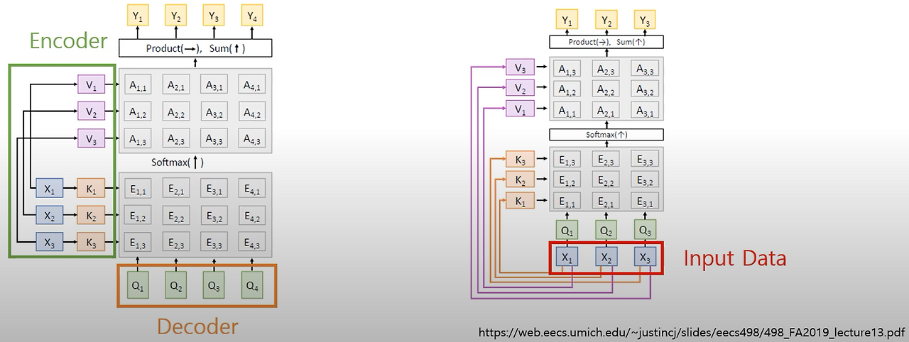
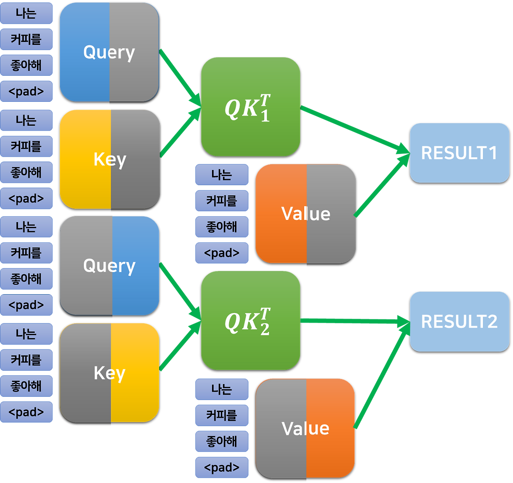
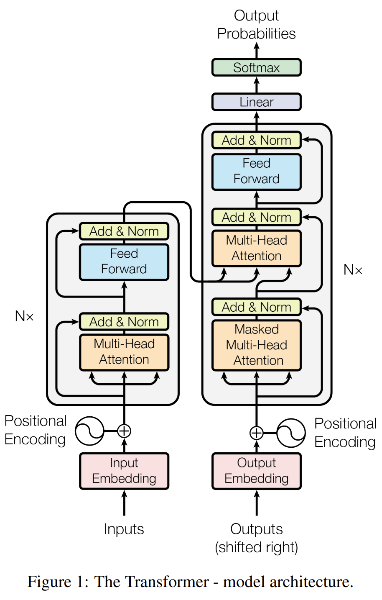

# 📍 Transformer
Self-Attention 매커니즘 기반으로 문장의 의미를 이해하고 생성하는 딥러닝 모델 구조이다. RNN과 LSTM 없이도 순차적 정보를 병렬적으로 처리할 수 있어 빠르고 정확한 학습이 가능하다. 이후 GPR, BERT, ViT 등 다양한 모델의 기반이 되는 중요한 구조이다. 이를 이해하기 위해 먼저 알아야 할 개념들을 살펴볼거다.

## 1. Transformer 이해를 위한 개념
### (1) Attention
> Attention은 입력 전체를 동시에 보고, 어떤 단어(또는 토큰)가 중요한지 가중치를 두어 처리하는 방식이다. 일반적으로 인코더-디코더 구조에서 사용되며, 디코더가 예측을 수행할 때 인코더의 정보를 활용하여 특정 단어에 집중하는 방식이다.

#### Attention의 특징
- Bottleneck 현상 해결
- Gradient Vanishing 문제 해결

### (2) Self-Attention
> 같은 문장 내에서, 즉 입력으로 들어온 시퀀스 안에서 단어들 간의 관계를 고려하는 것이다. 

#### [Attention과 Self-attention 차이]

- Attention : 디코더로부터 query가 나오고 인코더로부터 key와 value값이 나와서 인코더와 디코더 사이의 상관관계를 바탕으로 특징을 추출
- Self-attention : 입력 데이터로부터 query, key, value가 모두 계산이 되고, 데이터 내의 상관관계를 바탕으로 특징을 추출
- Attention은 다른 시퀀스 간의 관계를 파악하는 반면, Self-attention은 단일 시퀀스 내의 단어들 간의 관계를 파악한다

### (3) Query, Key, Value (Q, K, V)

> Transformer Attention에서 Q,K,V는 단어 간의 연관성을 파악하고, 중요한 정보를 뽑아내는 역할을 한다.
- Query(Q) : "어떤 정보를 찾아야 할까? 를 결정하는 역할. 현재 처리 중인 단어 입장에서, 다른 단어들로부터 어떤 정보를 얻고 싶은지를 나타낸다.
- Key (K): 각 단어가 가진 특징을 압축한 값. 모든 단어는 고유한 Key를 가지고 있어서 Query가 어떤 단어와 연관이 있는지를 평가할 때 사용된다.
- Value (V): 실제 정보를 담고 있는 값. Query와 Key를 통해 주목해야 할 단어가 결정되면, 그 단어에 담긴 정보가 Value에서 전달된다.
> query와 key 사이의 유사성을 계산하기 위해 코사인 유사도를 사용한다.
### (4) Positional Encoding
> Transformer는 RNN처럼 순차처리를 하지 않기 때문에 입력 순서 정보를 알 수 없다. 그래서 토큰의 위치 정보를 인위적으로 추가해줘야 한다. Embedding dimension과 같은 크기를 가지는 위치 정보를 담고 있는 벡터가 positional encoding이다. 

#### 고려해야할 조건
1. 위치 정보를 추가하는 것이 토큰 임베딩을 약간 수정해야 한다
    - 만약 위치 정보를 추가함에 따라 같은 단어의 뜻이 완전히 달라진다면, 모델은 단어의 뜻을 학습하지 못한다
2. positional encoding이 모든 위치에서 다른 값을 가져야 한다
   - 만약 첫 번째 단어를 
1이라는 값으로 인코딩하고, 열한 번째 단어도 1이라는 값으로 인코딩하면 첫번째 단어와 열한번째 단어가 같은 단어일 경우 완전히 같은 뜻으로 인코딩 될 것이다.
3. 가까운 단어들의 positional encoding은 유사해야 한다
    - Positional Encoding의 목적 자체가 단어들의 상대적인 위치를 나타내는 것이기 때문에 가까운 단어들은 비슷한 값으로, 먼 단어들은 다른 값으로 인코딩 되는 것이 바람직하다.

### (5) Multi-Head Attention
> 한 개의 Attention Head는 하나의 관계만 집중 가능하다. 여러 head를 사용하면 다양한 관계를 병렬적으로 학습할 수 있다. 멀티-헤드 어텐션은 셀프 어텐션을 여러번 수행한 걸 가리킨다.

위처럼 나누어진 attention head들이 각각 다른 특성을 학습할 수 있도록 한다. 어텐션은 softmax를 통해 후처리 되는데, 이는 큰 값을 갖는 한 두개의 관계들만이 강조되도록 한다. 

## 2. Transformer Architecture

1. 입력 데이터를 임베딩하고, positional encoding 정보를 더해준다
2. 데이터를 인코더에 입력한다
   1. Multi-head self attention을 수행한다
   2. Residual connection & Layer Normalization 을 수행한다
   3. feed forward network를 통과한다
   4. residual connection & layer normalization 을 수행한다
3. 인코더의 출력을 입력삼아, 인코더 n개를 모두 통과한다
4. 디코더의 입력을 임베딩하고, positional encoding 정보를 더해준다
5. 데이터를 디코더에 입력한다
   1. masked multi-head self attention을 수행한다
   2. residual connection & layer normalization을 수행한다
   3. 인코더의 출력과 Multi-head cross attention을 수행한다
   4. residual connection & layer normalization을 수행한다
   5. feed forward network를 통과한다
   6. residual connection & layer normalization을 수행한다
6. 디코더로 n개를 모두 통과한다
7. linear 계층과 softmax를 통과하여, 디코더 입력에 이어질 단어를 출력한다

