# A ConvNet for the 2020s

## 논문 정보
> - 논문 제목 : A ConvNet for the 2020s
> - 모델 이름 : ConvNeXt
> - 발표 연도 : 2022 (Meta AI / Facebook AI Research)
> - 한줄 요악 : Transformer 설계 원칙을 CNN에 체계적으로 이식해, 순수 CNN만으로도 ViT 수준의 성능을 달성한 현대적 ConvNet

## Introduce

당시 ViT계열 모델이 CNN보다 좋은 성능을 내면서 SOTA를 달성했다.

초기의 ViT는 분야에서는 패치 또는 이미지의 크기, 연산량 등의 이유로 Backbone으로 사용되지 못해 Object Detection, Segmentation 등의 분야에서 SOTA를 달성하는데 어려움이 있었다.

그러나 Sliding Window Attention, Cyclic Shift Window Attention 기법과 함께 계층적 구조의 ViT의 (Swin Transformer) 등장으로 기존의 CNN Backbone을 대체할 수 있게 되었고 성능 또한 좋았다.

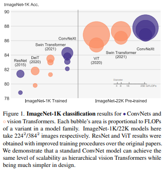

본 논문의 저자들은 Swin Transformer의 비교군으로 ResNet을 사용 했는데 두 모델은 비슷한 듯 다르며 성능이 차이가 나는 이유가 있다고 한다.

위와 같이 말한 이유는 다음과 같다.

- 두 모델은 비슷한 Inductive Bias를 가진다는 점에서 비슷함.
- 학습 과정과 Macro/Micro 수준에서의 구조 디자인이 다름.

그래서 본 논문에서는 ViT의 구조 디자인을 참고하여 ResNet을 수정하며 성능에 대한 실험을 하고자 한다.

---

## 모델 구조 변경

ResNet 모델을 modernize하기 위한 로드맵을 보자.

일단 몇 가지를 바꿔가면서 CNN과 Transformer의 네트워크 성능을 비교한다. ResNet을 점차 modernize 하며 Swin Transformer구조로 향해 가볼 것이다. 이때 모델은 FLOPs(4.5x10⁹)가 서로 비슷한 ResNet-50과 Swin-T(tiny)를 비교하였다.

이 논문의 목표는 ViT 이전과 이후의 모델 간의 차이를 줄이고, 순수 ConvNet이 달성할 수 있는 한계를 테스트하는 것이다. 이를 위해 ResNet50을 기반으로 하여 hierarchical Transformer를 CNN으로 현대화하여, 성능을 점진적으로 향상한 ConvNeXt 모델을 제안한다.

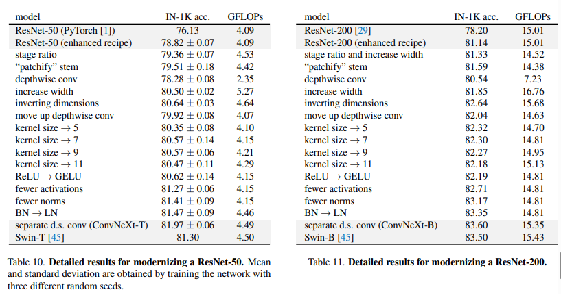

### 1. Training Techniques ( 76.1% -> 78.8% )
기본적으로 Base model(ResNet-50/200)에 아래와 같은 train techniques를 적용하여 ResNet-50모델 성능을 76.1%에서 78.8%로 향상해서 진행하였으며 이 train technique은 모든 train에 동일하게 적용하여 학습하였다. 그리고 세 가지의 다른 random 시드의 평균으로 accuracy를 구하여 평가하였다. 또한 train과 evaluation은 동일하게 ImageNet dataset을 이용한다.

[Train Techniques]
- original 90 epochs에서 300 epochs까지 늘려서 진행
- AdamW optimizer 사용
- Data Augmentation 사용: Mixup, Cutmix, RandAugment, Random Erasing, regularization schemes including StochasticDepth, Label Smoothing

- 성능: 76.1% → 78.8%

### 2. Macro design
#### (1) Stage 연산 비율 변경
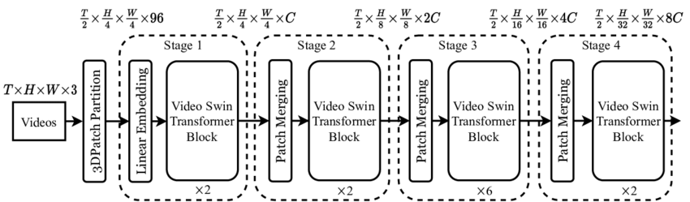

- Swin-Transformer는 위의 구조와 같이 stage를 갖고 있고, 그 stage의 비율은 1:1:3:1을 가지고 있다. 그래서 ResNet-50에서 사용하는 residuel block도 (3,4,6,3)에서 (3,3,9,3)로 같은 비율로 변경했다.
- 성능: 78.8% -> 79.4%
- FLOPs: 4.1G → 4.5G

#### (2) ‘Patchify’로 Stem 변경 
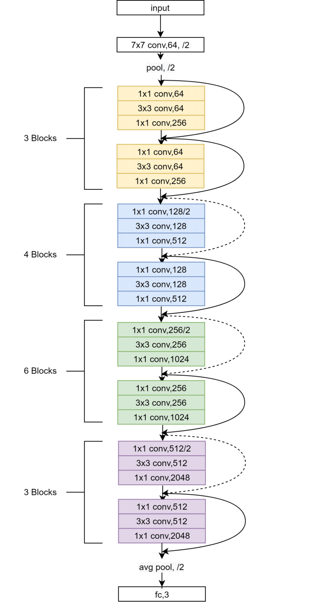

- 먼저, ResNet은 Stem 부분에서 7x7 필터와 stride 2, max pooling을 사용하여 입력 이미지를 4배 다운샘플링한다. 반면에 Vision Transformer는 이미지를 14x14 또는 16x16 패치로 나누며, Swin Transformer는 더 작은 4x4 패치로 이미지를 나눈다.
- 이에 따라 4x4 필터 크기에 stride 4를 적용하여, 합성곱을 수행하는 "patchify" 레이어를 만든다. 이는 Swin-T의 stem과 비슷한 작업을 수행하는 Non-overlapping convolution이라고 할 수 있다.
- 성능: 79.4% → 79.5%
- FLOPs: 0.1G 감소

### 3. ResNeXt
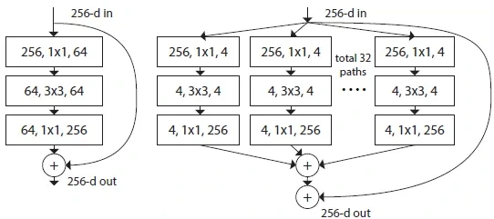
왼) ResNet 구조, 오) ResNeXt 구조

ResNeXt의 핵심 구성 요소는 grouped convolution이며 더 많은 그룹을 이용해 너비를 확장시키고 각자 연산 후 다시 concatenate하는 것이었다. 위의 예시에서는 input channel을 32개의 patch로 나누어 grouped convolution을 한다.

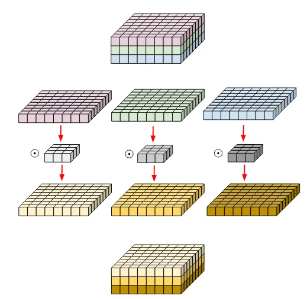
왼) 일반적인 convolution 오)  depth wise convolution

여기서 depth wise convolution을 이용하는데 이것은 채널당 정보를 혼합하는 self-attention의 가중 합 연산(Weighted Sum)과 유사하며, 공간 차원에서만 정보를 혼합한다. Depthwise conv와 1 × 1 conv을 결합하여 사용하는 것은 각 작업이 공간 또는 채널 차원을 통해 정보를 혼합한다는 의미이고, 이는 둘 다 혼합하지는 않는 Vision Transformer와 비슷한 특성이다.

depth wise convolution은 네트워크 FLOP와 정확도를 감소시키는데, 추가적으로 Swin-T와 채널을 맞추기 위해 채널 수를 64에서 96으로 증가시켜서 아래와 같은 결과를 냈다.

- 성능: 80.5%(1% up)
- FLOPs: 5.3G (0.9G up)

### 4. Inverted Bottleneck
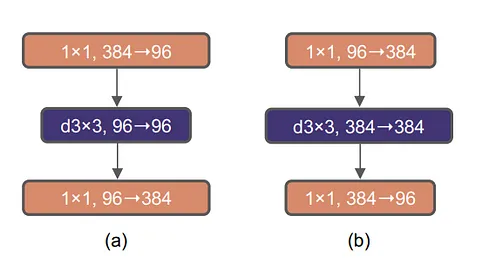
그림(a)는 기존 ResNet의 Bottleneck 구조이고, Mobilenet V2에서는 FLOPs를 줄이기 위해 그림(b)과 같은 Inverted Bottleneck을 사용하였다. Inverted Bottleneck을 채택한 이유는 Transformer 블록에서 MLP 블록의 hidden dimension에서도 input dimension의 4배나 넓은 inverted bottleneck 구조를 갖고 있기 때문이다.

결과적으로 downsampling residual block에 의해 많은 FLOPs가 감소되었으며 결과는 아래와 같다.

- 성능: 80.6% (0.1% up)
- FLOPs:  4.6G (0.7 down)

### 5. Large kernel size
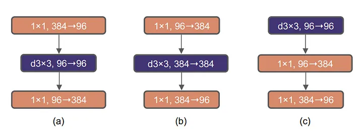
작은 커널 사이즈(3x3)의 컨벌루션 레이어를 쌓는 것이 표준처럼 자리잡고 있는데 이러한 작은 커널 크기는 현대 GPU에서 효율적인 하드웨어 구현을 가지고 있기 때문이다. 그렇지만 Swin-T는 윈도우 크기가 7x7로 3x3 크기보다는 훨씬 크기 때문에 large kernel 사이즈를 고려하게 된다.

여기서 (b)에서 (c)로 depthwise conv를 위로 올리게 된다. 이 과정은 복잡/비효율적인 모듈 (MSA, large-kernel conv)은 채널이 적을 것이고, 효율적이고 밀집된 1×1 레이어가 중요한 작업을 한다는 것을 의미한다. 그러나 이것만 변화시킨 경우 성능이 약간 감소한다.

이후 3, 5, 7, 9, 11 커널 사이즈를 비교하며 실험했을 때 7x7 커널 사이즈가 saturation 되었다.

- 성능: 79.9% → 80.6%
- FLOPs: 유지

### 6. Micro Design

1. ReLU → GELU

GELU는 ReLU의 부드러운 변형으로 생각 할 수 있으며 Google BERT나 최신 Transformer에서 사용되었다.
정확도는 변하지 않았지만 모든 activation function을 GELU로 사용하였다.

2. Fewer activation function
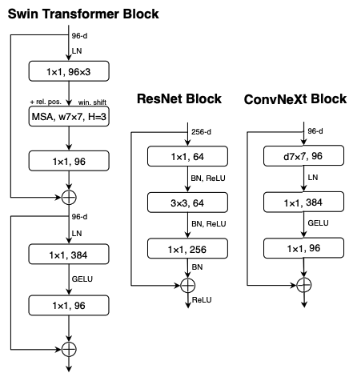
- Transformer는 MLP 블록에 activation function이 하나만 있음. 그에 비해 ConvNet(conv → normal → activation)은 각 컨볼루션 레이어에 활성화 함수 추가
- ConvNeXt: 1x1 레이어 사이에 하나의 GELU만 남겨두고 나머지 activation function은 모두 제거
- 성능: 81.3%(0.7%상승) → 이때부터 Swin-T의 성능과 거의 맞먹는 결과를 얻음

3. Fewer normalization layer
- Transformer: MSA, MLP block 앞에서만 Normalization 수행
- ConvNeXt: 한 개의 batch norm(BN)을 inverted bottleneck의 첫 번째 1x1 conv layer 앞쪽에 적용시켰다
- 성능: 81.4%(0.1%상승) → Swin(81.3%) 넘음

4. BN → LN
- 그동안 비전 Task에서는 BN이 우선적으로 선택되는 반면 LN은 Transformer에서 사용되었는데 LN을 바로 ResNet에 적용하면 성능이 안 나오지만 modernize 된 ConvNeXt에서는 0.1% 성능 향상
- 성능: 81.5%

5. Separate downsampling layers
- 각 단계의 시작에서 residual block을 사용하여 3x3 conv 및 stride 2로 달성
- Swin Transformers에서는 단계 사이의 별도의 다운샘플링 층이 추가됨
- 그래서 공간 다운샘플링을 위해 2x2 conv 레이어를 사용
- 그런데 train이 발산하게 되고 공간 해상도가 변경되는 곳마다 정규화 층을 추가하는 것이 훈련을 안정화 할 수 있다.
- 각 다운샘플링 층 앞에 하나, stem 다음에 하나, 그리고 GAP 후에 하나 이렇게 LN을 넣어줌
- 성능: 82.0%

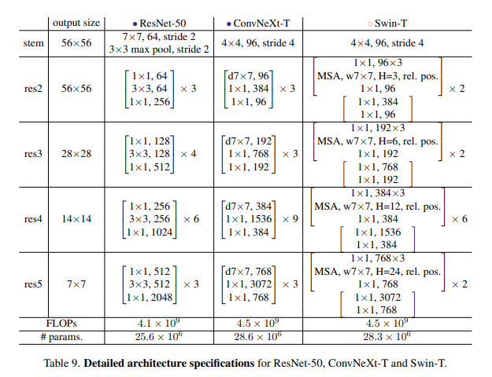

## Conclusion
ResNet을 Modernize하여 만든 ConvNeXt 모델은 Swin Transformer와 대략 동일한 FLOP, 파라미터수 처리량 및 메모리 사용량을 가졌음에도 불구하고 Shift Window Attention이나 relative position biases과 같은 특수한 모듈이 필요하진 않는다.

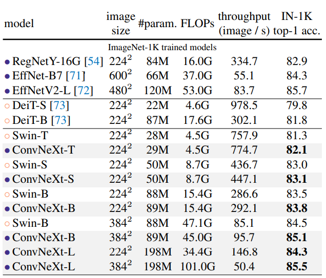