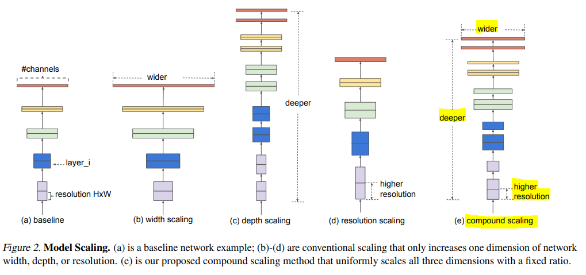
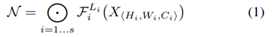
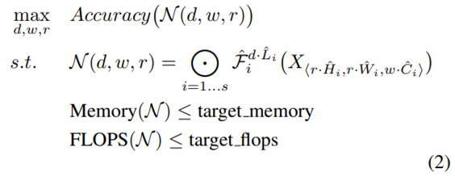
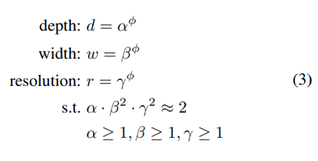
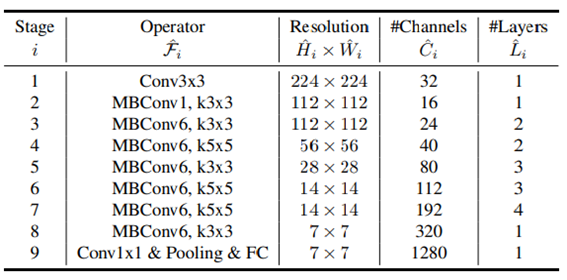
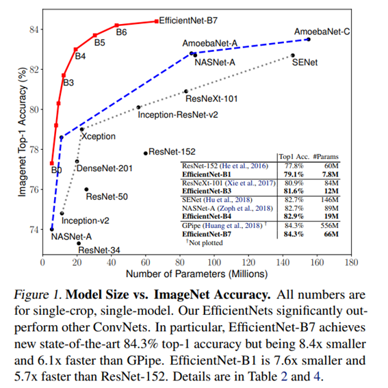

# EfficientNet: Rethinking Model Scaling for Convolutional Neural Networks

## 논문 정보
> - 논문 제목 : EfficientNet: Rethinking Model Scaling for Convolutional Neural Networks
> - 모델 이름 : EfficientNet (B0 ~ B7)
> - 발표 연도 : 2019 (Google Research)
> - 한줄 요악 : 모델의 depth, width, resolution을 개별적으로 키우지 않고, 하나의 원칙(Compound Scaling)으로 동시에 확장해 효율과 성능을 모두 잡은 CNN 아키텍처

## Introduce

스케일링 방법은 ConvNet의 성능향상을 위해 자주 사용되는 방법이다. 가장 많이 알려진 방법으로는 델의 깊이, 너비를 깊게 만드는 방법이다. 또한 이미지의 resolution에 따라 모델 사이즈를 변경시키는 방법이 있다. 즉 세가지 중 하나만 차원을 조정하는 방식이 사용됐었고, 사소하게 조정해줘야하는 작업이 필요해서 최적의 정확도와 효율을 내는 방법이 아직 없었다.

본 논문에서는 세 개의 균형을 간단한 상수비로 구할 수 있다. 임의 조정방식들과는 달리, 본 논문에서는 세 개를 균등하게 스케일링 한다.
이를 위해 Compound Scaling Method를 제안했다
- 기존 연구에서는 임의로 세가지 요소를 scale함
- 이 연구에서는 network의 width, depth, resolution을 fixed scaling coefficient로 균일하게 scale함

---

## Related Work
### ConvNet Accuracy
AlexNet 이후 ImageNet competition에서 더 깊어지고 커지면서 정확도가 높아지는 모델들이 여럿 발표되었다. 최근 발표되는 모델들은 ImageNet뿐만 아니라 다른 데이터셋에서도 잘 작동한다. 그러나 정확도는 높아졌지만, 사용하는 자원 역시 크게 늘어났다.

### ConvNet Efficiency
깊은 ConvNets는 좀좀 over-parameterized된다. 효율을 높이기 위해 모델 압축하는 여러 기법이 제안되었다.(SqueezeNets, MobileNets, ShuffleNets 등.)

### Model Scaling
ResNet(ResNet-18, ResNet-50, ResNet-200)은 깊이를 달리 하였다.
MobileNets는 network width를 달리 하였다.
또한 이미지 해상도가 높아지면 (찾아낼 정보가 많아서) 정확도를 높아진다. (물론 계산량도 많이 늘어난다.)
많은 연구가 진행되었으나 어떻게 효율적인 조합을 찾는지는 아직까지 정립되지 않았다.

## Main Idea
### Compound Model Scaling
#### 1. Problem Formulation
H, W, C를 입력 tensor의 크기, F를 Conv layer라 하면 ConvNet은 아래의 수식으로 정의할 수 있다.

design space를 좁히기 위해 모든 레이어는 균등하게 scaling 하고, 최고의 정확도를 갖도록 하는 optimization 문제를 다룬다. 이를 식으로 나타내면 아래와 같다.

#### 2. Scaling Dimensions
가장 중요한 문제는 최적의 d, w, r은 서로 연관되어 있다는 것이고 다른 제약조건에서 값이 변한다는 것이다
- Depth: 네트워크의 깊이가 증가할수록 모델의 capacity가 커지고 더 복잡한 feature를 잡아낼 수 있지만, vanishing gradient의 문제로 학습시키기가 더 어려워진다. 이를 해결하기 위해 Batch Norm, Residual Connection 등의 여러 기법들이 등장하였다.
- Width: 각 레이어의 width를 키우면 정확도가 높아지지만 계산량이 제곱에 비례하여 증가한다.
- Resolution: 입력 이미지의 해상도를 키우면 더 세부적인 feature를 학습할 수 있어 정확도가 높아지지만 마찬가지로 계산량이 제곱에 비례해 증가한다.

#### 3. Compound Scaling
depth, width, resolution을 하나의 계수로 동시에 확장해, 같은 연산량 대비 최적의 성능을 얻는 스케일링 전략으로 계산량은 깊이에 비례하고, 나머지 두 변수에 대해서 그 제곱에 비례하므로 다음과 같은 비율로 변수들이 움직이게 정할 수 있다.

- 위 그림은 Depth, resolution 을 고정했을 때 width 의 변화에 따른 성능 변화 결과이다.

## Network Architecture

EfficientNet은 MobileNetV2의 MBConv 블록을 기본으로 하는 CNN 계열 모델이다

전체 구조는
1. Stem Conv (3x3 conv)
2. MBConv Blocks 반복
3. Head conv + Global average pooling
4. Fully connected layer

α, β, γ를 직접 갖고 큰 모델에 실험해서 더 좋은 결과를 얻을 수도 있지만 큰 모델에 대해서는 그 실험에 들어가는 자원이 너무 많다. 그래서 작은 baseline network에 대해서 먼저 좋은 α, β, γ를 찾고(STEP 1) 그 다음에 전체적인 크기를 키운다(STEP 2).

핵심 구성 요소
- MBConv (Mobile Inverted Bottleneck Convolution)
  - Depthwise Separable Convolution
  - Inverted Residual 구조
- Squeeze-and-Excitation (SE) Block
  - Channel-wise attention
- Swish Activation Function
  - ReLU 대비 부드러운 비선형성

EfficientNet-B0
- Neural Architecture Search(NAS)로 설계된 baseline 모델
- 이후 B1~B7은 scaling rule에 따라 확장

## Conclusion

### 장점
- 매우 높은 파라미터 효율
- 체계적인 모델 확장 전략
  - B0 -> B7까지 일관된 스케일링
- 모바일 엣지 환경에 적합
  - 경량 모델 실무 활용도 높음
- ImageNet SOTA 달성

### 단점
- 구조가 복잡함
  - MBConv + SE + Swish → 구현 난이도 상승
- 학습 비용 큼
  - 큰 모델은 학습 자원 요구 높음
- CNN의 한계
  - Global context modeling에서 Transformer 대비 불리
  
### 결론
EfficientNet은
**“모델을 어떻게 키워야 가장 효율적인가?”**라는 질문에 대한 명확한 해답을 제시한 모델이다.

- 단순히 깊거나 넓게 만드는 것이 아니라 depth, width, resolution을 함께 고려한 scaling 전략이 핵심
- 이후 EfficientDet, EfficientNetV2 등 파생 연구에 큰 영향
- 현재도 classification backbone으로 널리 사용됨

EfficientNet은 CNN 모델 설계와 스케일링 관점에서 하나의 기준점이 되는 논문이다.