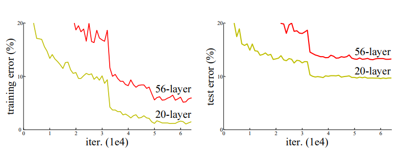
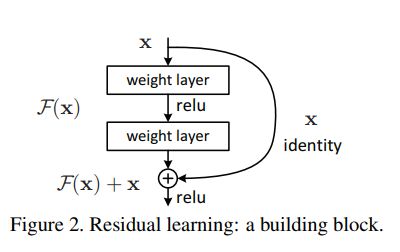
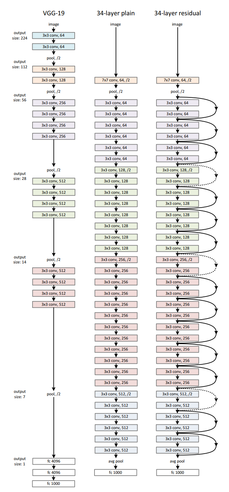

# Deep Residual Learning for Image Recognition

## 논문 정보
> - 논문 제목 : Deep Residual Learning for Image Recognition
> - 모델 이름 : Resnet
> - 발표 연도 : 2015
> - 한줄 요악 : 모델의 깊이가 깊어질수록 학습이 어려워지고, 정확도가 감소하는 문제를 잔차 학습(Residual Learning) 개념을 도입하여 해결함

## ResNet이 등장한 배경

네트워크의 깊이가 깊어질수록 성능이 좋다는 것은 알려져 있지만 학습과 테스트 성능이 오히려 저하될 수 있음을 알 수 있다.
이는 Gradient Vanishing(기울기 소실) 문제와 관련이 있는데 네트워크가 깊어질수록 역전파 시 기울기가 점점 작아져서 앞쪽 레이어의 가중치가 거의 업데이트 되지 않기 때문이다.

이 논문에서는 해결책으로 Residual Learning 도입했다. 위의 이미지는 잔차 블록(Residual Block) 구조를 나타낸 것인데 이것이 잔차학습의 핵심 개념이다

1. 입력 x : 입력값은 블록의 시작점
2. Weight Layer(가중치 레이어) : 입력 x는 두 개의 가중치 레이어를 통과하며, 각 가중치 레이어는 일반적으로 Convolutional Layer 이다.
3. ReLU 활성화 함수 : 각 가중치 레이어 뒤에는 ReLU 활성화 함수가 적용되어 비선형성을 추가
4. 잔차 함수 F(x) : 이 두 개의 가중치 레이어를 거친 후의 출력은 잔차 함수 F(x). 이 함수는 원래의 입력 x에서 추가적으로 학습해야 할 변화 또는 차이를 의미한다.
5. Identity Shortcut (직접 연결) : 입력값 x는 별도의 연산 없이 출력에 직접 더해진다.
이 부분이 "identity connection" 인데, 입력값 x는 그대로 유지되면서 F(x)에 더해지므로, 네트워크가 깊어져도 학습할 때 중요한 정보가 유지된다.
6. 결합 연산 : 잔차 함수 F(x)와 원래의 입력값 x는 합쳐진다. 이 연산은 덧셈으로 이루어지며, 이로 인해 출력이 F(x) + x가 된다
7. 최종 ReLU : 마지막으로 합쳐진 결과에 다시 ReLU가 적용되어 다음 레이어로 전달된다

## ResNet의 핵심 아이디어
### Residual Block (잔차 블록)
- 기존 신경망에서는 입력 x를 여러 개의 Convolution Layer를 거쳐 출력 H(x) 를 생성
- ResNet에서는 x를 그대로 출력에 더해주는 Skip Connection(Shortcut Connection) 을 추가
- 즉, 학습 대상이 H(x)가 아니라 F(x) = H(x) - x 가 된다.
  
### 왜 Residual Block이 효과적인가?
1. Gradient Flow가 원활해짐
     - 역전파할 때, 기울기가 직접 입력으로 전달되기 때문에 깊은 네트워크에서도 기울기 소실 문제가 완화된다
2. 학습이 쉬워짐
    - 원래는 깊이가 깊어지면 학습이 어려워지지만, Residual Learning을 통해 네트워크가 작은 변화만 학습하면 되므로 더 깊어질 수 있다.

## ResNet 구조
ResNet은 다양한 깊이로 구성될 수 있으며, 논문에서는 ResNet-18, ResNet-34, ResNet-50, ResNet-101, ResNet-152 등의 구조를 제안했다. 

위의 세개의 모델을 비교해보자
#### VGG-19
- VGG-19는 매우 단순하고 일관된 네트워크 구조로, 층을 깊게 쌓아 여러 개의 3x3 합성곱(conv) 층을 사용한다.
- 이 구조는 합성곱 층 사이에 풀링(pooling) 층을 넣어 특징 맵의 크기를 줄이면서 특징을 추출하는 방식을 사용한다.
- 하지만 층이 깊어질수록 성능 저하 문제가 발생할 수 있다.
#### 34-layer Plain 네트워크
- 34-layer plain 네트워크는 VGG-19보다 훨씬 더 깊은 구조를 가지고 있다.
- 이 네트워크 역시 여러 층을 쌓아 출력값을 학습하지만, 추가적인 잔차 학습 없이 모든 층에서 새로운 출력을 직접 학습하려고 한다.
- 깊어질수록 성능 저하 문제가 발생할 가능성이 높다.
#### 34-layer Residual 네트워크
- 34-layer residual 네트워크는 잔차 학습을 적용한 구조로 각 층에서 입력 값을 그대로 유지하면서 잔차(Residual)만을 학습한다.
- 지름길 연결(identity connection)을 통해 입력 값을 바로 출력으로 전달하고, 동시에 층에서 학습된 잔차 F(x)를 더해 최종 출력을 얻는다.
- 이렇게 하면, 신경망이 깊어지더라도 중요한 입력 정보가 손실되지 않고, 추가적인 정보만 학습하기 때문에 더 깊은 네트워크에서도 성능이 저하되지 않는다.

## ResNet의 한계점 및 이후 연구
#### 한계점
1. Skip Connection이 항상 최적은 아니다.
   - ResNet이 깊어질수록 Identity Mapping 성향이 강해져서 학습이 잘 안 되는 경우가 있다.
   - 이를 개선한 DenseNet에서는 모든 레이어가 서로 연결되어 있다.
2. 추가적인 계산 비용 증가
   - ResNet은 기본적으로 Layer 개수가 많아지고, Bottleneck 구조를 사용하지 않으면 계산량이 증가할 수 있다.

#### 이후 연구
- ResNeXt (2017): Grouped Convolution을 사용하여 효율적인 학습 구조 도입.
- Wide ResNet (WRN): 깊이를 줄이고 대신 폭을 늘려서 성능 개선.
- DenseNet (2017): 모든 레이어를 연결하는 Dense Connection 구조.
- EfficientNet (2019): Neural Architecture Search(NAS)를 사용하여 최적의 구조 탐색.

## 결론
- ResNet은 Gradient Vanishing 문제를 해결하고 더 깊은 신경망 학습을 가능하게 만든 혁신적인 모델이다.
- Residual Block을 도입하여 깊이 152층의 네트워크도 학습 가능하게 했고, ImageNet 챌린지에서 SOTA 달성했다.
- CNN 모델들의 기본적인 구조적 틀을 제공한 중요한 네트워크 아키텍처이다.