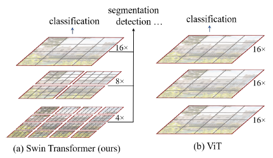
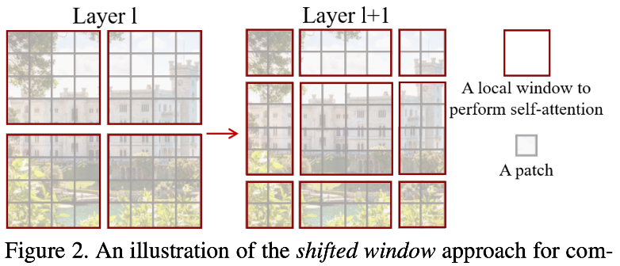
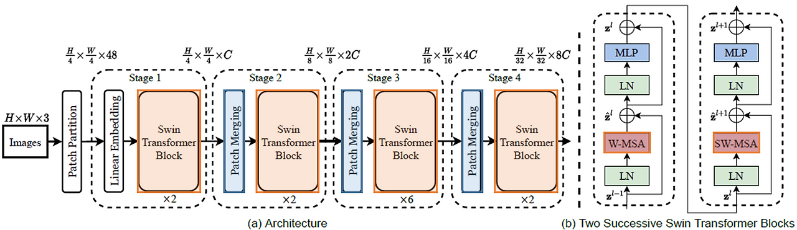
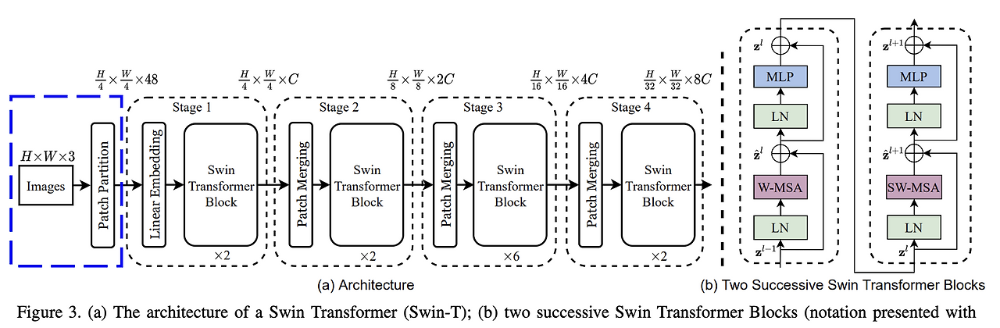
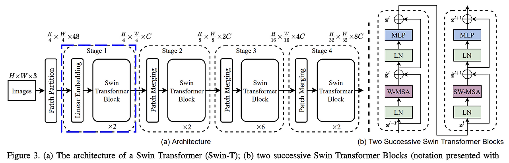
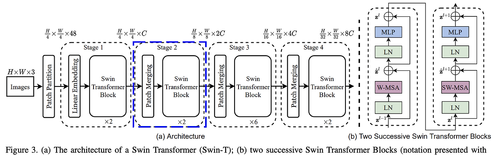
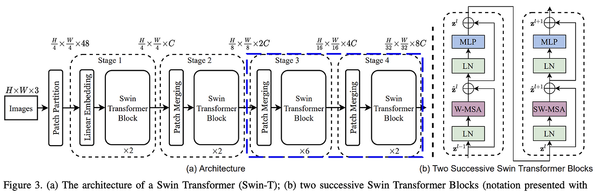
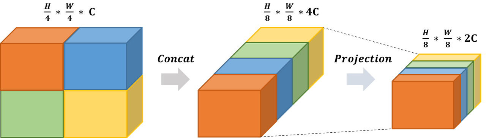

# Swin Transformer: Hierarchical Vision Transformer using Shifted Windows

## 논문 정보
> - 논문 제목 : Swin Transformer: Hierarchical Vision Transformer using Shifted Windows
> - 모델 이름 : Swin Transformer
> - 발표 연도 : 2021
> - 한줄 요악 : Transformer를 vision에 효과적으로 적용하기 위해 cnn의 지역성과 계층적 구조를 결합한 transformer 구조

## Swin Transformer 등장 배경
기존 ViT (Vision Transformer)의 한계
1. 고정된 입력 크기 필요 : position embedding이 고정되어 있어서 입력 해상도 변화에 약함
2. 계층적 특성 부족 : ViT는 동일 해상도로 동작하여 객체의 local → global 표현 학습에 비효율적
3. 계산량 : nlp에 비해서 cv는 기본적으로 데이터가 크며 고해상도 이미지를 처리해야한다. 이미지가 커질수록 self-attention 연산 복잡도가 기하급수적으로 커져서 비효울적

## 핵심 아이디어
### 1. Patch Partitioning & Patch Merging

Swin transformer는 input image를 patch로 나누고 네트워크가 깊어질수록 이런 patch들을 합쳐서 사용하는 방식이다.

> - 맨 아래에 있는 layer에서, 한 개의 patch는 4x4 크기의 crop된 image라고 생각해보자
> - 다음 layer에서는 인접한 2x2개씩 묶어서 (merge) 더 큰 patch를 만든다
> - 이렇게 되면 patch의 수는 1/4로 줄어들고, patch 해상도 자체는 가로세로로 각각 2배씩 커진다
> - 이런 방식으로 patch를 점점 merge해 나간다

이렇게 merge했을 때 hierarchial representation (정보를 층별로 점점 추상화하는 구조적 표현)을 학습시킬 수 있는 효과가 있다고 한다. 이는 FPN 구조나 u-net 같은 모델처럼 다른 해상도에서 얻은 정보들을 같이 고려하는 것과 같은 맥락이라고 한다.

### 2. Shifted window

input image를 patch로 나누고 각 windows가 독립적으로 attention 연산을 진행하면 서로 다른 window끼리는 attention 연산이 진행되지 않는다. 그럼 장기의존성을 가져 전역적으로 정보를 집계하는 transformer의 구조를 깨버리는 것이고 성능 또한 저하된다.

그래서 이 부분을 shifted window 방식으로 각각의 window 끼리 attention 연산을 진행하는 것이다. 모든 windows끼리는 아니더라도 일부 shift windows 방식을 진행하여 연산 속도와 정확도 둘다 월등한 성능을 기록하였다. 

> 윈도우 내에서 모든 패치의 쿼리는 같은 키 셋을 사용한다. (Q,K,V 중에서 K가 동일)
> -> 더 효율적으로 연산가능하고 지연시간이 줄어듬

## Swin Transformer Architecture

모델의 구조는 위와 같다. 기존 ViT와 다른 부분은 patch merging 과 shift window를 적용한 swin transformer block 이다ㅏ. 네트워크의 흐름은 다음과 같다.

### 1. Input

- RGB 이미지가 input되면 이를 겹치지 않는 패치로 자른다
- 각 패치는 (4x4) 크기
  - 패치는 (4x4 픽셀) x (RGB 3채널) 이므로 (4x4x3=48)의 디멘션을 갖는다
### 2. Stage 1

- 먼저 linear embedding 레이어를 통과한다
  - 각 패치 벡터를 고정 차원으로 선형 변환해서 transformer의 입력으로 만듦
  - 앞선 토큰들의 feature 들이 디멘션 C로 전사된다
- swin transformer block * 2
  - 2개의 block이 연속적으로 처리됨
  - 각각의 block에서 W-MSA, SW-MSA 가 진행됨
  - 토큰의 갯수에는 영향을 주지 않기 때문에 output shape = (H/4 x W/4 x C)
### 3. Stage 2

- Patch merging 레이어를 통과한다
  - 모델을 더 깊게 만들고 더 복잡한 추론을 하기 위해
  - 이를 통해 패치의 개수 (H/4 x W/4) -> (H/8 x W/8)
- swin transformer block * 2
- C -> 2C 가 되는 과정
  - merging layer 는 (2x2) 만큼 주변 패치의 feature를 concatnate로 합쳐버린다 : C -> 4C
  - merging layer 내부에는 리덕션 레이어가 있어서 이를 절반으로 전사한다 : 4C -> 2C
  - 결론적으로 C -> 4C -> 2C
### 4. Stage 3, Stage 4

- stage2를 2번 더 반복한다
- 패치의 개수는 ((H/8 x W/8) -> (H/16 x W/16) -> (H/32 x W/32))
- 패치의 디멘션은 (2C -> 4C -> 8C)
- 마지막 swin transformer block 뒤에 mlp로 들어간다

## Patch merging & swin transformer block
### Patch merging
해상도를 줄이는 방법은 ? 

- stage1의 출력인 H/4 * W/4 * C 차원을 2*2 그룹들로 나눈다.
- 나눠진 하나의 그룹은 H/8 * W/8 * C 의 차원을 가지고, 4개의 그룹들을 채널을 기준으로 병합한다
- 병합된 H/8 * W/8 * 4C 의 차원축소를 위해 절반인 2C의 차원으로 축소한다
- 위 과정이 모든 stage에서 동일하게 작용한다
  
이러한 계층적 구조는, 일반적인 representations보다 더 계층적인 representations을 학습할 수 있고, 줄어든 차원만큼 연산속도에도 이점이 있다.

### swin transformer block
swin transformer에는 두 종류의 블록이 번갈아 등장하는데 요약하자면 아래와 같다
| 이름         | 의미                                     | 특징 요약                            |
| ---------- | -------------------------------------- | -------------------------------- |
| **W-MSA**  | Window-based Multi-head Self Attention | 윈도우 내 local attention만 함 (기본 블록) |
| **SW-MSA** | Shifted Window MSA                     | 윈도우를 반칸 이동시켜 경계 정보를 섞음           |

#### 1. W-MSA Block (기본 윈도우 블록)
- 무엇을 하는지?
  - feature map을 격자처럼 나눔
    - 예: 56×56을 7×7 윈도우로 나누면 → 8×8개의 윈도우 생김
  - 각 윈도우 내부에서만 Self-Attention 수
  - 윈도우 간에는 정보 교류가 없음 (완전 독립적)
- 윈도우 경계에 걸친 픽셀 간 상호작용이 없다는 한계가 있음

#### 2. SW-MSA Block (Shift된 윈도우 블록)
- W-MSA는 윈도우 간 정보 교류가 없어서 로컬 특화는 잘하지만 글로벌 표현력이 약하기 때문에 필요하다
- 무엇을 하는지?
  - 기존 W-MSA의 윈도우를 반 윈도우 크기만큼 (ex. 3칸) 가로/세로 이동함
  - 새로 나뉜 윈도우에서는 이전에 경계에 걸려 있던 픽셀들이 같은 윈도우에 포함
  - 윈도우 간 정보 교류 가능해짐 (문맥 확장!)
- 문제는?
  - Shift했기 때문에 윈도우가 겹치면서 문제가 생김 →
윈도우를 다시 패딩(padding)하고 정렬시키는 연산이 필요함 →
이를 masking 또는 roll + partition 방식으로 해결함

## 장점 및 단점 
### 장점
1. 계층적(hierarchical) 구조
2. Shifted Window로 효율성과 표현력의 균형 확보
   - W-MSA: 계산 효율성 유지
   - SW-MSA: 윈도우 간 정보 교류 가능 → 전역 표현력 강화
   - 두 방식이 번갈아 적용되어 global-local balance가 매우 좋음
3. 연산 효율성 (Linear Complexity)
4. 다양한 downstream task 적합
### 단점
1. 복잡한 구조
2. 윈도우 기반 attention의 한계
   - sw-msa 로 윈도우 간 정보가 섞이긴 하지만, 진짜 global attention보다 덜 직관적임
3. 작은 객체에 불리할 수 있음
4. 메모리 사용량 여전히 큼
