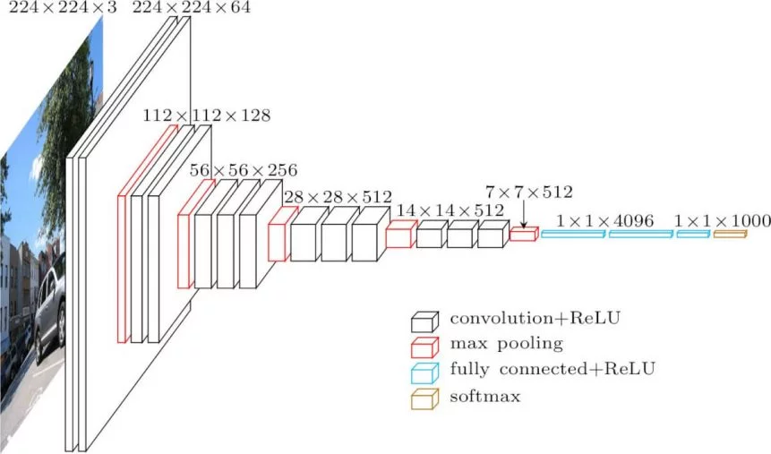
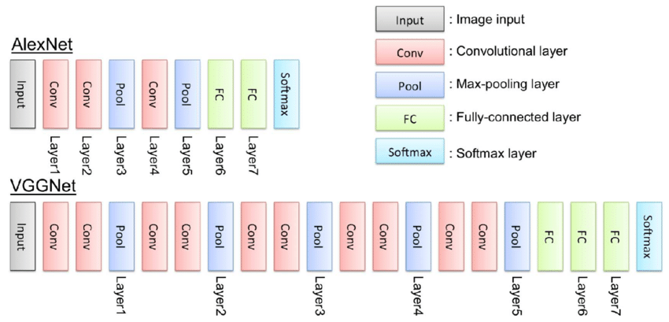
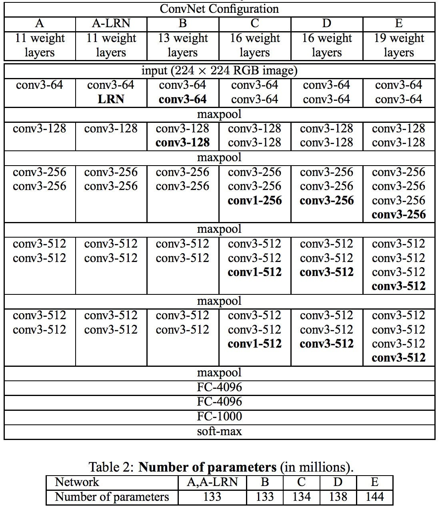
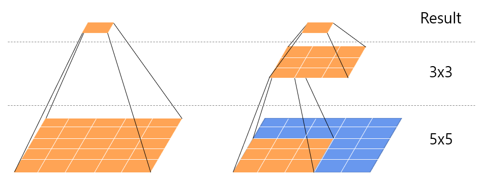

# Very Deep Convolutional Networks for Large-Scale Image Recognition

## 논문 정보
> - 논문 제목 : Very Deep Convolutional Networks for Large-Scale Image - Recognition  
> - 모델 이름 : VGGNet 
> - 발표 연도 : 2014
> - 한줄 요악 : 3x3 Conv filter를 여러개 쌓아 기존 CNN 모델의 layer 개수를 deep하게 늘렸고, 이것이 대규모 이미지 인식에서 좋은 결과를 얻게 함

## VGGNet?
VGGNet은 OxFord대학교의 Visual Geometry Group이 개발한 CNN Network이다. 비록 2014년 ILSVRC에서 2위에 그쳤지만 이해하기 쉬운 간단한 구조로 되어있고 변형이 용이하기 때문에 같은 대회에서 1위를 차지한 GoogleNet보다 더 많이 활용되고 있다.

CNN Network의 성능을 향상시키는 가장 기본적인 방법은 망의 깊이를 늘리는 것이다. VGGNet은 이러한 망 깊이가 따른 네트워크의 성능변화를 확인하기 위해 개발된 네트워크이다. 논문에서는 동일한 컨셉의 깊이가 다른 6가지 구조에 대해 발표하였고 성능을 비교했다.

*[VGGNet16 Architecture]*

## 모델 구조
VGG 모델은 딥러닝 기반 컴퓨터 비전 시대를 열었던 AlexNet(2012)의 8-layers 모델보다 깊이가 2배 이상 깊은 네트워크다. 이를 통해 ImageNet Challenge에서 AlexNet의 오차율을 절반(16.4 > 7.3)으로 줄였다. 오차율을 줄일 수 있던 이유는 모든 합성곱 레이어에서 **3x3 필터**를 사용했기 때문이다.

### ARCHITECTURE / CONFIGURATIONS
 
#### (1) Input image  
- 224 x 224 RGB
- 전처리는 RGB의 평균값 빼주는 것만 적용 

#### (2) Conv layer
- 3 x 3 Conv filter 사용
- 추가로, 1 x 1 Conv filter도 사용
- stride는 1, padding 또한 1

#### (3) Pooling layer
- Conv layer 다음에 적용되고, 총 5개의 max pooling layer로 구성
- 2 x 2 사이즈, stride는 2

#### (4) FC layer
- 처음 두 FC layer는 4,096 채널
- 마지막 FC layer는 1,000 채널

#### (5) 그 외
- 마지막 출력층에는 soft-max layer 적용
- 그 외 모든 layer에 활성함수는 ReLU를 사용    

 

Depth에 따라 모델 구조가 조금씩 변형되었으며, 11 depth인 A 구조에서부터 19 depth인 E구조까지 있다. 우리가 흔히 사용하는 것은 D(vggnet16) 와 E(vggnet19) 이다.    
기존의 7x7 사이즈보다 작은 크기의 필터를 사용함으로써 상당수의 파라미터를 줄일 수 있었다. 그럼에도 불구하고 최종단의 Fully connected layer로 인해 상당수의 파라미터가 존재하고 있다.

VGGNet 파라미터수에 대해

VGGNet은 depth가 늘어남에도 더 큰 conv layer를 사용한 얕은 신경망보다 오히려 파라미터 수가 줄어들었다고 설명한다. 하지만  당시 ILSVRC 2014에서 1등을 차지한 GoogLeNet의 저자 Szegedy가 비판을 했던 부분은 파라미터의 개수가 너무 많다는 점이다. 위의 표를 보면 알 수 있는 것처럼, GoogLeNet의 파라미터의 개수가 <b>5백만개</b> 수준이었던 것에 비해 VGGNet은 가장 단순한 A-구조에서도 파라미터의 개수가 <b>133 백만개</b>로 엄청나게 많다. (GoogLeNet : 22 layers / VGGNet : 11~19 layers)

그 결정적인 이유는 VGGNet의 경우는 AlexNet과 마찬가지로 최종단에 fully-connected layer 3개가 오는데 이 부분에서만 파라미터의 개수가 약 122 백만개가 온다고 한다. 참고로 GoogLeNet은 Fully-connected layer가 없다.

> 정리 : 3x3 보다 더 큰 conv layer를 사용하는 얕은 신경망보다 파라미터 수가 적긴 하지만 그렇다고 가장 적은 것도 아니고 가장 효율적인 것도 아니다.

## Discussion
### 🌟 3x3 conv filter를 사용하면 좋은 점은?
#### 1. **비선형성  증가**

- 위의 그림을 보면 3x3 conv filter 2개 사용하는 것이 5x5 conv filter 1개 사용하는 것과 같다. 같은 논리로 3x3 conv filter 3개 사용하는 것이 7x7 conv filter 1개 사용하는 것과 같다.
- conv filter를 통과하고 나면 ReLU 함수를 적용하게 되는데 3x3필터를 사용하게 되면 5x5/7x7필터보다 **ReLU함수를 더 많이 거치게 되고 그렇기 때문에 비선형성이 증가하고 모델이 깊어진다**.
    - 비선형성이 증가한다는 것은 그만큼 복잡한 패턴을 좀 더 잘 인식할 수 있게 된다.
#### 2. **파라미터 수 감소**
- c개의 채널을 가진 3x3 filter를 3번 쓸 때의 파라미터 수 = n_layer x (HxWxC) = 3($3^2$x$C^2$) = 27$C^2$
- c개의 채널을 가진 7x7 filter를 1번 쓸 때의 파라미터 수 = n_layer x (HxWxC) = 1($7^2$x$C^2$) = 49$C^2$
- 따라서 3x3 을 이용하면 파라미터 수가 감소하고 오버피팅을 줄이는 효과가 있다고 한다.

물론 위와 같은 특징이 모든 경우에 좋은 방향으로 작용하는 것은 아니므로 주의할 필요가 있다. 무작정 네트워크의 깊이를  깊게 만드는 것이 장점만 있는 것은 아니다. 여러 레이어를 거쳐 만들어진 특징 맵(Feature Map)은 동일한 Receptive Field에 대해 더 추상적인 정보를 담게 된다. 목적에 따라서는 더 선명한 특징 맵이 필요할 수도 있다.

### 🌟 1x1 conv filter를 사용하는 이유는?
#### 1. **Channel 수 조절**

- 1x1 conv filter는 위의 그림과 같이 채널 수를 조절할 때 사용한다
- filter의 개수를 input의 dimension보다 작게하여 채널 수를 조절 할 수 있다.
- output의 dimension은 달라지지만, 기존 이미지의 가로 세로 사이즈는 그대로 유지할 수 있다

#### 2. 연산량 감소

- 1번의 채널 갯수의 감소는 직접적으로 연산량 감소로 이어진다
- 위의 그림처럼 1x1 conv filter를 사용하게 되면 연산량이 많이 줄어드는 것을 볼 수 있다.
- 연산량도 줄이고 네트워크를 구성할 때 좀 더 깊게 구성할 수 있다.
  
#### 3. 비선형성 증가
- 많은 수의 1 x 1 Convolution을 사용했다는 것은 ReLU 활성화 함수를 지속적으로 사용했다는 것이다.
- 이는 모델의 비선형성을 증가시켜 준다.
- 즉, 좀 더 복잡한 문제를 해결하는것이 가능해진다.

## 결론

데이터셋은 ILSVRC-2012를 사용하였고 validation set을 test set으로 사용하여 실험했다고 한다. 결과는 ILSVRC2014에서 좋은 결과(2등)을 얻었다.  
결론적으로 VGGNet은 성능이 좋은 deep CNN모델로 그 구조가 간단하여 이해나 변형이 쉬운 분명한 장점을 갖고 있기는 하지만, 파라미터의 수가 엄청나게 많기 때문에 학습 시간이 오래 걸린다는 분명한 약점을 갖고 있다.
실험에서 네트워크의 깊이를 최대 19 레이어(VGG-19)까지만 사용했는데 그 이유는 해당 실험의 데이터에서는 분류 오차율이 VGG-19에서 수렴했기 때문이다. 학습 데이터 세트가 충분히 많다면 더 깊은 모델이 더 유용할 수도 있다.

