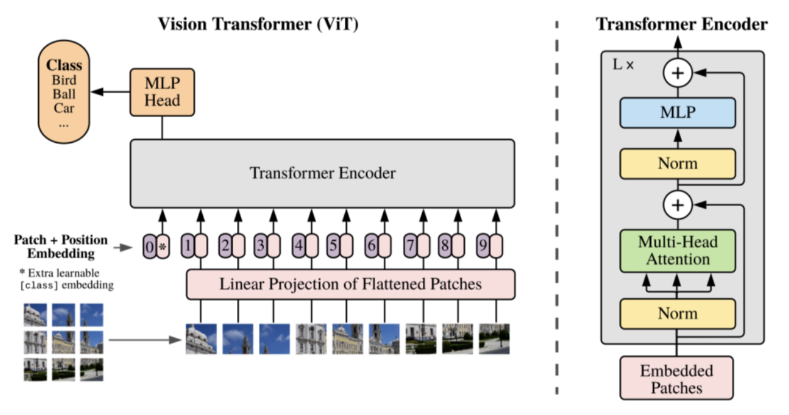
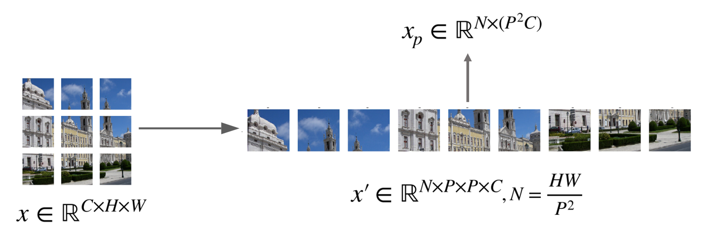
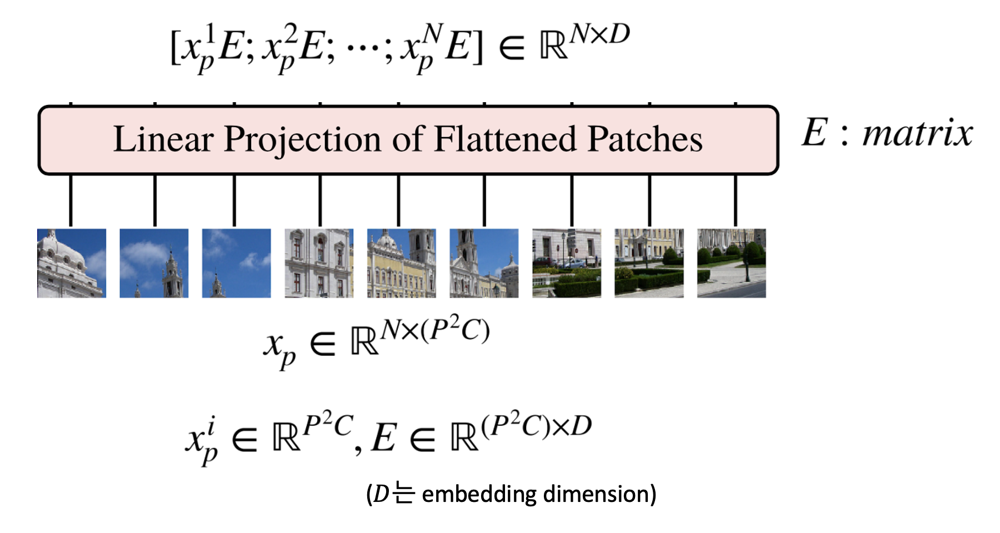
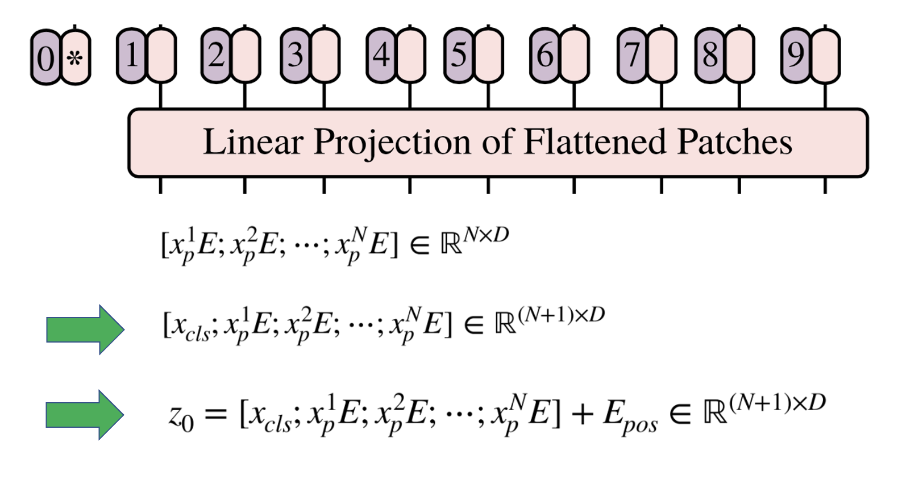
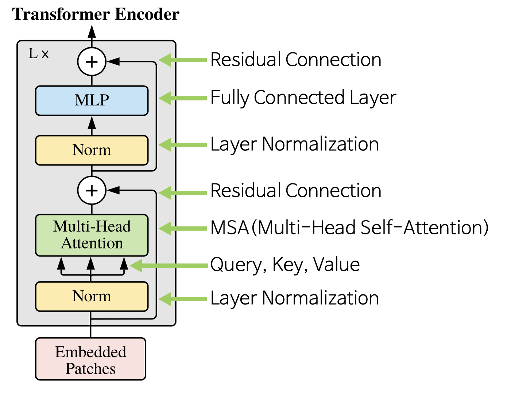
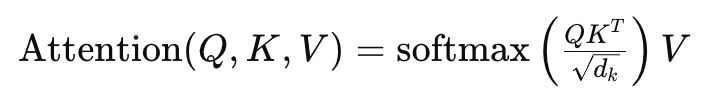

# An Image is Worth 16x16 Words: Transformers for Image Recognition at Scale

## 논문 정보
> - 논문 제목 : An Image is Worth 16x16 Words: Transformers for Image Recognition at Scale
> - 모델 이름 : ViT
> - 발표 연도 : 2021
> - 한줄 요악 : 이미지를 패치로 나눈 후 transformer로 처리하여 cnn 없이도 이미지 분류가 가능한 최초의 순수 transformer 기반의 비전 모델

## ViT 등장 배경
1. 기존에는 cnn이 이미지 처리의 정석이었음
   - ResNet, EfficientNet, DenseNet 등 CNN 계열이 이미지 분류, 검출, 분할 등 모든 비전 분야를 장악하고 있었음
   - CNN은 local feature (ex: edge, texture) 를 잘 잡고, parameter sharing과 translation invariance 등의 장점이 있음
2. cnn의 한계가 존재함
   - 제한된 receptive field : 멀리 떨어진 두 객체 간 관계를 잘 반영 못함
   - 구조적 제약 : conv, pooling 등의 고정된 연산 구조
   - 전역 정보 처리 약함 : attention처럼 long-range dependency 학습 어려움
3. nlp에서는 transformer가 혁신을 일으킴
   - 핵심은 self-attention으로 문장 내 단어 간 관계를 자유롭게 모델링 가능

Transformer에 사용되는 Multi-Head Attention 매커니즘의 원리와 작동방식은 무시할 수 없을만큼 매력적이며 이 매커니즘을 Computer Vision에 접목시키려는 노력은 많이 있었다.

Attention 매커니즘을 이미지 내의 전체 픽셀에 적용하려고도 하였고, 이웃한 local에 대해 적용하려고도 하는 등의 여러 방법이 존재했다.

본 논문은 이미지를 여러 패치로 나누어 패치 자체를 단어처럼 보며 CNN에 의존하지 않고 Classification 작업에 적용하였다.

## ViT Architecture

ViT는 기존 Transformer의 Encoder 구조를 사용한다. 따라서, Transformer에 맞는 입력 값을 사용해야한다. 기존 Transformer에서는 시퀀스 데이터를 Embedding 하고, Positional Encoding을 추가해준다. Vision Transformer에서도 동일한 방식을 거친다.

### (1) Linear Projection of Flattened Patches
- Transformer 구조에 맞는 입력값을 넣어야 한다
- Transformer와 동일하게 시퀀스 데이터에 embedding, positional encoding 추가

#### 1. Image Patch 만들기

- 입력 이미지 : (C, H, W) 크기
- 패치 단위로 쪼갬 : (C, P, P) 크기, N : 나뉘어진 패치의 개수
- 각 패치를 flatten 과정을 거쳐 벡터로 만들면 각 벡터의 크기는 $P^2$C가 되고 이 벡터가 N개가 된다. 이 N개의 벡터를 합친 것을 $x_{p}$라고 한다.

#### 2. Patch Embedding

- 앞에서 생성한 $x_{p}$ 를 Embedding 하기 위하여 행렬 $E$와 연산을 한다.  
$E$의 shape은 $(P^2C, D)$ 가 된다.  
$D$는 embedding dimension으로 $P^2C$ 크기의 벡터를 $D$로 변경하겠다는 의미이다.  
- 따라서, $x_{p}$의 shape은 $(N, P^2C)$,  
$E$의 shape은 $(P^2C, D)$ 이므로 곱 연산을 하면 $(N, D)$의 크기를 가지게 된다.  
- 배치 사이즈까지 고려하면 (B, N, D)의 크기를 가지는 텐서가 된다.

#### 3. Class Token

- 임베딩 결과에 클래스를 예측하는 [cls] 토큰을 1개 추가한다
- (N, D) 크기의 행렬이 (N+1, D) 크기가 된다
- 클래스 토큰은 학습 가능한 파라미터를 입력해 주어야 한다
#### 4. Position Embedding
- [cls] 토큰이 추가된 값에 동일한 크기인 (N+1, D) 크기의 위치 임베딩을 더해준다

### (2) Transformer Encoder

- Transformer의 Encoder는 L번 반복하기 위해 입력과 출력의 크기가 같도록 유지한다.
- Vision Transformer에서 사용된 아키텍쳐는 기존의 Transformer Encoder와 조금 다르지만 큰 맥락은 유지한다. 기존의 Transformer Encoder에서는 MSA를 먼저 진행한 다음 LayerNorm을 진행하지만 ViT에서는 순서가 바뀌어 있는 것을 알 수 있다.
- 입력값 $z_{0}$에서 시작하여 L번 반복 시 $z_{L}$이 최종 Encoder의 출력이 된다.

#### 1. Layer Normalization
- 각 feature에 대해 정규화를 수행한다 = D차원 방향에 대해 정규화를 수행한다
- Transformer에서는 BatchNorm 대신 LayerNorm 사용
#### 2. Multihead self-attention
- 입력 토큰 간의 관계를 계산함 (예: 한 패치가 다른 패치와 얼마나 관련 있는지)
- 여러 "Head"로 나누어 다양한 시각으로 attention을 수행함
- 각 Head는 다음 연산을 수행:
    
- 입력 → Query(Q), Key(K), Value(V)로 선형 변환 → self-attention 계산
#### 3. Residual Connection
- Attention 결과에 입력값을 더함 (skip connection) 즉, Output = Attention + Input
- 학습 안정화와 성능 향상을 도와줌
→ 깊은 네트워크에서도 gradient 소실을 막음
#### 4. MLP
- 2개의 완전연결 계층(Fully Connected Layer)과 GELU 활성화 함수(Activation)를 적용한다
> GELU 함수 특징
> - 입력값과 입력값의 누적 정규 분포의 곱을 사용한 형태
> - 활성화 함수의 조건을 만족
>   - 모든 점에서 미분 가능
>   - 단조 증가 함수 아님
### (3) MLP Head
- L번 반복한 Transformer Encoder의 마지막 출력에서 클래스 토큰 부분만 분류 문제에 사용하며, 마지막에 추가적인 MLP를 이용하여 클래스를 분류한다.

## ViT의 장단점
### 장점
1. transformer 구조를 거의 그대로 사용하기 때문에 확장성이 좋다. 기존 attention 기반의 모델들은 이론적으로 좋음에도 불구하고 특성화된 attention 패턴 때문에 효과적으로 다른 네트워크에 확장하기가 어려웠다.
2. transformer가 large scale 학습에 우수한 성능이 있다는 것이 검증되었기 때문에 이와 같은 효과를 그대로 얻을 수 있다.
3. transfer learning 시, cnn 보다 학습에 더 적은 계산 리소스를 사용한다.
### 단점
1. Inductive bias 의 부족으로 인해 CNN보다 데이터가 많이 요구된다.
> Inductive bias란 모델이 처음 보는 입력에 대한 출력을 예측하기 위하여 사용하는 추가적인 가정
   - transformer 모델은 attention 구조만을 사용한다. attention은 cnn과 같이 local receptive field를 보는 것이 아니라, 데이터 전체를 보고 attention할 위치를 정하는 매커니즘이기 때문에 이 패턴을 익히기 위해서 cnn보다 더 많은 데이터를 필요로 하게 된다

## Conclusion
- image recognition 분야에 Transformer를 직접적으로 적용한 첫 사례
- 간단하면서 높은 확장성을 가진 Transformer 구조를 성공적으로 Image Recognition에 적용
- 이미지에 특정된 inductive bias를 아키텍처에 주입하지 않음 (이미지 패치 추출 부분 제외)
  - 모델 학습 과정 전체적으로 이미지를 NLP에서 사용되던 것처럼 패치 시퀀스로 다룸
  - inductive bias가 약하기 때문에 보다 general-purpose의 architecture라고 할 수 있음. (one-for-all)
- 큰 사이즈의 데이터셋에서 사전 학습한 후에 기존의 CNN 기반 baseline보다 더 좋은 성능. 추가적으로, 사전학습이 그리 어렵지 않다는 점.