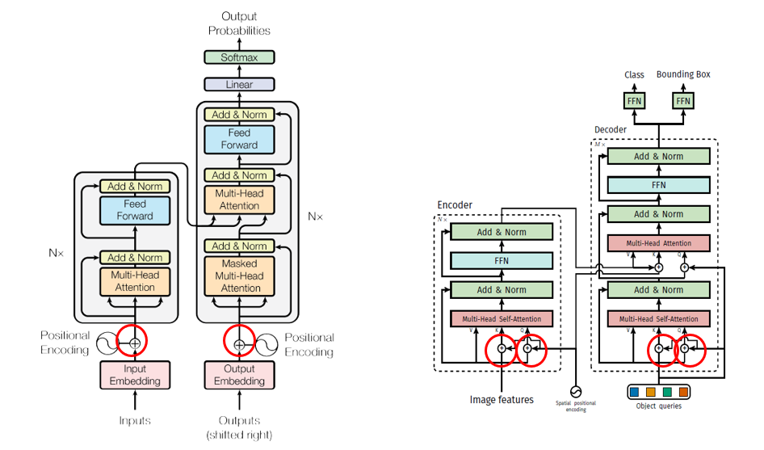

# Transformer 기반 Object Detection Models
> [등장 배경]
> - CNN 기반의 한계
>   - 고정된 receptive field -> global context 부족
>   - anchor 기반 방식의 복잡성
>   - multi-scale feature에 대한 의존성
>
> [Transformer의 장점]
> - global self-attention으로 context-aware detection 가능
> - anchor-free 방식과 잘 맞음
> - end-to-end 학습으로 pipiline 단순화

## DETR(2020)
### 논문 정보
> - 논문 제목 : End-to-End Object Detection with Transformers (Facebook AI)
> - 모델 이름 : DETR
> - 발표 연도 : 2020(ECCV)
> - 한줄 요약 : cnn + transformer 로 end-to-end object detection을 최초로 구현한 모델. DETR are a set-based global loss that forces unique predictions via bi-partite matching and a transformer encoder-decoder architecture.

### Network Architecture 
DETR은 cnn backbone + transformer + FFN으로 구성되어 있다.

#### 1. CNN backbone
input image를 cnn backbone에 통과시켜 feature map을 뽑아낸다. 이 역할은 ResNet과 같은 CNN 모델이 수행한다. 일반적으로 Resnet-50 이나 Resnet-101 과 같은 네트워크가 사용된다.
추출된 feature map은 이후 flatten되어 Transformer Encoder에 전달된다. 여기서 각 위치의 feature vector는 포지셔널 인코딩이 추가된 후 입력으로 사용된다. 포지셔널 인코딩은 CNN의 위치 정보를 보완해주기 위해 반드시 필요하다.

1. input image 크기는 h_0 x w_0
2. cnn을 통과하여 출력된 feature map은 C x H x W (ResNet50은 C=2048, H = h_0 / 32, W = w_0/32)
3. 1x1 convolution을 적용하여 d x H x W 형태로 바꿈 (C>d)
4. transformer에 들어가기 위해서는 2차원이어야 하므로, d x H x W 3차원에서 d x HW 2차원으로 구조를 바꿈

#### 2. Transformer

1. Encoder
- (파란색 박스) d x HW의 feature matrix에 positional encoding 정보를 더한 matrix를 multi-head self-attention에 통과시킨다.
- transformer의 특성 상 입력 matrix와 출력 matrix의 크기는 동일하다

2. Decoder
- (분홍색 박스) n개의 bouding box에 대해 n개의 Object query를 생성한다. 초기 object query는 0으로 설정되어 있다. 
- (보라색 박스) decoder는 앞에 설명한 n개의 object query를 입력받아 Multi-head self-attentiond을 거쳐 가공된 n개의 unit을 출력한다
- (노란색 박스) 이 n개의 unit들이 query로 그리고 encoder의 출력 unit들이 key와 value로 작동하여 encoder-decoder multi-head attention을 수행한다
- (초록색 박스) 최종적으로 n개의 Unit들은 각각 ffn을 거쳐 object class와 정보를 출력한다

#### 3. FFN (Feed Forward Network)
transformer의 결과로 나온 n개의 Unit은 FFN을 통과하여 class와 bounding box의 크기와 위치를 동시에 예측한다. 이때 bi-partite matching을 통해 각 bounding box가 겹치지 않도록 한다

### Original Transformer vs DETR Transformer
1. positional encoding 하는 위치가 다르다.
- CNN Backbone으로 뽑아낸 feature matrix d×HW에는 위치 정보가 소실되어있다. 기존의 Transformer도 이와 같은 문제점을 해결하기 위해 Positional encoding을 더해주었다. DETR도 마찬가지로 Positional encoding을 더해주는데 위치가 살짝 다르다.

2. Autoregression이 아닌 Parallel 방식으로 output을 출력한다.
- 기존 transformer는 단어 한 개씩 순차적으로 출력값을 내놓는다. autoregression은 현재 output값을 출력하기 위해 이전 단계까지 출력한 output값을 참고하는 방식이다. 반면 DETR에서 사용한 transformer는 paralle 방식으로, 즉 모든 Output값을 통채로 출력하는 방식이다.

### Main idea
#### 1. Object Query

#### 2. Bipartite Matching (Hungarian Algorithm)

#### 3. Set-based Loss Function
