# Transformer 기반 Object Detection Models
> [등장 배경]
> - CNN 기반의 한계
>   - 고정된 receptive field -> global context 부족
>   - anchor 기반 방식의 복잡성
>       - 하나의 gt에 대하여 여러개의 bbox가 있음
>   - multi-scale feature에 대한 의존성
>
> [Transformer의 장점]
> - global self-attention으로 context-aware detection 가능
> - anchor-free 방식과 잘 맞음
> - end-to-end 학습으로 pipiline 단순화

## Transformer 핵심
| 구분 | Self-Attention | Cross-Attention |
|------|----------------|----------------|
| **Q, K, V의 출처** | 모두 **같은 feature set** | Q는 **다른 source**, K/V는 **다른 feature set** |
| **목적** | 같은 feature들 간의 **내적 관계 학습 (context understanding)** | 한 feature set이 **다른 feature set을 참조 (정보 결합)** |
| **예시 (DETR 기준)** | Encoder에서 **Feature Map 내부의 관계**를 학습 | Decoder에서 **Object Query가 Encoder Feature를 참조** |
| **비유** | “내 생각 안에서 관계를 정리” | “다른 사람의 생각(정보)을 참고” |
- **Encoder의 Self-Attention**  
  → 이미지의 모든 픽셀(또는 patch)이 **서로의 관계를 학습**해서 전역 정보를 얻음.  
  *(예: 고양이 귀와 몸통이 서로 관련 있음을 학습)*  

- **Decoder의 Cross-Attention**  
  → 각 **Object Query**가 Encoder의 Feature Map에서 **관련된 영역의 정보만 집중적으로 가져옴**  
  *(예: “고양이” query는 고양이 영역에 주로 집중)*

## DETR(2020)
### 논문 정보
> - 논문 제목 : End-to-End Object Detection with Transformers (Facebook AI)
> - 모델 이름 : DETR
> - 발표 연도 : 2020(ECCV)
> - 한줄 요약 : cnn + transformer 로 end-to-end object detection을 최초로 구현한 모델. DETR are a set-based global loss that forces unique predictions via bi-partite matching and a transformer encoder-decoder architecture.

### Network Architecture 
DETR은 cnn backbone + transformer + FFN으로 구성되어 있다.
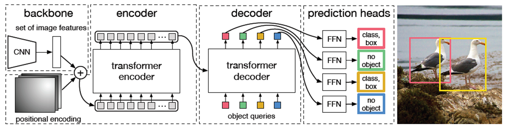

#### 1. CNN backbone
input image를 cnn backbone에 통과시켜 feature map을 뽑아낸다. 이 역할은 ResNet과 같은 CNN 모델이 수행한다. 일반적으로 Resnet-50 이나 Resnet-101 과 같은 네트워크가 사용된다.
추출된 feature map은 이후 flatten되어 Transformer Encoder에 전달된다. 여기서 각 위치의 feature vector는 포지셔널 인코딩이 추가된 후 입력으로 사용된다. 포지셔널 인코딩은 CNN의 위치 정보를 보완해주기 위해 반드시 필요하다.

1. input image 크기는 h_0 x w_0
2. cnn을 통과하여 출력된 feature map은 C x H x W (ResNet50은 C=2048, H = h_0 / 32, W = w_0/32)
3. 1x1 convolution을 적용하여 d x H x W 형태로 바꿈 (C>d)
4. transformer에 들어가기 위해서는 2차원이어야 하므로, d x H x W 3차원에서 d x HW 2차원으로 구조를 바꿈

#### 2. Transformer
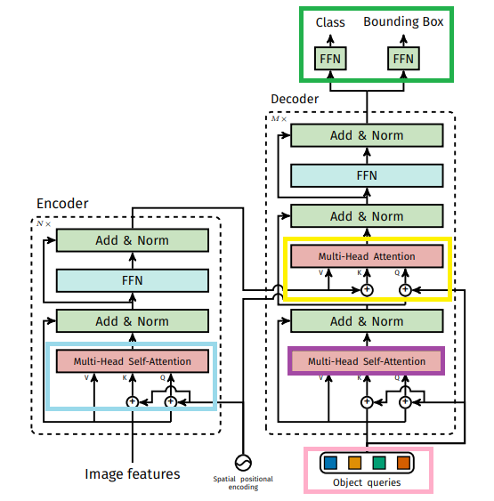

1. Encoder
- (파란색 박스) d x HW의 feature matrix에 positional encoding 정보를 더한 matrix를 multi-head self-attention에 통과시킨다.
- transformer의 특성 상 입력 matrix와 출력 matrix의 크기는 동일하다

2. Decoder
- (분홍색 박스) n개의 bouding box에 대해 n개의 Object query를 생성한다. 초기 object query는 0으로 설정되어 있다. 
- (보라색 박스) decoder는 앞에 설명한 n개의 object query를 입력받아 Multi-head self-attentiond을 거쳐 가공된 n개의 unit을 출력한다
- (노란색 박스) 이 n개의 unit들이 query로 그리고 encoder의 출력 unit들이 key와 value로 작동하여 encoder-decoder multi-head attention을 수행한다
- (초록색 박스) 최종적으로 n개의 Unit들은 각각 ffn을 거쳐 object class와 정보를 출력한다

#### 3. FFN (Feed Forward Network)
transformer의 결과로 나온 n개의 Unit은 FFN을 통과하여 class와 bounding box의 크기와 위치를 동시에 예측한다. 이때 bi-partite matching을 통해 각 bounding box가 겹치지 않도록 한다

### Original Transformer vs DETR Transformer
1. positional encoding 하는 위치가 다르다.
- CNN Backbone으로 뽑아낸 feature matrix d×HW에는 위치 정보가 소실되어있다. 기존의 Transformer도 이와 같은 문제점을 해결하기 위해 Positional encoding을 더해주었다. DETR도 마찬가지로 Positional encoding을 더해주는데 위치가 살짝 다르다.

2. Autoregression이 아닌 Parallel 방식으로 output을 출력한다.
- 기존 transformer는 단어 한 개씩 순차적으로 출력값을 내놓는다. autoregression은 현재 output값을 출력하기 위해 이전 단계까지 출력한 output값을 참고하는 방식이다. 반면 DETR에서 사용한 transformer는 paralle 방식으로, 즉 모든 Output값을 통채로 출력하는 방식이다.

### Main idea
#### 1. Object Query
Object query는 DETR만의 독특한 구성 요소다.
- 각 쿼리는 하나의 객체를 예측하기 위한 학습 가능한 벡터다
- cnn backbone에서 추출한 feature map을 transformer encoder가 처리하고, decoder는 고정 개수(n개) object query를 입력받아 각 query가 하나의 objcet 후보를 예측하도록 한다.
- 쿼리는 transformer 디코더에 입력되며, 이미지의 feature들과 상호 작용하며 관련된 객체 정보를 뽑아낸다

즉, object query는 "이 쿼리는 이미지 속의 어떤 객체를 예측해줘" 라는 요청 역할을 수행하는 셈이다. 이 개수는 고정되어 있고, 학습을 통해 쿼리마다 특정 유형의 객체를 탐지하도록 자연스럽게 분화된다. query는 학습 가능한 embedding이므로, 네트워크가 어떤 물체를 찾을지 "자율적으로" 학습하게 된다.

#### 2. Bipartite Matching (Hungarian Algorithm)
DETR에서는 디코더가 고정된 수의 오브젝트 쿼리(Object Queries)를 입력받아, 각 쿼리에 대해 객체의 클래스와 바운딩 박스를 예측한다. 예를 들어, 100개의 쿼리를 사용하는 경우라면 매 예측 시점마다 100개의 객체 후보가 생성된다. 하지만 실제 이미지에는 객체가 5개만 있을 수도 있고, 12개일 수도 있다. 즉, 예측 결과와 실제 정답의 수가 다르며, 순서도 전혀 일치하지 않는다. 이처럼 예측된 값과 실제 값의 수가 다르고 일대일 대응이 불분명한 상황에서, 각 예측값이 어떤 실제 객체를 예측하려 한 것인지 매칭해주는 과정이 필요하다.

이를 위해 DETR은 헝가리안 알고리즘을 사용한다. 헝가리안 알고리즘은 예측값과 정답 간의 매칭 비용(Matching Cost)을 최소화하는 방식으로, 가장 효율적인 1:1 매칭을 찾아주는 최적화 알고리즘이다.

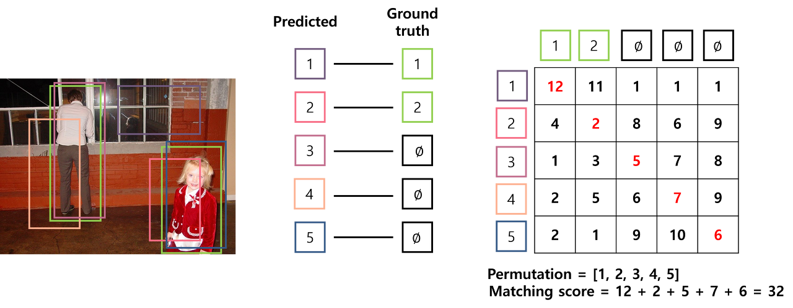
위 예시에서는 두 사람을 detection할 때, 예측된 bbox를 gt와 매칭시키는 문제이다. 이 때 각 예측된 bbox를 gt에 매칭시킬 경우의 모든 cost는 오른쪽 행렬과 같다. 가운데 그림처럼 1대 1 대응이 될 경우의 총 cost는 32이다.

하지만 위 가운데 그림처럼 1대 1 대응이 된다면 총 cost는 12가 된다. 헝가리안 알고리즘은 이렇게 cost에 대한 행렬을 입력 받아 matching cost가 최소인 permutation을 출력한다. 

[헝가리안 매칭의 장점]
- 후처리 필요 없음 : 전통적인 객체 검출 모델과 달리, nms (중복 박스 제거 방법) 같은 후처리 과정이 필요 없다
- 단순한 구조 : 앵커 박스가 필요 없기 때문에 모델 구조가 훨씬 간결해진다
- 일관된 학습 가능 : 각 예측에 대해 정답과의 매칭이 명확히 정의되므로, 학습 과정이 안정적이고 일관된다
- 다대다 예측 -> 1:1 매칭으로 : 고정된 수의 쿼리에서 다수의 예측을 하되, 실제 객체와는 정확한 1:1 대응을 찾기 때문에 불필요한 중복 예측이 줄어든다

#### 3. Set-based Loss Function
위의 헝가리안 매칭을 기반으로, 전체 예측 세트를 gt세트와 동일한 크기로 보고 Loss를 정의. 
핵심은 중복 박스가 나오지 않도록 set 단위로 예측을 한다.

Loss 구성
- Classification Loss (예측 class vs. GT class)
- Bounding Box Regression Loss (L1)
- Generalized IoU Loss

### 특징 맟 장단점
- Anchor-free
- Set prediction + bipartite matching loss
- COCO dataset에 대해서 Faster R-CNN baseline 급의 정확도와 런타임 성능을 보여줌
- end-to-end training이 가능
- 아주 간단명료한 구조 + 깔끔한 코드
- Simple but 학습 느리고 작은 물체에 대한 성능이 매주 낮음

---

## Deformable DETR
### 논문 정보
> - 논문 제목 : Deformable DETR: Deformable Transformers for End-to-End Object Detection
> - 모델 이름 : Deformable DETR
> - 발표 연도 : 2020 (arXiv, MSRA / Microsoft Research Asia)
> - 한줄 요약 : 기존 DETR의 느린 수렴 속도와 대규모 데이터 필요 문제를 해결하기 위해 Deformable Attention을 도입하여, multi-scale feature를 효과적으로 활용한 개선된 Transformer 기반 Object Detection 모델

본 논문은 DETR의 후속 연구이다. 기존 DETR은 transformer 구조를 object detection에 도입하면서, cnn으로 구성되는 object detection의 패러다임을 전환하였다. 하지만 기존 DETR은 2가지 제한점이 존재했다.
- 수렴 속도가 너무 느림
- 작은 object에 대한 낮은 성능

DETR을 수렴하려고 학습시키면 적어도 500Epoch정도는 돌아야 한다. 이에 따른 낮은 수렴 속도에 대한 제한점은 DETR 원문에도 작성되어 있다.
그리고 CNN에서도 그랬듯이, 높은 해상도에서 Feature를 추출해야 작은 객체에 대한 Detection 성능이 올라가는데, Transformer 구조상 높은 해상도에서 Attention을 수행하면 계산복잡도와 메모리 사용량이 기하급수적으로 올라간다. 

본 논문에서는 이러한 제한점을 극복하기 위해, Deformable Convolution에 대한 메커니즘을 도입했다. 

### Network Architecture 
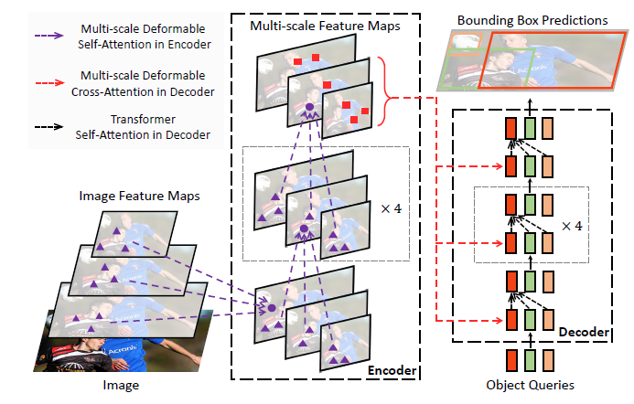
1. backbone network
- DETR과 유사하게 cnn backbone network에 Input image를 넣어 feature map을 뽑아낸다. 
- DETR과 달리 single-scale이 아닌 multi-scale feature map을 사용하게 된다.

2. Encoder
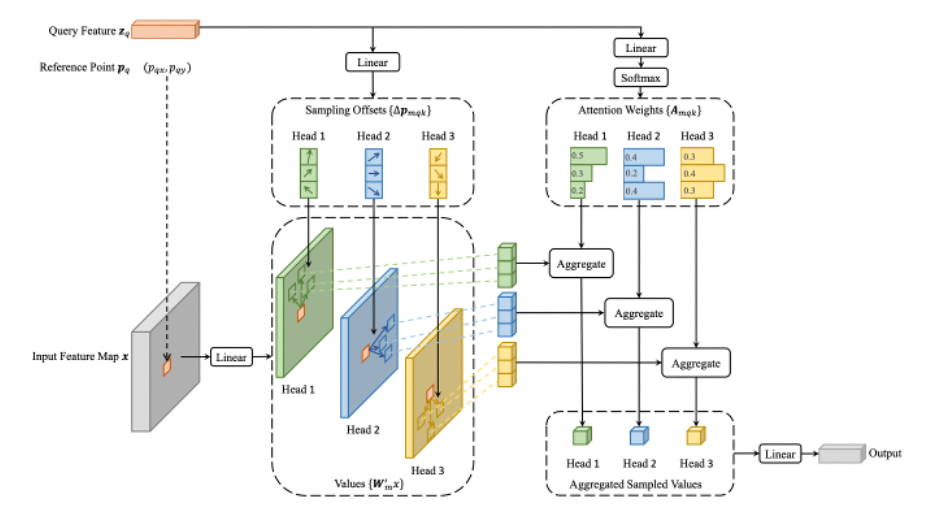
- backbone에서 뽑아낸 multi-scale feature map을 바탕으로 Object가 있음직한 reference point를 예측한다. 
  - reference point : feature 안의 어떠한 한 기준점에서 offset을 얼마나 설정해서 attention을 해야하는지를 결정하는 기준점
  - reference point = input query (=feature map의 모든 pixel)
- 예측된 reference point 근처에서 sampling point를 추출하게 되고, 이 sampling point끼리의 attention weight를 계산한다.
- 계산된 attention weight는 reference point를 개선하는데 사용되며, 다음 layer에서는 개선된 reference point 근처에서 다시 sampling point들을 추출한다. 
- 이후에는 다시 위 task를 반복한다.

    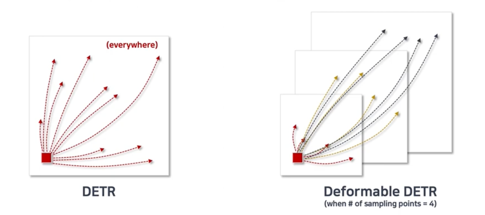
    DETR의 경우 한 위치에서 모든 픽셀에 대해 attention 연산을 수행하는 반면, deformable detr은 한 위치에서 sampling points들에 대해서만 attention 연산을 수행한다. 
    또한 하나의 scale이 아닌, 다른 모든 scale에서의 pixel에 대해서도 attention 연산을 수행하므로 속도와 여러 크기의 물체에 대해서 DETR보다 성능이 좋다.

3. Decoder
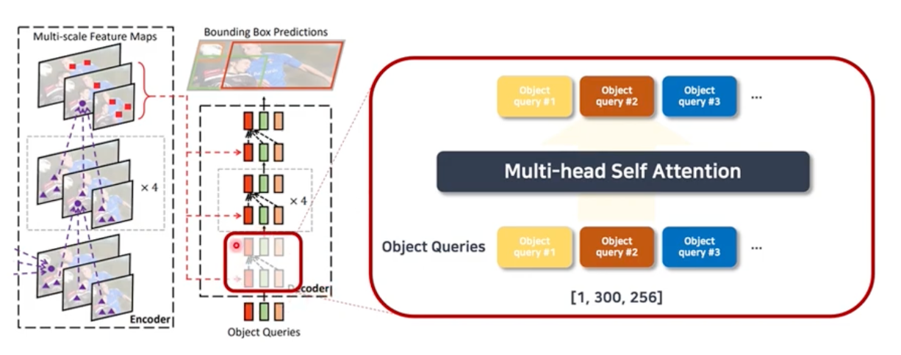
- decoder의 경우, self attention부분과 cross attention하는 부분이 존재한다.
- self attention은 decoder의 Input인 object query들을 multi-head attention 하여 최적의 매칭을 찾는다.
- cross attetion은 object query들을 Linear layer에 통과시켜 reference points들을 추출하고 각 reference point에서 sampling points를 뽑아 인코더와 동일한 방식으로 value를 계산한다.

### Main idea
#### 1. Deformable Attention
기존 DETR의 문제점은 attention이 너무 global하고 dense하다는 것이다. 즉, 모든 query가 이미지 전체의 모든 위치에 attention을 계산해서 (1) 연산량이 매우 많고 (2) 수렴 속도가 매우 느림 의 문제가 있었다. 그래서 도입된 deformable attention은 각 query가 전체 Feature map을 보지 않고 관심 있어 할 법한 위치 몇 개만 보고 집중하게 했다.

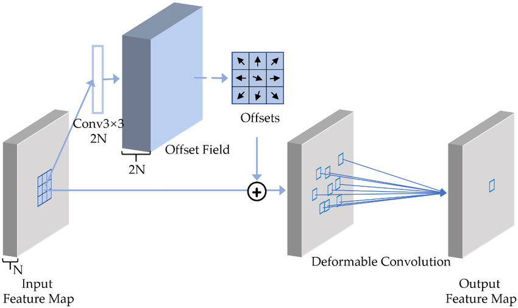
Deformable에 대해 설명을 간단하게 하자면 다음과 같다
- 커널 자체를 convolution으로 학습시켜, offsets(커널의 각 cell이 이동할 위치)을 구한다
- 커널에 이 offsets을 더해 새로운 커널을 탄생시킨다
  - 이 새로운 커널들은 기존 커널과 같이 정수의 좌표가 아닌 소수의 좌표!

이렇게 변형된 convolution에서 features 값을 추출하는 것이 deformable convolution이다.

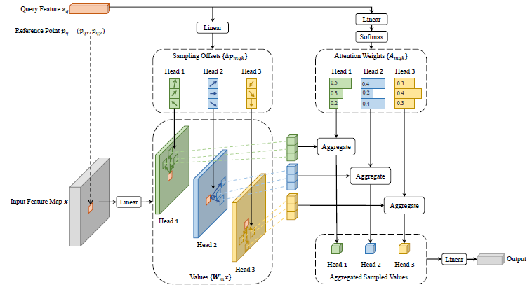
이 논문의 핵심인 deformable attention을 single-scale에서 어떻게 이루어지는지 보면 위와 같은 구조가 나온다. 이 구조에서 attention score를 구하는 절차는 아래와 같다.
- Input Feature Map x의 한 픽셀에 출력 차원이 3MK인 Linear Layer를 적용하여 Query Feature z_q를 출력하고 (M: Multi-Head의 수, K: Keys의 수), 2MK, MK를 각각 분할해서 적용
  - 2MK는 keys에 대한 offsets로 활용. 이 offsets은 정수가 아닌 소수
  - MK에 K를 기준으로 softmax를 취한 값이 attention weights (A_mqk) 이고 시그마 A_map = 1
- input feature map x에 linear layer를 적용하여 values를 출력

위에서 위에서 Attention Weight와 Query, Key, Value에 대한 정보가 다 있으니 이제 아래 수식으로 Attention Score를 구한다. 
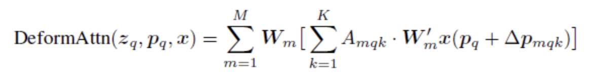

본 논문은 Multi-Scale Feature maps에 대해 Deformable Attention을 진행하였기 때문에, 위 Single-Scale를 Multi-Scale로 확장해 준다. 그럼 아래와 같은 식이 나온다.
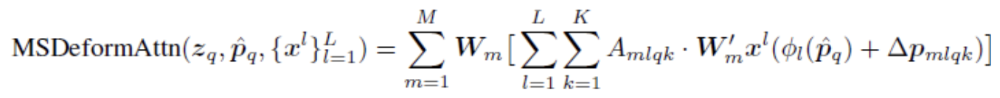
추가된 것은 각 scale feature map에서 Level인 l만 추가 되었다.

#### 2. Multi-Scale Feature Representation
문제의 배경은 다음과 같다. 객체는 크기가 다양한데 cnn에서 레이어가 깊어질수록 저해상도는 global하고 semantic-rich한 정보를 담고 고해상도는 local하고 detail-rich한 정보를 담게 된다. 이 정보를 한 번에 다루는게 핵심인데 multi-scale feature는 여러 해상도의 feature map을 동시에 사용하여 큰 물체와 작은 물체를 모두 잘 탐지하도록 한다.

구현방식은 아래와 같다.

(1) FPN (Feature Pyramid Network, 2017)
- CNN 백본의 여러 층의 feature를 결합 (bottom-up + top-down)
- 각 scale에서 작은/큰 객체 탐지 가능
- SSD, Faster R-CNN, YOLO 등에서도 기본 구조로 채택됨

(2) Deformable DETR의 Multi-Scale Attention
- FPN에서 나온 feature pyramid (예: 1/8, 1/16, 1/32)를 Transformer Encoder로 전달
- Deformable Attention이 여러 스케일 feature map에서 sampling
- Query는 여러 스케일의 정보를 동시에 활용

작동원리는
1. backbone(cnn or resnet)에서 multi-level feature 추출
2. 각 feature map을 transformer encoder 입력으로 전달
3. deformable attention이 모든 scale을 동시에 참고

### 특징 및 장단점
- 학습 속도 개선 : 기존 DETR보다 10배 빠른 수렴
- 소규모 데이터에서도 학습 가능
- 소형 객체 탐지 성능 향상
- end-to-end 학습 유지
- sparse attention이라고 해도 여전히 transformer 기반이라 연산량이 크다
- Anchor-like sampling 위치를 학습해야 하므로 모델이 완전히 anchor-free라고 보기는 어려움

---