# Transformer 기반 Object Detection Models
> [등장 배경]
> - CNN 기반의 한계
>   - 고정된 receptive field -> global context 부족
>   - anchor 기반 방식의 복잡성
>       - 하나의 gt에 대하여 여러개의 bbox가 있음
>   - multi-scale feature에 대한 의존성
>
> [Transformer의 장점]
> - global self-attention으로 context-aware detection 가능
> - anchor-free 방식과 잘 맞음
> - end-to-end 학습으로 pipiline 단순화

## Transformer 핵심
| 구분 | Self-Attention | Cross-Attention |
|------|----------------|----------------|
| **Q, K, V의 출처** | 모두 **같은 feature set** | Q는 **다른 source**, K/V는 **다른 feature set** |
| **목적** | 같은 feature들 간의 **내적 관계 학습 (context understanding)** | 한 feature set이 **다른 feature set을 참조 (정보 결합)** |
| **예시 (DETR 기준)** | Encoder에서 **Feature Map 내부의 관계**를 학습 | Decoder에서 **Object Query가 Encoder Feature를 참조** |
| **비유** | “내 생각 안에서 관계를 정리” | “다른 사람의 생각(정보)을 참고” |
- **Encoder의 Self-Attention**  
  → 이미지의 모든 픽셀(또는 patch)이 **서로의 관계를 학습**해서 전역 정보를 얻음.  
  *(예: 고양이 귀와 몸통이 서로 관련 있음을 학습)*  

- **Decoder의 Cross-Attention**  
  → 각 **Object Query**가 Encoder의 Feature Map에서 **관련된 영역의 정보만 집중적으로 가져옴**  
  *(예: “고양이” query는 고양이 영역에 주로 집중)*

## DETR(2020)
### 논문 정보
> - 논문 제목 : End-to-End Object Detection with Transformers (Facebook AI)
> - 모델 이름 : DETR
> - 발표 연도 : 2020(ECCV)
> - 한줄 요약 : cnn + transformer 로 end-to-end object detection을 최초로 구현한 모델. DETR are a set-based global loss that forces unique predictions via bi-partite matching and a transformer encoder-decoder architecture.

### Network Architecture 
DETR은 cnn backbone + transformer + FFN으로 구성되어 있다.
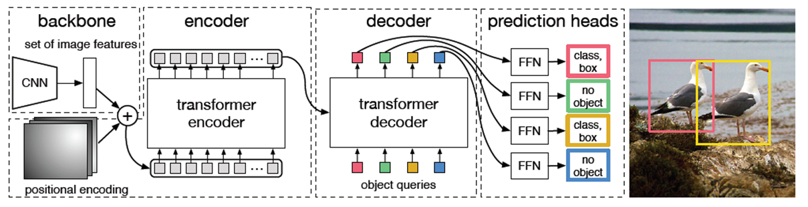

#### 1. CNN backbone
input image를 cnn backbone에 통과시켜 feature map을 뽑아낸다. 이 역할은 ResNet과 같은 CNN 모델이 수행한다. 일반적으로 Resnet-50 이나 Resnet-101 과 같은 네트워크가 사용된다.
추출된 feature map은 이후 flatten되어 Transformer Encoder에 전달된다. 여기서 각 위치의 feature vector는 포지셔널 인코딩이 추가된 후 입력으로 사용된다. 포지셔널 인코딩은 CNN의 위치 정보를 보완해주기 위해 반드시 필요하다.

1. input image 크기는 h_0 x w_0
2. cnn을 통과하여 출력된 feature map은 C x H x W (ResNet50은 C=2048, H = h_0 / 32, W = w_0/32)
3. 1x1 convolution을 적용하여 d x H x W 형태로 바꿈 (C>d)
4. transformer에 들어가기 위해서는 2차원이어야 하므로, d x H x W 3차원에서 d x HW 2차원으로 구조를 바꿈

#### 2. Transformer
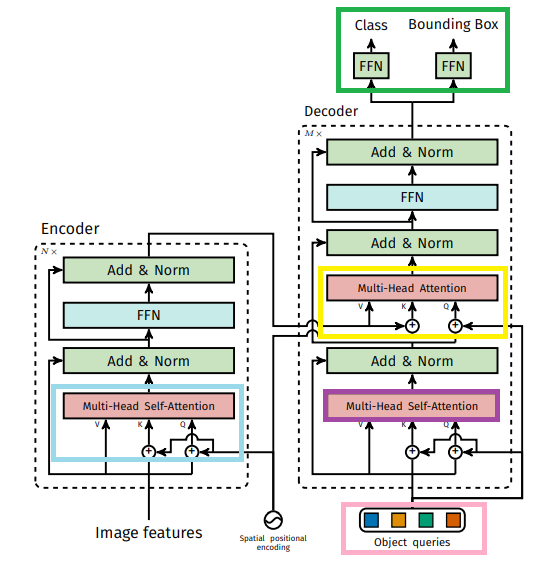

1. Encoder
- (파란색 박스) d x HW의 feature matrix에 positional encoding 정보를 더한 matrix를 multi-head self-attention에 통과시킨다.
- transformer의 특성 상 입력 matrix와 출력 matrix의 크기는 동일하다

2. Decoder
- (분홍색 박스) n개의 bouding box에 대해 n개의 Object query를 생성한다. 초기 object query는 0으로 설정되어 있다. 
- (보라색 박스) decoder는 앞에 설명한 n개의 object query를 입력받아 Multi-head self-attentiond을 거쳐 가공된 n개의 unit을 출력한다
- (노란색 박스) 이 n개의 unit들이 query로 그리고 encoder의 출력 unit들이 key와 value로 작동하여 encoder-decoder multi-head attention을 수행한다
- (초록색 박스) 최종적으로 n개의 Unit들은 각각 ffn을 거쳐 object class와 정보를 출력한다

#### 3. FFN (Feed Forward Network)
transformer의 결과로 나온 n개의 Unit은 FFN을 통과하여 class와 bounding box의 크기와 위치를 동시에 예측한다. 이때 bi-partite matching을 통해 각 bounding box가 겹치지 않도록 한다

### Original Transformer vs DETR Transformer
1. positional encoding 하는 위치가 다르다.
- CNN Backbone으로 뽑아낸 feature matrix d×HW에는 위치 정보가 소실되어있다. 기존의 Transformer도 이와 같은 문제점을 해결하기 위해 Positional encoding을 더해주었다. DETR도 마찬가지로 Positional encoding을 더해주는데 위치가 살짝 다르다.
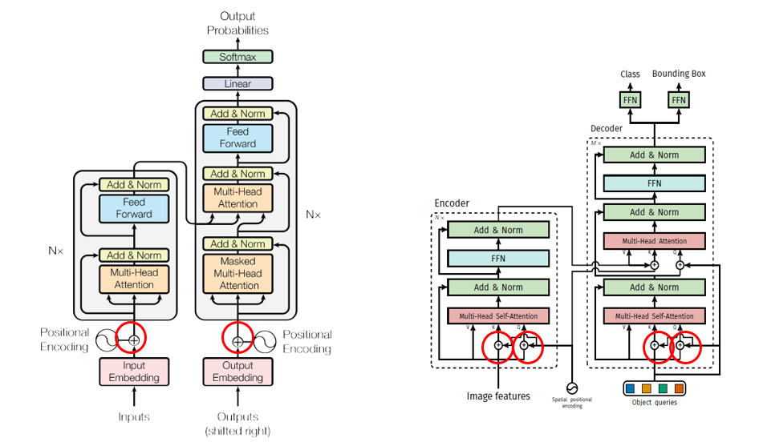
2. Autoregression이 아닌 Parallel 방식으로 output을 출력한다.
- 기존 transformer는 단어 한 개씩 순차적으로 출력값을 내놓는다. autoregression은 현재 output값을 출력하기 위해 이전 단계까지 출력한 output값을 참고하는 방식이다. 반면 DETR에서 사용한 transformer는 paralle 방식으로, 즉 모든 Output값을 통채로 출력하는 방식이다.

### Main idea
#### 1. Object Query
Object query는 DETR만의 독특한 구성 요소다.
- 각 쿼리는 하나의 객체를 예측하기 위한 학습 가능한 벡터다
- cnn backbone에서 추출한 feature map을 transformer encoder가 처리하고, decoder는 고정 개수(n개) object query를 입력받아 각 query가 하나의 objcet 후보를 예측하도록 한다.
- 쿼리는 transformer 디코더에 입력되며, 이미지의 feature들과 상호 작용하며 관련된 객체 정보를 뽑아낸다

즉, object query는 "이 쿼리는 이미지 속의 어떤 객체를 예측해줘" 라는 요청 역할을 수행하는 셈이다. 이 개수는 고정되어 있고, 학습을 통해 쿼리마다 특정 유형의 객체를 탐지하도록 자연스럽게 분화된다. query는 학습 가능한 embedding이므로, 네트워크가 어떤 물체를 찾을지 "자율적으로" 학습하게 된다.

#### 2. Bipartite Matching (Hungarian Algorithm)
DETR에서는 디코더가 고정된 수의 오브젝트 쿼리(Object Queries)를 입력받아, 각 쿼리에 대해 객체의 클래스와 바운딩 박스를 예측한다. 예를 들어, 100개의 쿼리를 사용하는 경우라면 매 예측 시점마다 100개의 객체 후보가 생성된다. 하지만 실제 이미지에는 객체가 5개만 있을 수도 있고, 12개일 수도 있다. 즉, 예측 결과와 실제 정답의 수가 다르며, 순서도 전혀 일치하지 않는다. 이처럼 예측된 값과 실제 값의 수가 다르고 일대일 대응이 불분명한 상황에서, 각 예측값이 어떤 실제 객체를 예측하려 한 것인지 매칭해주는 과정이 필요하다.

이를 위해 DETR은 헝가리안 알고리즘을 사용한다. 헝가리안 알고리즘은 예측값과 정답 간의 매칭 비용(Matching Cost)을 최소화하는 방식으로, 가장 효율적인 1:1 매칭을 찾아주는 최적화 알고리즘이다.

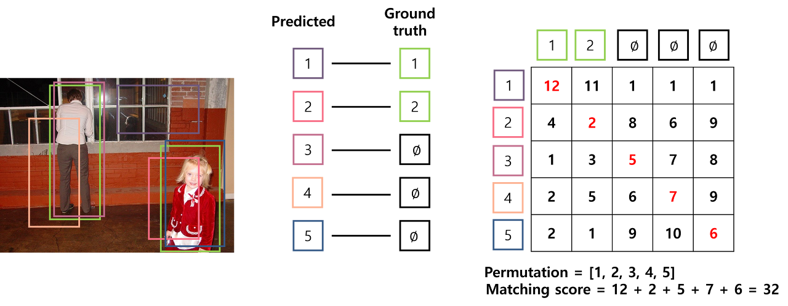
위 예시에서는 두 사람을 detection할 때, 예측된 bbox를 gt와 매칭시키는 문제이다. 이 때 각 예측된 bbox를 gt에 매칭시킬 경우의 모든 cost는 오른쪽 행렬과 같다. 가운데 그림처럼 1대 1 대응이 될 경우의 총 cost는 32이다.

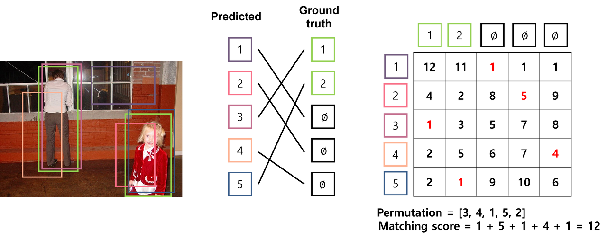
하지만 위 가운데 그림처럼 1대 1 대응이 된다면 총 cost는 12가 된다. 헝가리안 알고리즘은 이렇게 cost에 대한 행렬을 입력 받아 matching cost가 최소인 permutation을 출력한다. 

[헝가리안 매칭의 장점]
- 후처리 필요 없음 : 전통적인 객체 검출 모델과 달리, nms (중복 박스 제거 방법) 같은 후처리 과정이 필요 없다
- 단순한 구조 : 앵커 박스가 필요 없기 때문에 모델 구조가 훨씬 간결해진다
- 일관된 학습 가능 : 각 예측에 대해 정답과의 매칭이 명확히 정의되므로, 학습 과정이 안정적이고 일관된다
- 다대다 예측 -> 1:1 매칭으로 : 고정된 수의 쿼리에서 다수의 예측을 하되, 실제 객체와는 정확한 1:1 대응을 찾기 때문에 불필요한 중복 예측이 줄어든다

#### 3. Set-based Loss Function
위의 헝가리안 매칭을 기반으로, 전체 예측 세트를 gt세트와 동일한 크기로 보고 Loss를 정의. 
핵심은 중복 박스가 나오지 않도록 set 단위로 예측을 한다.

Loss 구성
- Classification Loss (예측 class vs. GT class)
- Bounding Box Regression Loss (L1)
- Generalized IoU Loss

### 특징 맟 장단점
- Anchor-free
- Set prediction + bipartite matching loss
- COCO dataset에 대해서 Faster R-CNN baseline 급의 정확도와 런타임 성능을 보여줌
- end-to-end training이 가능
- 아주 간단명료한 구조 + 깔끔한 코드
- Simple but 학습 느리고 작은 물체에 대한 성능이 매주 낮음

---

## Deformable DETR
### 논문 정보
> - 논문 제목 : Deformable DETR: Deformable Transformers for End-to-End Object Detection
> - 모델 이름 : Deformable DETR
> - 발표 연도 : 2020 (arXiv, MSRA / Microsoft Research Asia)
> - 한줄 요약 : 기존 DETR의 느린 수렴 속도와 대규모 데이터 필요 문제를 해결하기 위해 Deformable Attention을 도입하여, multi-scale feature를 효과적으로 활용한 개선된 Transformer 기반 Object Detection 모델

본 논문은 DETR의 후속 연구이다. 기존 DETR은 transformer 구조를 object detection에 도입하면서, cnn으로 구성되는 object detection의 패러다임을 전환하였다. 하지만 기존 DETR은 2가지 제한점이 존재했다.
- 수렴 속도가 너무 느림
- 작은 object에 대한 낮은 성능

DETR을 수렴하려고 학습시키면 적어도 500Epoch정도는 돌아야 한다. 이에 따른 낮은 수렴 속도에 대한 제한점은 DETR 원문에도 작성되어 있다.
그리고 CNN에서도 그랬듯이, 높은 해상도에서 Feature를 추출해야 작은 객체에 대한 Detection 성능이 올라가는데, Transformer 구조상 높은 해상도에서 Attention을 수행하면 계산복잡도와 메모리 사용량이 기하급수적으로 올라간다. 

본 논문에서는 이러한 제한점을 극복하기 위해, Deformable Convolution에 대한 메커니즘을 도입했다. 

### Network Architecture 
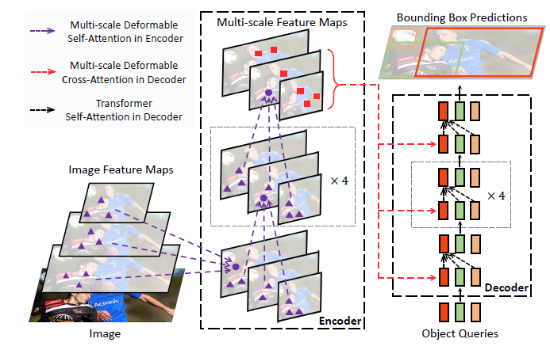
1. backbone network
- DETR과 유사하게 cnn backbone network에 Input image를 넣어 feature map을 뽑아낸다. 
- DETR과 달리 single-scale이 아닌 multi-scale feature map을 사용하게 된다.

2. Encoder
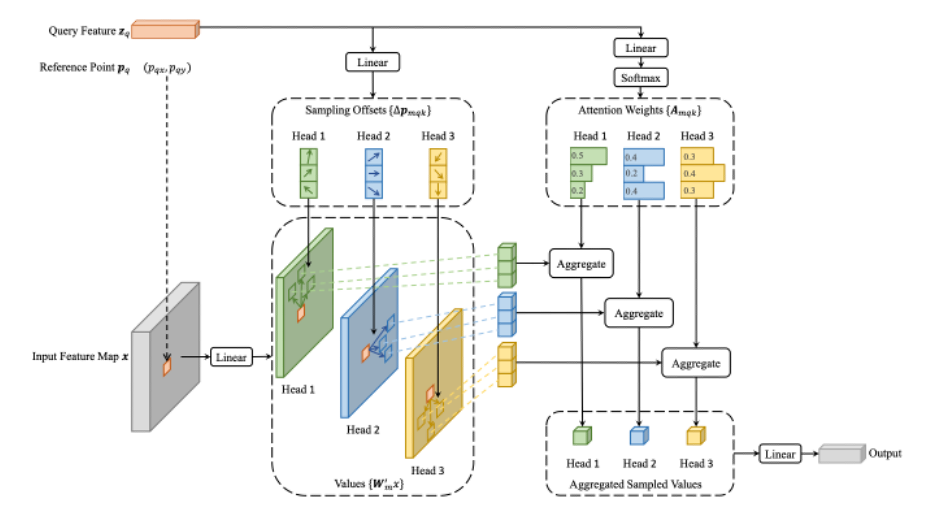
- backbone에서 뽑아낸 multi-scale feature map을 바탕으로 Object가 있음직한 reference point를 예측한다. 
  - reference point : feature 안의 어떠한 한 기준점에서 offset을 얼마나 설정해서 attention을 해야하는지를 결정하는 기준점
  - reference point = input query (=feature map의 모든 pixel)
- 예측된 reference point 근처에서 sampling point를 추출하게 되고, 이 sampling point끼리의 attention weight를 계산한다.
- 계산된 attention weight는 reference point를 개선하는데 사용되며, 다음 layer에서는 개선된 reference point 근처에서 다시 sampling point들을 추출한다. 
- 이후에는 다시 위 task를 반복한다.

    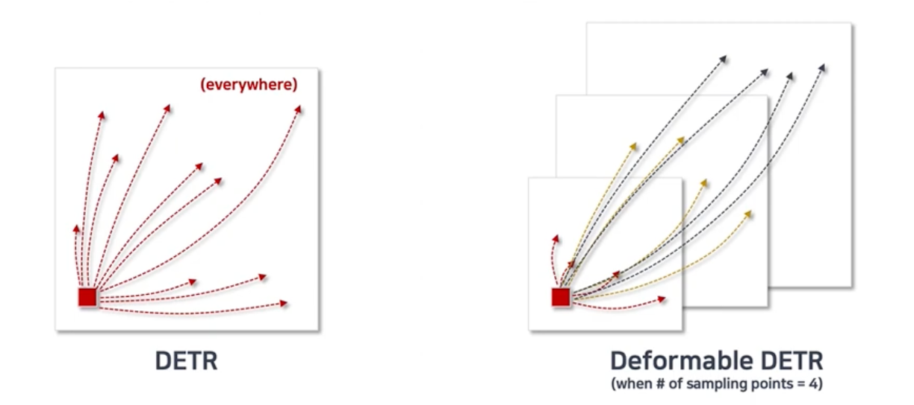
    DETR의 경우 한 위치에서 모든 픽셀에 대해 attention 연산을 수행하는 반면, deformable detr은 한 위치에서 sampling points들에 대해서만 attention 연산을 수행한다. 
    또한 하나의 scale이 아닌, 다른 모든 scale에서의 pixel에 대해서도 attention 연산을 수행하므로 속도와 여러 크기의 물체에 대해서 DETR보다 성능이 좋다.

3. Decoder
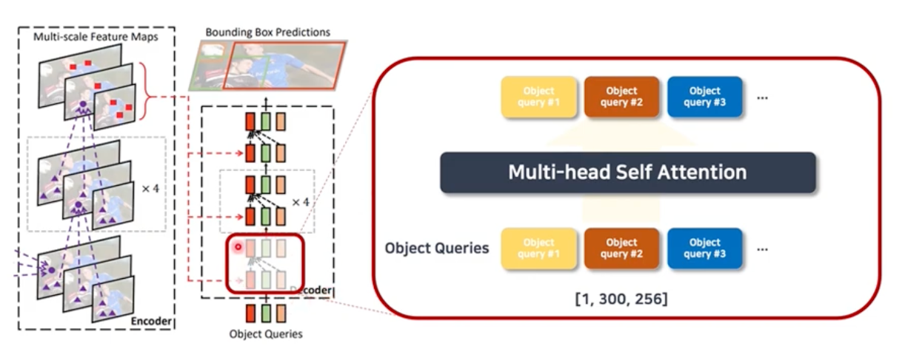
- decoder의 경우, self attention부분과 cross attention하는 부분이 존재한다.
- self attention은 decoder의 Input인 object query들을 multi-head attention 하여 최적의 매칭을 찾는다.
- cross attetion은 object query들을 Linear layer에 통과시켜 reference points들을 추출하고 각 reference point에서 sampling points를 뽑아 인코더와 동일한 방식으로 value를 계산한다.

### Main idea
#### 1. Deformable Attention
기존 DETR의 문제점은 attention이 너무 global하고 dense하다는 것이다. 즉, 모든 query가 이미지 전체의 모든 위치에 attention을 계산해서 (1) 연산량이 매우 많고 (2) 수렴 속도가 매우 느림 의 문제가 있었다. 그래서 도입된 deformable attention은 각 query가 전체 Feature map을 보지 않고 관심 있어 할 법한 위치 몇 개만 보고 집중하게 했다.

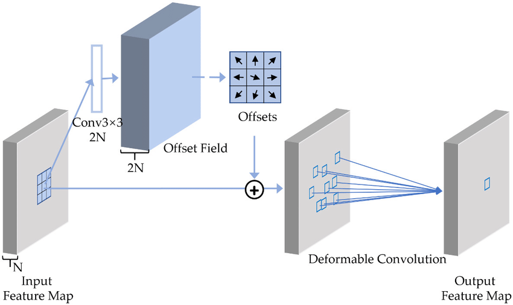
Deformable에 대해 설명을 간단하게 하자면 다음과 같다
- 커널 자체를 convolution으로 학습시켜, offsets(커널의 각 cell이 이동할 위치)을 구한다
- 커널에 이 offsets을 더해 새로운 커널을 탄생시킨다
  - 이 새로운 커널들은 기존 커널과 같이 정수의 좌표가 아닌 소수의 좌표!

이렇게 변형된 convolution에서 features 값을 추출하는 것이 deformable convolution이다.

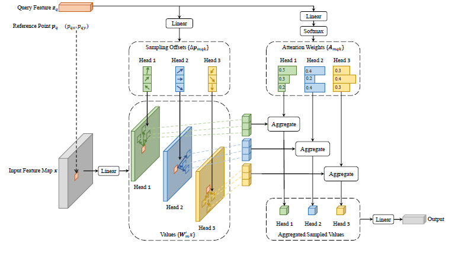
이 논문의 핵심인 deformable attention을 single-scale에서 어떻게 이루어지는지 보면 위와 같은 구조가 나온다. 이 구조에서 attention score를 구하는 절차는 아래와 같다.
- Input Feature Map x의 한 픽셀에 출력 차원이 3MK인 Linear Layer를 적용하여 Query Feature z_q를 출력하고 (M: Multi-Head의 수, K: Keys의 수), 2MK, MK를 각각 분할해서 적용
  - 2MK는 keys에 대한 offsets로 활용. 이 offsets은 정수가 아닌 소수
  - MK에 K를 기준으로 softmax를 취한 값이 attention weights (A_mqk) 이고 시그마 A_map = 1
- input feature map x에 linear layer를 적용하여 values를 출력

위에서 위에서 Attention Weight와 Query, Key, Value에 대한 정보가 다 있으니 이제 아래 수식으로 Attention Score를 구한다. 
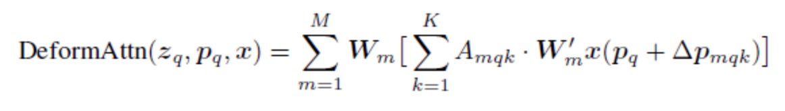

본 논문은 Multi-Scale Feature maps에 대해 Deformable Attention을 진행하였기 때문에, 위 Single-Scale를 Multi-Scale로 확장해 준다. 그럼 아래와 같은 식이 나온다.
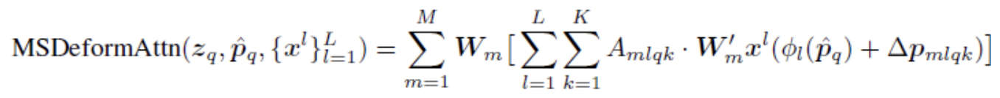
추가된 것은 각 scale feature map에서 Level인 l만 추가 되었다.

#### 2. Multi-Scale Feature Representation
문제의 배경은 다음과 같다. 객체는 크기가 다양한데 cnn에서 레이어가 깊어질수록 저해상도는 global하고 semantic-rich한 정보를 담고 고해상도는 local하고 detail-rich한 정보를 담게 된다. 이 정보를 한 번에 다루는게 핵심인데 multi-scale feature는 여러 해상도의 feature map을 동시에 사용하여 큰 물체와 작은 물체를 모두 잘 탐지하도록 한다.

구현방식은 아래와 같다.

(1) FPN (Feature Pyramid Network, 2017)
- CNN 백본의 여러 층의 feature를 결합 (bottom-up + top-down)
- 각 scale에서 작은/큰 객체 탐지 가능
- SSD, Faster R-CNN, YOLO 등에서도 기본 구조로 채택됨

(2) Deformable DETR의 Multi-Scale Attention
- FPN에서 나온 feature pyramid (예: 1/8, 1/16, 1/32)를 Transformer Encoder로 전달
- Deformable Attention이 여러 스케일 feature map에서 sampling
- Query는 여러 스케일의 정보를 동시에 활용

작동원리는
1. backbone(cnn or resnet)에서 multi-level feature 추출
2. 각 feature map을 transformer encoder 입력으로 전달
3. deformable attention이 모든 scale을 동시에 참고

### 특징 및 장단점
- 학습 속도 개선 : 기존 DETR보다 10배 빠른 수렴
- 소규모 데이터에서도 학습 가능
- 소형 객체 탐지 성능 향상
- end-to-end 학습 유지
- sparse attention이라고 해도 여전히 transformer 기반이라 연산량이 크다
- Anchor-like sampling 위치를 학습해야 하므로 모델이 완전히 anchor-free라고 보기는 어려움

---

## DINO
### 논문 정보
> - 논문 제목 : DINO: DETR with Improved DeNoising Anchor Boxes for End-to-End Object Detection
> - 모델 이름 : DINO
> - 발표 연도 : 2022
> - 한줄 요약 : denoising + contrastive-like 학습으로 DETR의 수렴 속도와 성능을 동시에 끌어올린 모델

DETR은 학습 속도가 느리고, 학습이 수렴할 때 많은 epoch가 필요하다는 문제가 있었다. 또한 DETR이 생성한 bounding box 안에서 찾으려는 객체가 없을 때 혹은 객체가 겹쳐 있을 때, 인지가 제대로 되지 않는다는 문제점이 있었다. DINO는 DETR의 구조를 유지한 채, 학습 안정성과 수렴 속도, 성능을 모두 향상시키기 위해서 다음 3가지 기법을 사용하였다.

### Network Architecture
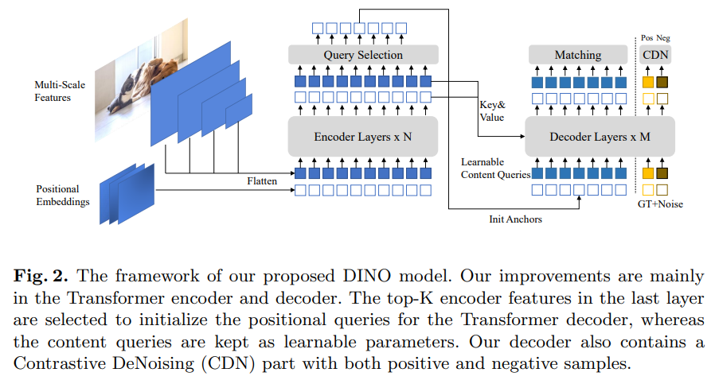
1. 이미지가 주어지면, ResNet이나 Swin Transformer와 같은 백본을 사용하여 다중 스케일 특징을 추출한 후, 이를 해당 positional embeddings과 함께 Transformer 인코더에 입력
2. mixed query selection strategy
   1. 디코더의 positional query로 앵커를 초기화하기 위해
   2. content query를 초기화하지 않고, 학습 가능하게 남겨둠
3. Deformable Attention
   1. 인코더 출력의 특징을 결합하고 query를 층별로 업데이트
4. Contrastive DeNoising Training
   1. taking into account hard negative samples
5. look forward twice
   1. later layers의 정제된 박스 정보를 활용하여 인접 early layer의 매개변수를 최적화하기 위해, adjacent(인접) layers 간의 그라디언트를 전달

### Main idea
#### 1. Contrastive DeNoising Training (CDN)
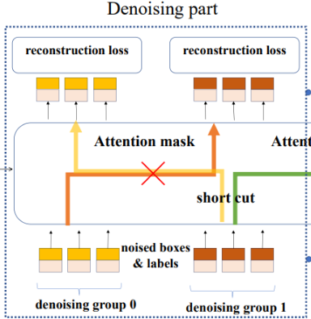

DINO의 가장 핵심적인 기법이다. 기존의 DETR의 모델을 학습할 시 노이즈에 대해서 민감하고, 어떤 데이터가 좋은 데이터인 지 구별을 하는 데 어려움이 있었다. 이를 해결하기 위해서 DINO는 denoising 이라는 학습 방식을 도입하였다. denoising은 2가지의 방식으로 구성된다.

1. Positive Queries : GT 객체의 bounding box와 label을 약간 변형하여 입력한다. 예를 들어 GT box의 좌표에 노이즈를 추가하거나, class label에 약간의 변형을 가한다
2. Negative Queries: 완전히 잘못된 box나 label을 생성하여 함께 넣는다.

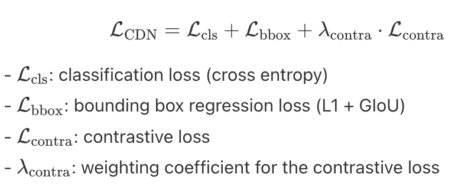

Contrastive Loss는 positive와 negative queries 간의 특징간 거리를 조절하여 다음과 같이 정의한다. 이는 단순히 Bounding Box 회귀와 classification loss만 사용하는 게 아니라, positive는 더 가까이, negetive는 더 멀어지도록 유도하는 것을 도입해서 객체를 더 명확하게 구별하게 해준다.

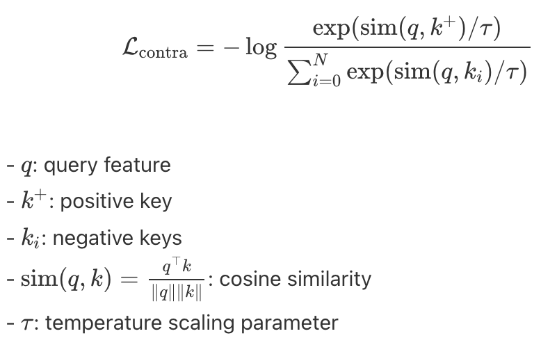

이를 통해서, 모델이 더 빠르게 수렴하게 되고, 노이즈에 강건한 학습을 할 수 있게 된다.

#### 2. Mixed Query Selection
기존의 DETR에서는 query가 모두 초기화되며, 학습 초반에는 Detection 성능이 불안전했다. DINO에서는 이를 보완하기 위해서 query를 섞어 사용한다.
1. Learnable Queries (Anchor Queries)
   - 고정된 위치에서 학습이 가능한 query들을 초기화한다. DETR는 모두 랜덤하게 초기화 되어 아무런 정보가 없었지만, 고정된 위치에서 초기화 하기 때문에 기존의 특징을 가지고 있어 anchor box처럼 특정 영역을 담당하게 유도된다.
2. Random Queries
   - 무작위의 query를 사용하지 않는 것은 아니다. 무작위의 query도 함께 사용하여 다양한 객체를 포괄적으로 탐지할 수 있도록 하였다.
3. CDN Queries
   - denoising한 query들도 함께 포함한다.
  
다양한 query를 섞어 사용함으로써, 모델은 초기부터 안정적인 학습이 가능해졌다.

#### 3. Look Forward Twice
이 내용 중에 가장 간단한 내용이다. DETR은 하나의 디코더 블록을 고려하지만, DINO는 2개의 블록을 동시에 고려하여 예측하는구조를 형성한다.
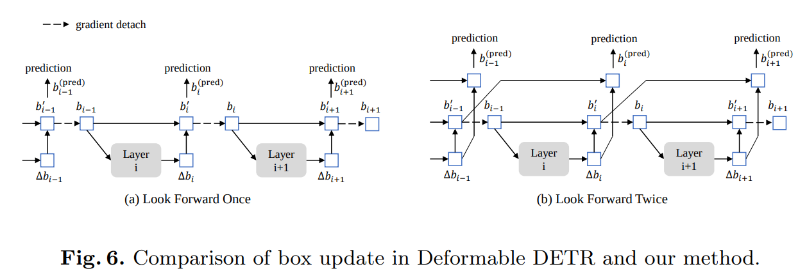

이를 통해서 객체의 위치나 모양 정보가 계층적으로 더 정확히 보정된다는 장점이 있고, 더 넓은 정보를 활용할 수 있게 된다는 장점이 있다.

### 특징 및 장단점
[장점]
- DETR 대비 훨씬 빠른 학습
- 높은 mAP (SOTA 수준)
- 안정적인 training
- multi-scale 잘 처리
[단점]
- 여전히 구조 복잡 (튜닝 요소 많음)
- YOLO 대비 inference 속도 느림
- small dataset에서는 과적합 가능

---

## RT-DETR
### 논문 정보
> - 논문 제목 : RT-DETR: DETRs Beat YOLOs on Real-time Object Detection
> - 모델 이름 : RT-DETR
> - 발표 연도 : 2023 (last revised 2024)
> - 한줄 요약 : Transformer 기반 detection을 YOLO 수준의 속도로 만든 실시간 DETR

### Network Architecture
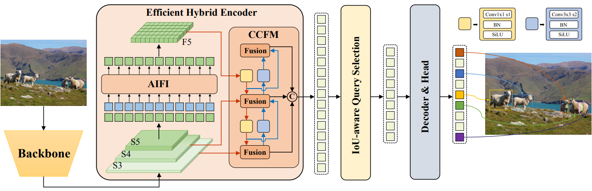
제안된 RT-DETR은 백본, 하이브리드 인코더, 보조 예측 헤드가 있는 Transformer 디코더로 구성된다.
 1. 백본의 마지막 세 단계의 출력 feature {S3, S4, S5}를 인코더에 대한 입력으로 활용
 2. 하이브리드 인코더는 스케일 내 상호 작용과 스케일 간 융합을 통해 멀티스케일 feature를 일련의 이미지 feature로 변환
 3. IoU-aware query selection은 디코더에 대한 초기 object query 역할을 하기 위해 인코더 출력 시퀀스에서 고정된 개수의 이미지 feature를 선택하는 데 사용
 4. 마지막으로 보조 예측 헤드가 있는 디코더는 object query를 반복적으로 최적화하여 상자와 신뢰도 점수를 생성

### Main idea
#### 1. Efficient Hybrid Encoder
[Computational bottleneck analysis]

Deformable-DETR은 학습 수렴을 가속화하고 성능을 향상시키기 위해 멀티스케일 feature 도입을 제안하고 계산을 줄이기 위한 deformable attention 메커니즘을 제안하였지만 attention 메커니즘의 개선으로 계산 오버헤드가 줄어들었음에도 불구하고 입력 시퀀스의 길이가 급격히 증가하면 여전히 인코더가 계산 병목 현상을 일으키고 DETR의 실시간 구현을 방해한다. Deformable-DETR에서 인코더는 GFLOP의 49%를 차지하지만 AP의 11%만 기여한다. 이러한 병목을 극복하기 위해서 우선 멀티 스케일 트랜스포머 인코더의 computational redundancy 계산 중복을 분석한다. 

직관적으로, 객체에 대한 풍부한 semantic information을 포함하는 high-level features 고수준 특징은 low-level features 저수준 피쳐에서 추출되므로 concatenated multi-scale 피쳐들의 피쳐 상호작용은 중복을 포함한다. 따라서, 저자들은 simulatenous 동시적인 intra-scale 스케일 내 및 cross-scale 스케일 간 피쳐 상호작용이 비효율적임을 증명하기 위해 다양한 유형의 인코더를 갖는 a set of variants 변형 세트를 설계하며 이는 아래 Figure 3에 묘사된다.

특히 RT-DETR에서 사용된 더 작은 크기의 데이터 리더와 더 가벼운 디코더를 갖춘 DINO-Deformable-R50을 실험에 사용한다. 먼저 DINO-Deformable-R50에서 변형 A로 다중 스케일 트랜스포머 인코더를 제거한다. 그런 다음, 다양한 유형의 인코더를 삽입하여 A를 기반으로 하는 일련의 변형을 생성한다.

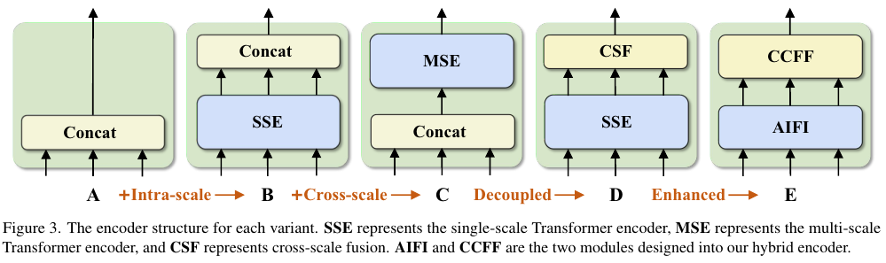

1. A->B
   - Variant A에 single scale Transformer encoder (SSE)를 삽입한다. Intra-scale는 피쳐 멀티 스케일 피쳐들의 상호작용을  위한 동일한 인코더를 공유하며 concatenate해서 결과를 출력한다.
2. B->C
   - Variant C는 변형 B에 cross-scale feature fusion을 삽입하여 Multi scale Transformer encoder  (MSE)에 concatenated 피쳐를 넣어서 intra-scale와 cross-scale 피쳐 상호작용을 동시에 수행한다. 
3. C->D
   - Variant D는 intra-scale 상호작용과 cross-scale fusion을 서로 분리하며, intra-scale에는 single-scale Transformer를, cross-scale fusion (CSF) 에는 PANet-style을 적용한다. 
4. D->E
   - Variant E는 Efficient hybrid encoder를 적용한다. 

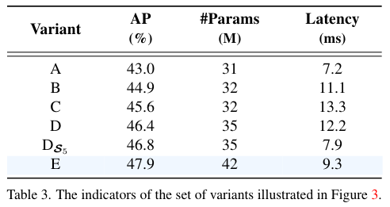

[Hybrid design]

Efficient Hybrid Encoder는 다음의 2개의 모듈로 구성된다, Attention-based Intra-scale Feature Interaction (AIFI)와 CNN-based Cross-scale Feature Fusion (CCFF)다. 

1. Attention-based Intra-scale Feature Interaction (AIFI)
- 싱글 스케일 트랜스포머 인코더를 사용하여 S5에서만 intra-scale 상호작용을 수행함으로써 variant D에 기반한 계산 비용을 더욱 줄인 것
  - 더 풍부한 의미 개념을 가진 고수준 피쳐에 셀프 어텐션 연산을 적용하면 개념적 개체 간의 연결을 포착하여 후속 모듈에서 객체의 위치 지정 및 인식을 용이하게 만듬
2. CNN-based Cross-scale Feature Fusion (CCFF)
-  CNN 계층으로 구성된 여러 개의 fusion blocks를 fusion path에 삽입하는 cross-scale fusion 모듈을 기반으로 최적화된다.
- Fusion blocks의 역할은 두 개의 인접한 스케일 피쳐를 새로운 피쳐로 합성하는 것이며, 그 구조는 아래 Figure 5
  - fusion blocks 은 채널 수를 조정하기 위해 두 개의 1 × 1 컨볼루션을 포함
  - RepConv로 구성된 N개의 RepBlock이 feature fusion에 사용되고, 두 fusion path는 element-wise addition을 통해 합성

  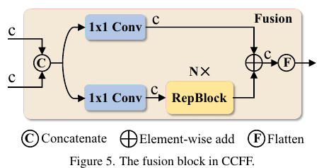

#### 2. Uncertainty-minimal Query Selection
DETR에서 객체 질의 최적화의 어려움을 줄이기 위해, 여러 후속 연구를 토대로 한 질의 선택 기법을 제안한다. 이전 연구들은 공통적으로 confidence scores 신뢰도 점수를 사용하여 인코더에서 상위 K개의 피쳐를 선택하여 object queries 객체 질의 (또는 position quereis 위치 질의)로 초기화한다. 신뢰도 점수는 피쳐가 foreground objects 전경 객체를 포함할 가능성을 나타낸다. 그럼에도 불구하고 탐지기들은 객체의 category 범주와 location 위치를 동시에 모델링해야 하며, 이 두 가지는 피쳐의 품질을 결정한다. 따라서 피쳐의 performance score 성능 점수는 분류 및 위치 추정과 공동으로 상관관계가 있는 latent variable 잠재 변수다. 분석 결과 현재의 쿼리 선택은 선택된 특징으로 하여금 상당한 수준의 unceratainty 불확실성을 초래하여 디코더의 최적이 아닌 초기화를 초래하고 탐지기의 성능을 저해하는 결과를 가져온다.

이 문제를 해결하기 위해, 본 연구에서는 불확실성 최소 질의 선택 기법을 제안한다. 이는 인코더 피쳐의 공동 잠재 변수를 모델링하기 위해 episdemic uncertainty 인식적 불확실성을 명시적으로 구성하고 최적화하여 디코더에 고품질의 쿼리를 제공한다. 구체적으로 피쳐 불확실성 U는 아래 식 (2)에서 predicted distribution of localization 예측 지역화의 분포 P와 predicted distribution of classificaion 예측 분류 분포 C의 간의 discrepancy 불일치로 정의된다.

질의의 불확실성을 최소화하기 위해, 식 (2)를 loss 함수에 통합하여 식 (3)을 만든다. 이는 그라디언트 기반의 손실 함수 최소화로 최적화 한다
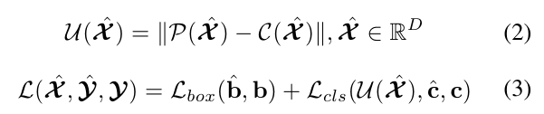

#### 3. Scaled RT-DETR
RT-DETR의 확장 가능한 버전을 제공하기 위해 ResNet 백본을 HGNetv2로 대체한다. 깊이 multiplier와 너비 multiplier를 사용하여 백본과 하이브리드 인코더를 함께 확장한다. 따라서 파라미터와 FPS의 수가 다른 두 가지 버전의 RT-DETR을 얻는다. 하이브리드 인코더의 경우 CCFM의 RepBlock 수와 인코더의 임베딩 크기를 각각 조정하여 깊이 multiplier와 너비 multiplier를 제어한다. 다양한 스케일의 RT-DETR은 균일한 디코더를 유지한다.

### 특징 및 장단점
[장점]
- 실시간 detection 가능 (YOLO급)
- NMS 필요 없음 (DETR 장점 유지)
- 정확도 vs 속도 균형 좋음

[단점]
- 구조 이해 난이도 있음
- extreme small object는 여전히 약점