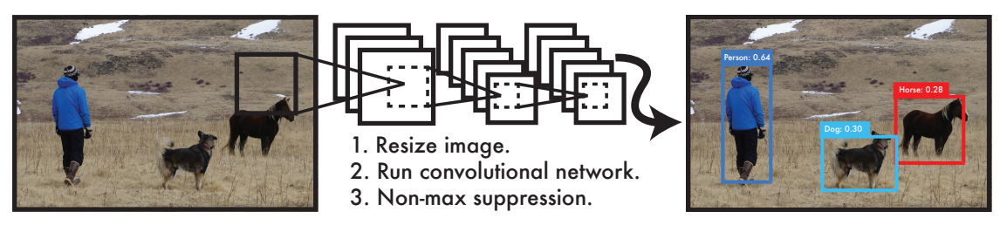
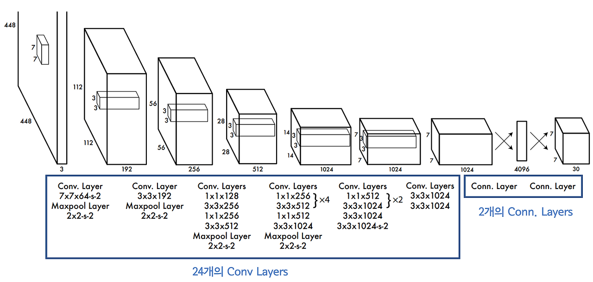
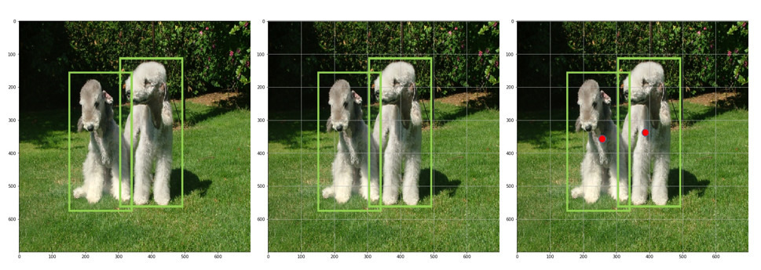
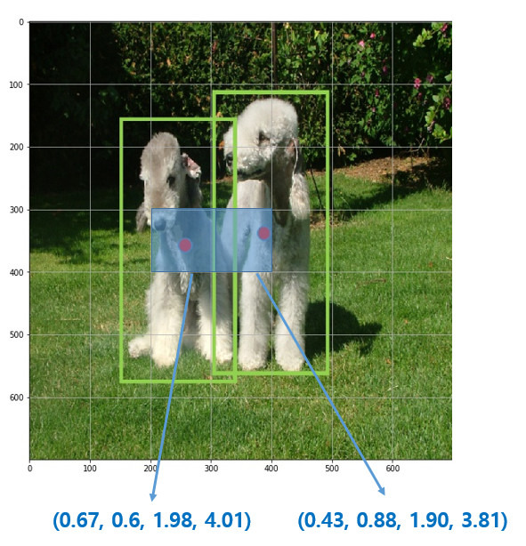
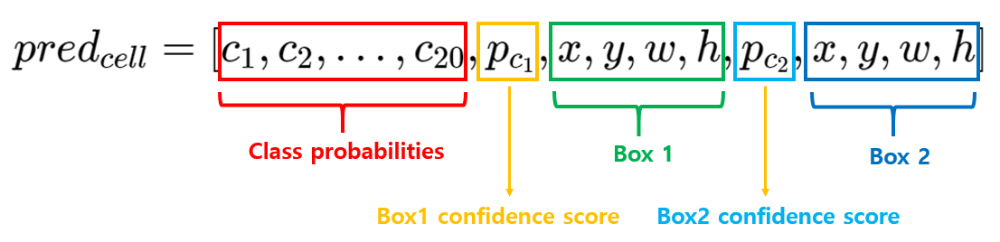
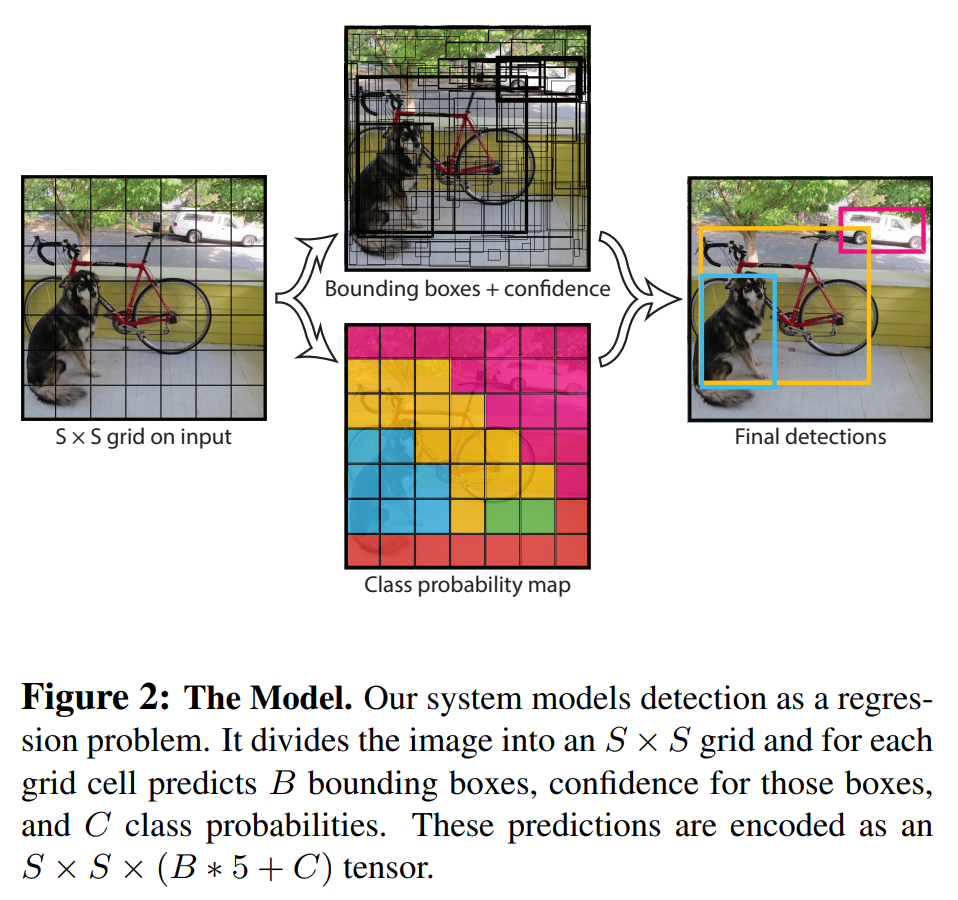

# You Only Look Once: Unified, Real-Time Object Detection

## 논문 정보
> - 논문 제목 : You Only Look Once: Unified, Real-Time Object Detection
> - 모델 이름 : YOLO
> - 발표 연도 : 2016(CVPR)
> - 한줄 요악 : 객체 탐지를 하나의 회귀 문제로 재정의하여, 이미지 전체를 단번에 보고 (real-time) 위치와 클래스를 동시에 예측하는 모델

## Introduction
기존의 객체 탐지 시스템들은 분류기를 탐지용으로 재활용하는 방식을 채택해 왔다. R-CNN은 제안 영역(region proposal)을 먼저 생성한 후, 제안된 박스마다 분류기를 생성한다. 이후 박스를 정제, 중복 탐지 제거, 객체 간 맥락 반영 등 복잡한 후처리 과정이 필요하다. 이러한 파이프라인은 느리고, 각 요소가 따로 학습되기 때문에 최적화도 어렵다.

YOLO는 객체 탐지를 하나의 회귀(regression) 문제로 다시 정의한다. 이미지 픽셀에서 곧바로 bounding box와 class probabilities를 동시에 예측하는 방식으로, 이미지를 한번만 보면 그 안에 객체의 위치를 예측할 수 있다. 

1. 입력 이미지를 448 x 448 크기로 리사이즈한다.
2. 그 이미지를 cnn에 통과시킨다
3. 예측한 결과 중 신뢰도가 일정 기준 이상인 것만 선택한다

#### <장점>
- 빠른 속도: 복잡한 탐지 파이프라인 없이 이미지 신경망을 한 번만 적용하면 된다. 기본 YOLO는 Titan X GPU에서 배치 없이도 초당 45프레임을 처리하며, 빠른 버전은 초당 150프레임 이상을 달성한다. 이는 실시간 영상 스트리밍도 지연 없이(25ms 이하) 처리할 수 있음을 의미한다. 또한 기존 실시간 시스템보다 2배 높은 mAP를 달성한다.
- 전체 이미지 기반 추론: 슬라이딩 윈도우는 영역 제안 기법과 달리 전체 이미지를 보기 때문에 형태뿐 아니라 맥락(context information)도 학습할 수 있다. Fast R-CNN과 같은 상위 탐지 모델은 배경을 객체로 오탐지하는 일이 많은데, YOLO는 이러한 배경 오류가 절반 이하이다.
- 뛰어난 일반화 능력: 학습 도메인과 다른 새로운 도메인에서 테스트해도 DPM이나 R-CNN보다 훨씬 나은 성능을 보인다. 새로운 환경이나 예기치 못한 입력에도 견고하게 작동한다.

## Network Architecture

YOLO 모델은 7x7x30에 맞는 feature map을 생성하기 위해 DarkNet이라는 독자적인 Convolutional Network을 설계했다. 
YOLO의 네트워크는 googlenet엣서 영감을 받았다.
- 24개의 con layer : 이미지의 특징 추출
- 2개의 fc layer : 물체의 클래스와 위치를 예측
- googlenet과 달리, Inception 모듈을 사용하지 않음
- 1 x 1 크기의 축소 레이어와 3 x 3 크기의 컨볼루션 레이어를 사용
- 최종적으로, 네트워크의 출력은 7 x 7 x 30 크기의 텐서

## Main idea
### 1-stage detector

YOLO는 별도의 region proposals를 사용하지 않고 전체 이미지를 입력하여 사용한다. 
- 먼저 전체 이미지를 sxs 크기의 grid로 나누어 준다
  - 여기서 객체의 중심이 특정 grid cell에 위치한다면, 해당 grid cell은 그 객체를 detect하도록 할당된다
  - 위의 그림에서 4행 3열의 grid cell이 왼쪽 개를 예측하도록 할당되었고, 4행 4열의 grid cell이 오른쪽 개를 예측하도록 할당되었다
  - 이는 나머지 grid cell은 객체를 예측하는데 참여할 수 없음을 의미한다
- 각각의 grid cell은 b개의 bounding box와 해당 bounding box에 대한 confidence score를 예측한다
  - confidence score는 해당 bounding box에 객체가 포함되어 있는지 여부와, box가 얼마나 정확하게 ground truth box를 예측했는지를 반영하는 수치
  - confidence score = Pr(object) * IoU(truthpred)

- 각각의 bouding box는 box의 좌표 정보 (x, y, w, h)와 confidence score 라는 5개의 예측값을 가진다
  - (x, y)는 grid cell의 경계에 비례한 box의 중심 좌표를 의미
  - x, y는 grid cell 내에 위치하기에 0~1 사이의 값을 가지지만 객체의 크기가 grid cell의 크기보다 더 클 수 있기 때문에 width, height 값은 1 이상의 값을 가질 수 있다
- 하나의 bounding box는 하나의 객체만을 예측하며, 하나의 grid cell은 하나의 bounding box를 학습에 사용한다

- 각 grid cell은 C개의 conditional class probabilities인 
Pr(classi|object)를 예측한다
  - 이는 특정 grid cell에 객체가 존재한다고 가정했을 때, 특정 class i 일 확률인 조건부 확률값이다
  - bounding box 수와 상관없이 하나의 grid cell마다 하나의 조건부 확률을 예측
  - 여기서 짚고 넘어갈 점은 bounding box별로 class probabilities를 예측하는 것이 아니라 grid cell별로 예측

논문에서는 S=7, B=2, C=20 설정했다(PASCAL VOC 데이터셋을 사용하여 학습하였기에 class의 수가 20개). 즉, 이미지를 7x7 grid로 나누고 각 grid cell은 2개의 bounding box와 해당 box의 confidence score, 그리고 C개의 class probabilities를 예측한다. 즉 이미지별 예측값의 크기는 7x7x(2x5+20)이다. 이와 같은 과정을 통해 bounding box의 위치와 크기, 그리고 class에 대한 정보를 동시에 예측하는 것이 가능해진다.

## Conclusion
1. 속도
- "You Only Look Once"라는 이름처럼, 이미지 전체를 한 번에 처리 → 실시간 처리 가능

2. 통합 모델
- Classification + Localization을 통합된 네트워크에서 end-to-end로 학습

3. 지역 정보 부족
- YOLO는 coarse하게 grid 단위로 객체를 예측하기 때문에, 작은 객체나 가까이 붙어 있는 객체 탐지 성능이 떨어짐

4. 일반화
- 기존 region proposal 기반(two-stage) 모델보다 잘 일반화되며, 배경 오탐(false positives) 줄임

### 한계
1. 각 grid cell 마다 B개의 bounding box만 추측해내야 한다는 공간적 제약성은
가까이 붙어있는 물체를 판별해내는데에 부정적 영향을 끼친다.
2. data로 부터 bounding box를 훈련시키기 때문에,
학습데이터에는 없는 특이한 ratio의 bounding box가
test data로 주어진다면 이를 잘 검출해내지 못한다.
3. 여러개의 down sampling을 사용하기 때문에
상대적으로 디테일하지 못한 feature를 구해낸다.
4. YOLO의 주요한 error는 부정확한 localization에서 일어나는데
그 이유는 작은 bounding box에서의 localization 에러와
큰 boudning box에서의 localization 에러에 대한 가중치가 동일하기 때문이다.

### 장점
1. 매우 빠르다. Titan X GPU를 기준으로 batch 처리를 하지 않고 1초당 45개의 사진을 처리할 수 있다. 
2. prediction을 할 때, 이미지의 전체적인 부분을 고려한다.
YOLO는 traing, test과정에서 이미지의 전체적인 영역을 고려하기 때문에
class에 관한 contextual information(문맥적인 정보)을 잘 고려하게 된다
3. object에 관한 일반적인 representation을 잘 학습한다.