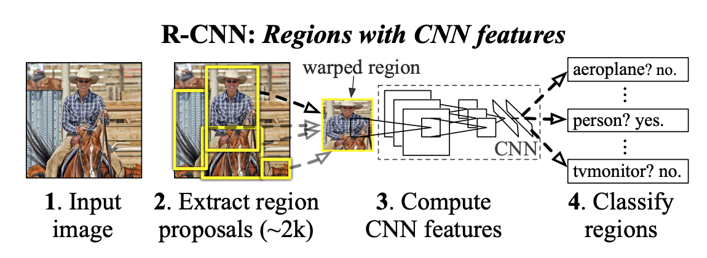

# Two-stage Object Detection
> Two-stage 방식은 "후보 영역(region proposal)"을 먼저 찾고, 그 영역을 분류 및 박스 회귀" 하는 방식이다
> 
> [구조]
> 1. Region Proposal 단계
> - 이미지에서 객체가 있을 법한 후보 영역을 찾음
> - 초기에는 Selective Search 같은 알고리즘 사용 → Faster R-CNN에서는 RPN(Region Proposal Network)으로 학습 기반 대체
> 2. Detection 단계
> - Proposal 영역을 Feature Extractor(CNN backbone) 를 통해 특징 벡터로 변환
> - 각 영역을 분류(Classification) + 박스 좌표 보정(Bounding Box Regression) 수행
>
> [특징]
> - 정확도 : 높음 -> 후보 영역 기반으로 세밀하게 탐지 가능
> - 속도 : 상대적으로 느림 (두 단계 수행 필요)
> - 대표 모델
>     - R-CNN
>     - Fast R-CNN
>     - Faster R-CNN
>
> [한줄 요약]
> - Two-Stage Detector = Region Proposal → Classification & Regression.
> - 정확도는 높지만 속도는 느려서, 이후 One-Stage (YOLO, SSD 등) 모델들이 등장하게 됨.

## R-CNN
### 논문 정보
> - 논문 제목 : Rich feature hierarchies for accurate object detection and semantic segmentation
> - 모델 이름 : R-CNN
> - 발표 연도 : 2014
> - 한줄 요악 : 이미지에서 후보 영역을 추출하고, 각 영역별로 CNN 특징을 학습하여 객체 분류와 박스 회귀 수행

### Architecture

1. Selective search 알고리즘을 통해 객체가 있을 법할 위치인 후보 영역(region proposal)을 2000개 추출하여, 각각을 227x227 크기로 warp 시켜줌
2. Warp된 모든 region proposal을 Fine tune된 AlexNet에 입력하여 2000x4096 크기의 feature vector를 추출
3. 추출된 feature vector를 linear SVM 모델과 Bounding box regressor 모델에 입력하여 각각 confidence score와 조정된 bounding box 좌표를 얻음
4. 마지막으로 Non maximum suppression 알고리즘을 적용하여 최소한의, 최적의 bounding box를 출력

### Main Ideas
#### 1. Region Proposal by Selective Search

R-CNN 모델은 구체적인 객체의 위치를 추정하기 앞서 Selective search 알고리즘을 통해 객체가 있을법할 위치인 후보 영역(Region proposal)을 추출한다. Selective search 알고리즘은 색상, 무늬, 명암 등의 다양한 기준으로 픽셀을 grouping하고, 점차 통합시켜 객체가 있을법한 위치를 bounding box 형태로 추천한다. 단일 이미지에서 2000개의 후보 영역을 추출한 뒤, CNN 모델에 입력하기 위해 227x227 크기로 warp(=resize)시켜준다. 
#### 2. Feature Extraction via CNN

2000개의 후보영역을 Fine tune된 AlexNet에 입력하여 2000(=후보 영역의 수)x4096(=feature vector의 차원) 크기의 feature vector를 추출한다. 논문의 저자는 객체 탐지시, 특정 도메인에 맞는 class를 예측하기 위해서 기존의 imagenet 데이터셋을 통해 pre-trained된 cnn 모델을 도메인에 맞게 fine tune하는 방식을 제안한다. 
#### 3. Bounding Box Regression
Selective search 알고리즘을 통해 얻은 객체의 위치는 다소 부정확할 수 있다. 이러한 문제를 해결하기 위해 bounding box의 좌표를 변환하여 객체의 위치를 세밀하게 조정해주는 Bounding box regressor 모델이 있다. 

위의 그림에서 회색 box는 Selective search 알고리즘에 의해 예측된 bounding box이며, 빨간 테두리 box는 ground truth box다. Bounding box regressor는 예측한 bounding box의 좌표 
P=(px, py, pw, ph)=(center X, center Y, width, height)가 주어졌을 때, ground truth box의 좌표 g = (gx, gy, gw, gh)로 변환되도록 하는 Scale invariant Transformation을 학습한다.

### 모델 특징
- 최초 CNN 기반 Object Detection 모델
- 정확도 높음 (mAP 대폭 향상)
- 학습 3단계 필요: CNN → SVM → BBox Regression
- 속도 매우 느림 (~47초/이미지)

----

## Fast R-CNN
### 논문 정보
> - 논문 제목: Fast R-CNN
> - 발표 연도: 2015
> - 한줄 요약: 한 번의 CNN Forward로 전체 이미지 Feature Map을 생성하고, RoI Pooling으로 후보 영역 특징 추출 → 분류 + 회귀 동시 학습

### R-CNN vs R-CNN

R-CNN 모델은 2000장의 region proposals를 CNN 모델에 입력시켜 각각에 대하여 독립적으로 학습시켜 많은 시간이 소요됐다. Fast R-CNN은 이러한 문제를 개선하여 단 1장의 이미지를 입력받으며, region proposals의 크기를 warp시킬 필요 없이 RoI(Region of Interest) pooling을 통해 고정된 크기의 feature vector를 fully connected layer(이하 fc layer)에 전달한다. 또한 Multi-task loss를 사용하여 모델을 개별적으로 학습시킬 필요 없이 한 번에 학습시킨다. 이를 통해 학습 및 detection 시간이 크게 감소하였다.

### Architecture

모델의 구조는 위와 같다.
1. input image와 multiple regions of interset(RoIs)가 입력으로 사용된다.
2. 각각의 RoI는 ConvNet 연산을 통해 고정된 크기의 feature map으로 pooling되고, FCs을 통해 feature vector로 매핑(mapping)된다.
3. RoI별 두 개의 output을 갖는다. 하나는 softmax probabilities이고, 다른 하나는 per-class bounding-box regression offsets이다.

모델은 multi-task loss로 end-to-end 학습된다. 
Fast R-CNN은 R-CNN과 마찬가지로 selective search로 RoIs(regions of interest = region proposals)를 먼저 찾은 후 딥러닝을 사용하는 2-stage detector이다.

### Main Ideas
#### 1. RoI pooling layer
RoI(region of interest) pooling은 feature map에서 region proposals에 해당하는 관심 영역(RoI)을 지정한 크기의 grid로 나눈 후 max pooling을 수행하는 방법이다. 각 channel별로 독립적으로 수행하며, 이 같은 방법을 통해 고정된 크기의 feature map을 출력하는 것이 가능하다. 

1. 원본 이미지를 CNN모델에 통과시켜 feature map을 얻는다
   - 800x800 -> 8x8 feature map
2. 동시에 원본 이미지에 대하여 selective search 알고리즘을 적용하여 region proposals를 얻는다
3. feature map에서 각 region proposals에 해당하는 영역을 추출한다. 이 과정은 RoI Projection을 통해 가능하다.
4. 추출한 RoI feature map을 지정한 sub-window의 크기에 맞게 grid로 나눠준다
5. grid의 각 셀에 대하여 max pooling을 수행하여 고정된 크기의 feature map을 얻는다

#### 2. Multi-task loss
Fast R-CNN 모델에서는 feature vector를 multi-task loss를 사용하여 Classifier와 Bounding box regressior을 동시에 학습시킨다. 각각의 RoI(=region proposal)에 대하여 multi task loss를 사용하여 학습시킨다. 이처럼 두 모델을 한번에 학습시키기 때문에, R-CNN 모델과 같이 각 모델을 독립적으로 학습시켜야 하는 번거로움이 없다는 장점이 있다. 

### 모델 특징
- R-CNN 대비 10배 이상 빠름
- End-to-End 학습 가능 (멀티태스크 손실: Classification + Regression)
- 메모리 효율 증가

--- 

## Faster R-CNN
### 논문 정보
> - 논문 제목: Faster R-CNN: Towards Real-Time Object Detection with Region Proposal Networks
> - 발표 연도: 2015
> - 한줄 요약: CNN으로 Region Proposal까지 예측하는 RPN 도입 → 후보 영역 생성과 Detection Head를 하나의 네트워크로 통합

### Architecture

Fast R-CNN은 Region Proposal 영역의 Selective Search는 gpu가 아닌 cpu로 돌아가 2.3초라는 시간이 걸렸다. 이것은 실시간에 적용하기에 무리가 있다. Faster R-CNN의 핵심 아이디어는 Region Proposal Network(RPN)이다. 기존 fast rcnn의 구조의 region proposal 영역만 RPN으로 바꾼 것이다. 이를 통해 gpu를 통한 RoI 계산이 가능해지고, RoI 를 학습시켜 정확도도 높일 수 있었다. 전체적인 동작 순서는 아래와 같다.
1. 원본 이미지를 Pre-trained된 cnn 모델에 입력하여 feature map을 얻는다
2. feature map은 RPN에 전달되어 적절한 region proposals를 산출한다
3. region proposals와 (1)과정에서 얻은 Feature map을 통해 roi pooling을 수행하여 고정된 크기의 feature map을 얻는다
4. Classification과 Bounding box regression을 수행한다

### Main Ideas
#### 1. Anchor Box

Selective search를 통해 region proposal을 추출하지 않을 경우, 원본 이미지를 일정 간격의 grid로 나눠 각 grid cell을 bounding box로 간주하여 feature map에 encode하는 Dense Sampling 방식을 사용한다. 이같은 경우 sub-sampling ratio를 기준으로 grid를 나누게 된다. 가령 원본 이미지의 크기가 800x800이며, sub-sampling ratio가 1/100이라고 할 때, CNN 모델에 입력시켜 얻은 최종 feature map의 크기는 8x8(800x1/100)가 된다. 여기서 feature map의 각 cell은 원본 이미지의 100x100만큼의 영역에 대한 정보를 함축하고 있다고 할 수 있다. 원본 이미지에서는 8x8개만큼의 bounding box가 생성된다고 볼 수 있다.

하지만 이처럼 고정된 크기의 바운딩 박스를 사용할 경우, 다양한 크기의 객체를 포착하지 못할 수 있다는 문제가 있다. 그래서 본 논문에서 고안한 방법이 Anchor Box 다. 지정한 위치에 사전에 정의한 서로 다른 크기(scale)와 가로세로비(aspect ratio)를 가지는 bounding box인 Anchor box를 생성하여 다양한 크기의 객체를 포착하는 방법이다. 

anchor box는 원본 이미지의 각 grid cell의 중심을 기준으로 생성한다. 원본 이미지에서 sub-sampling ratio를 기준으로 anchor box를 생성하는 기준점인 anchor를 고정한다. 이 anchor를 기준으로 사전에 정의한 anchor box 9개를 생성한다. 위의 그림에서 원본 이미지의 크기는 600x800이며, sub-sampling ratio=1/16 이다. 이 때 anchor가 생성되는 수는 1900(=600/16 x 800/16)이며, anchor box는 총 17100(=1900 x 9)개가 생성된다. 이같은 방식을 사용할 경우, 기존에 고정된 크기의 bounding box를 사용할 때보다 9배 많은 bounding box를 생성하며, 보다 다양한 크기의 객체를 포착하는 것이 가능하다. 

#### 2. RPN(Region Proposal Network)

RPN은 원본 이미지에서 region proposals를 추출하는 네트워크다. 원본 이미지에서 anchor box를 생성하면 수많은 region proposals가 만들어진다. RPN은 region proposals에 대하여 class score를 매기고, bounding box coefficient를 출력하는 기능을 한다. RPN의 세부구조를 보면
1. 3x3 convolution을 한번 더 해준다. padding은 same으로 주어 원래 Feature map의 크기를 유지한다.
2. 1x1 convolution 연산을 각각 실행해주어 classification과 bounding box regression의 정보를 추출한다
3. clasification에서는 박스가 오브젝트인지 아닌지를 학습한다. 즉, 물체가 있나 없나 만 판단 한다.
4. bounding box regression 영영ㄱ에서는 x1, y1, w, h의 정보들을 받아 원래 영역에 맞게 학습해 나아간다.

### 모델 특징
- RPN으로 Region Proposal 자동화 → 속도 개선
- Anchor Box 도입 → 다양한 크기·비율 객체 탐지 가능
- 정확도 유지 + 실시간 처리에 가까움 (~200ms/이미지)

--- 

## Two-Stage Object Detection: 발전 흐름 요약

| 모델 | 발표 연도 | 논문 제목 | 핵심 아이디어 | 주요 한계 | 개선점 |
|------|-----------|-----------|----------------|-----------|---------|
| **R-CNN** | 2014 | Rich feature hierarchies for accurate object detection and semantic segmentation | CNN으로 추출한 Feature + Selective Search로 Region Proposal 생성 후 SVM으로 분류 | Selective Search가 **느림**, Multi-stage 학습 과정 필요 | Deep CNN을 통한 **특징 추출 도입** |
| **Fast R-CNN** | 2015 | Fast R-CNN | Feature map을 공유 → ROI Pooling으로 고정 크기 벡터화 → 단일 네트워크에서 Classification + BBox Regression | 여전히 Region Proposal은 Selective Search → **병목 현상** | End-to-End 학습 가능, 속도 개선 |
| **Faster R-CNN** | 2015 | Faster R-CNN: Towards Real-Time Object Detection with Region Proposal Networks | **RPN**(Region Proposal Network)으로 Region Proposal도 CNN 기반으로 생성 | 속도와 성능 모두 개선되었지만, 실시간 검출은 한계 | 진정한 **End-to-End 학습** 완성 |
