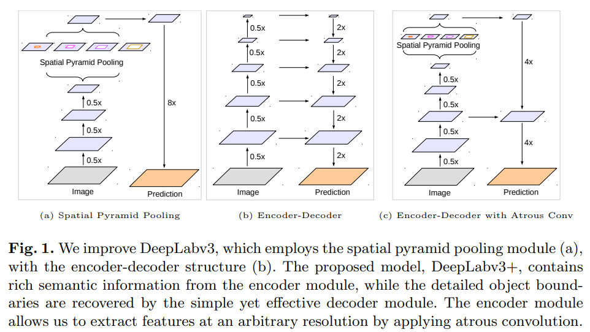
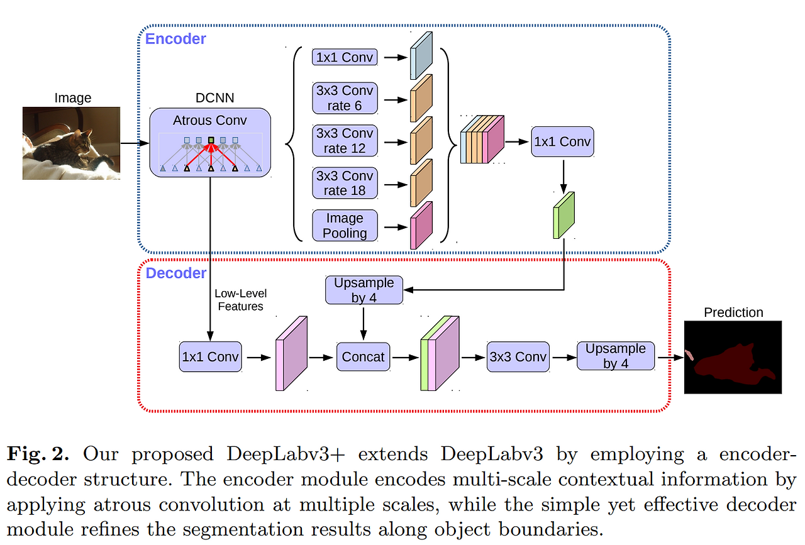
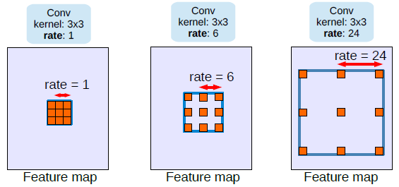
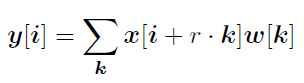
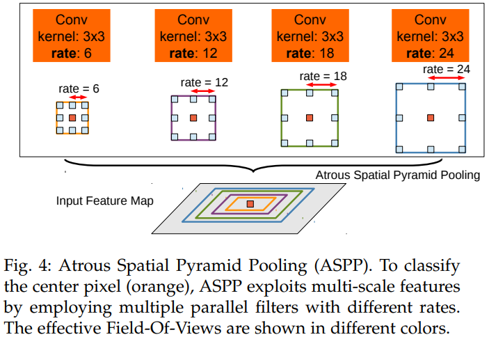
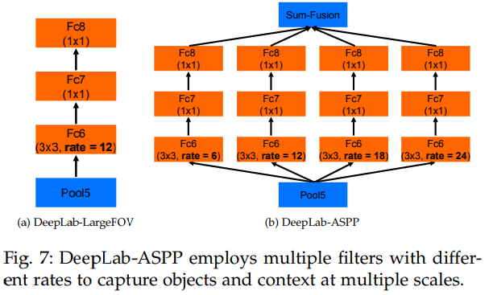
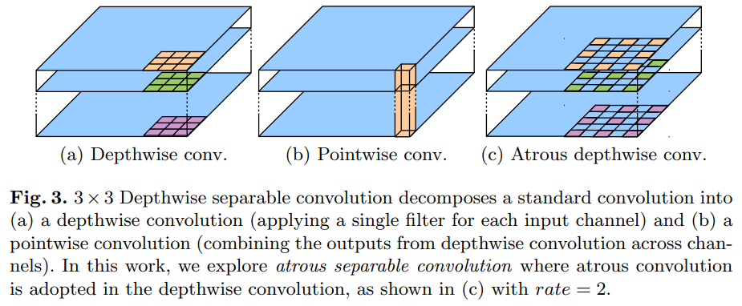

# Encoder-Decoder with Atrous Separable Convolution for Semantic Image Segmentation

## Prev Deeplab series
| 버전      | 핵심 혁신                                      | 목표                | 한계             |
| ------- | ------------------------------------------ | ----------------- | -------------- |
| v1      | Atrous conv + CRF                          | 해상도 유지            | Multi-scale 약함 |
| v2      | ASPP 도입                                    | Multi-scale 해결    | CRF 여전히 필요     |
| v3      | Enhanced ASPP + global context             | CRF 없이도 충분한 성능    | Decoder 부재     |
| **v3+** | Encoder–Decoder 완성 + atrous separable conv | Boundary 개선 + 효율성 | 현재까지 가장 실용적    |

### 1. Atrous (Dilated) Convolution
- 커널 사이에 간격을 두는 (dilation) convolution
- 파라미터 수를 늘리지 않고 receptive field를 크게 확장
- stride 없이 해상도를 유지

### 2. ASPP (Atrous Spatial Pyramid Pooling)
- 서로 다른 dilation rate로 convolution을 병렬 수행
- 다양한 scale의 객체를 한 번에 포착
- 작은 객체에는 낮은 dilation, 큰 객체에는 높은 dilation
- 전체 이미지 -> global average pooling -> multi-scale feature extractor 역할

## 논문 정보
> - 논문 제목 : Encoder-Decoder with Atrous Separable Convolution for Semantic Image Segmentation
> - 모델 이름 : DeepLabv3+
> - 발표 연도 : ECCV 2018
> - 한줄 요악 : DeepLabv3+는 Atrous Convolution과 ASPP로 다양한 스케일의 문맥 정보를 학습하고, 가벼운 Decoder로 경계까지 정교하게 복원하는 고성능 세그멘테이션 모델

## Introduction
본 논문에서 제안한 모델은 DeepLab 시리즈 중 v3+ 에 해당하는 모델로 이 모델의 시작점은 "Spatial pyramid pooling module과 encode-decoder structure을 결합하자" 이다. 

Spatial pytamid pooling(SPP) module의 경우 여러 비율과 효과적인 field-of-vies(FoV) 에서 filter 혹은 pooling 연산을 수행하여 다양한 크기의 contextual information을 인코딩할 수 있다.

encoder-decoder의 경우 점진적으로 spatial information을 복구하여 object의 경계를 더욱 선명하게 포착할 수 있다는 특징이 존재한다. 지금까지의 deeplab v1~3에서는 feature map을 단순히 bilinear upsamling을 적용한 것과는 차이를 보여준다. 

또한 encoder에 Xception model을 backbone으로 적용하였으며, Depthwise Separable convolution을 ASPP와 Decoder module에 적용하여 빠르고 강한 모델을 구축할 수 있었다. 

## Network Architecture

DeepLabv3+는 크게 두 가지 요소로 구성된다.
- Encoder : 
  - Backbone : modified Xception or ResNet
  - Atrous convolution + ASPP
    - 1x1 conv
    - 3개의 3x3 atrous conv
    - image-level feature
    - 위 5개 branch를 concat 후 1x1 conv로 채널 축소
- Decoder : Lightweight decoder 로 boundary refinement
  - encoder output을 4배 upsampling
  - low-level feature와 concat
    - low-level feature는 1x1 conv로 채널 수 조정
  - 3x3 conv 2개 적용
  - 최종적으로 4배 upsampling하여 원본 해상도 복원

v3+에서는 encoder에 약간 수정한 Xception module을 사용하는데 이는 feature map에 여러 size의 conv filter를 병렬적으로 적용하고 다시 합치는 방식인 inception module에 기초한 방식에 convolution을 point-wise conv -> depth-wise conv 방식을 도입한 Modlue이다. 

## Main Idea 
### 1. Atrous Convolution 

Atrous Convolution은 Dilated Convolution 또는 Hole Convolution이라고도 불리며, Convolutional Neural Network (CNN)에서 사용되는 컨볼루션 연산의 한 종류이다.

Atrous Convolution은 커널의 크기를 유지하면서 컨볼루션 연산을 수행하는 기법으로, 컨볼루션 연산의 Receptive Field(수용 영역)을 키울 수 있어서, 더 넓은 범위의 정보를 수집할 수 있다. 위 그림처럼 kernel size는 3x3 으로 동일하더라도 rate가 1인 경우에는 일반적인 convolution이고 rate가 6이 되면 빨간색 픽셀간의 거리가 6이 되는 것이다.

즉, rate가 커질수록 convolution filter 내부의 빈공간이 커지고 더 넓은 영역의 correltation을 추출하지만 세밀한 디테일보다는 큰 영역의 러프한 correalation을 추출한다고 볼 수 있다. 

Atrous convolution을 사용하면 trainable parameter 의 수는 유지한채 receptive field를 크게 사용할 수 있는 장점이 생겨 segmentation task에서 스케일이 큰 객체를 더욱 잘 검출할 수 있게 된다. 반면에 디테일한 정보는 줄어든다는 단점이 생긴다.

### 2. Atrous Spatial Pyramid Pooling

DeepLabv3+ 구조는 Encoder 끝단에서 Decoder로 정보를 넘겨주기 전에 Atrous Spatial Pyramid Pooling (ASPP)를 수행하는데, Spatial Pyramid Pooling 에서 Atrous 방식이 추가된 구조이다.

Feature map에 서로 다른 rate를 가지는 Atrous convolution을 병렬적으로 사용하고 추출된 feature map 들에 1x1 conv 연산을 수행한 뒤 합치는 방식이다.

이러한 방식은 이미지에서 서로 다른 스케일을 가진 객체를 더욱 잘 검출해낼 수 있도록 한다. 

### 3. Encoder-Decoder 구조 도입
DeepLabv3에서는 encoder-only 였다. Decoder 추가로 인해 object boundary를 더 정교하게 복원할 수 있고 Low-level feature 활용으로 detail을 보존할 수 있다.

### 4. Depthwise Separable Convolution

Depthwise Separable convolution은 standard convolution을 2가지 스텝 (depthwise -> pointwise) 으로 나누어 수행하는 방식인데, 파라미터 수를 많이 줄일 수 있어서 네트워크 경량화를 위해 많이 사용되는 방법이다.

첫 번째 단계는 Depthwise Convolution이다. 이 단계에서는 입력 데이터의 각 채널마다 따로따로 필터(kernel)를 적용한다. 이렇게 하면 입력 데이터가 갖고 있는 채널 수에 비례해 컨볼루션 연산의 수가 줄어들기 때문에, 연산 비용을 줄일 수 있다.

두 번째 단계는 Pointwise Convolution이다. 이 단계에서는 Depthwise Convolution을 통해 나온 결과를 다시 1x1 크기의 커널로 필터링하여 최종 출력을 만들어낸다. 이 단계에서는 각 채널 간의 상호작용을 고려할 수 있어, 입력 데이터의 특징을 더 잘 추출할 수 있다.

## Conclusion
### 장점
1. multi-scale 물체에 강함
- ASPP 에서 서로 다른 dilation rate로 수용 영역을 다르게 함 -> 다양한 크기의 객체 가능
2. boundary precisioin 개선
- decoder 추가로 객체 경계가 더 정확
3. 고성능 segmentation 모델의 표준
4. Attous conv 기반으로 resolution 유지 가능

### 단점
1. Atrous conv 계산 비용 증가
- dilation rate 크면 연산량 증가
- but separable conv 도입으로 상당 부분 완화됨
2. 매우 큰 해상도에서는 gpu 메모리 부담
3. full transformer 기반 모델(segformer)에 비해 global context 제한적

### 결론
DeepLabv3+는 segmentation 분야에서 U-Net 다음으로 가장 영향력 있는 모델이며,
- Atrous convolution로 공간 해상도 유지
- ASPP로 multi-scale context 획득
- 얇지만 효과적인 decoder로 boundary 복원

이라는 단순하면서 강력한 구조 덕분에
현재까지도 의료 영상, 자율주행, 지도/위성 영상, 산업 검사 등 다양한 실무 현장에서 표준 모델로 사용된다.