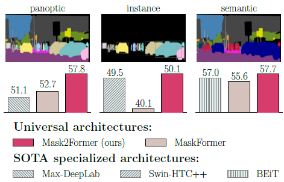
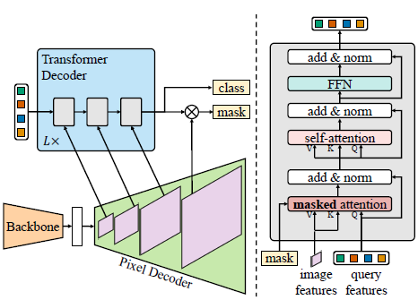
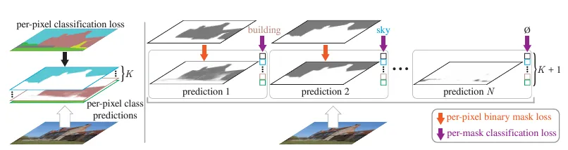
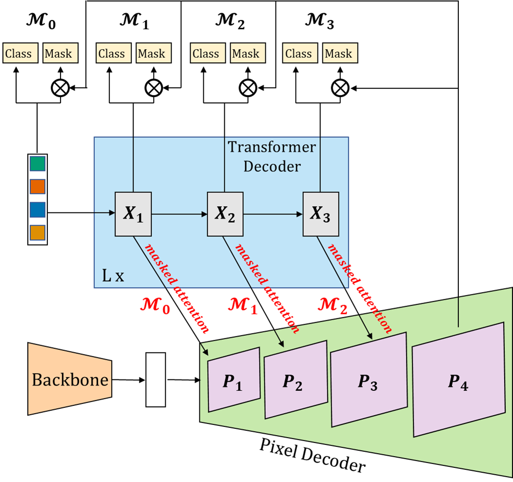
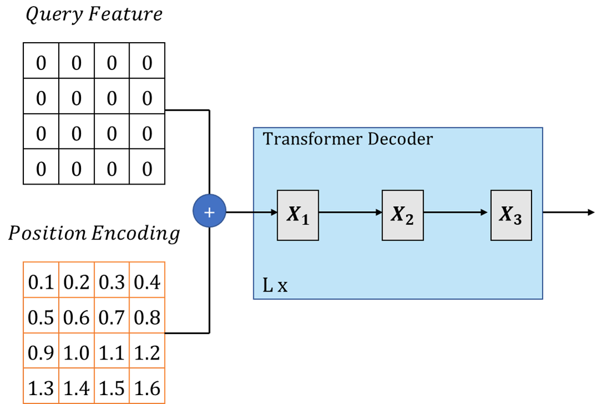

# Masked-attention Mask Transformer for Universal Image Segmentation

## 논문 정보
> - 논문 제목: Masked-attention Mask Transformer for Universal Image Segmentation
> - 모델 이름: Mask2Former
> - 발표 연도: 2022 (CVPR 2022)
> - 한줄 요약: 하나의 통합된 Transformer 구조로 Semantic / Instance / Panoptic segmentation을 모두 수행하는 범용 세그멘테이션 모델.

## Introduce
이 논문은 MaskFormer의 후속 모델로 기존 MaskFormer는 Instance Segmentation, Semantic Segmentation, Panoptic Segmentation 세 가지 작업을 하나의 모델로 통합한 모델이다. 

MaskFormer가 세 가지 작업에서 각각 독립적으로 연구되어야 하는 노력을, 하나의 모델로 통합하며 많은 각광을 받고 있었지만 성능 면에서는 모든 작업에서 뛰어나지는 못했다. 아울러 DETR 베이스로 설계된 모델이므로 수렴에도 300 Epoch 정도의 긴 시간을 가지는 제한점이 존재했다.

따라서, 본 논문은 위와 같은 제한 사항을 개선하는 Mask2 Former를 제안했다. 그 결과로 세 가지 작업 모두에서 가장 우월한 성능을 기록했다.

이 논문이 제안하는 기술은 크게 3가지 이다.
1. Masked Attention : 기존 Attention과 같이 모든 픽셀에 대해 연산하는 것이 아니라, 특정 의미있는 영역에만 부분적으로 연산하여 수렴의 가속
2. Multi-scale 구조 : 고해상도 피처를 활용하여 작은 객체에 대한 높은 성능
3. 최적화 향상 : self, cross-attention의 위치 변화, 쿼리 피처에 대한 학습, 드롭아웃 제거

## Network Architecture

기본적인 구조는 MaskFormer와 동일하게 Backbone, Pixel Decoder, Transformer Decoder로 구성되었고, 내부 구조의 약간의 변형만이 이루어졌다. 

1. backbone은 이미지로부터 low-resolution feature map을 추출한다
2. pixel decoder는 image feature로부터 upsampling을 수행하며 high resolution의 per pixel embedding을 생성한다
3. transformer decoder는 object query를 활용해 image feature들로부터 classification과 mask를 생성하기 위한 output query를 생성한다

위의 그림은 per pixel classification과 per mask classification의 차이이다. 

MaskFormer architecture의 특징은 pixel 단위 classification이 아니라, masking을 통해 pixel을 우선 그룹화하고, 이 결과를 N개의 category로 classification하는 과정으로 segment가 이뤄진다는 것이다. 

따라서 Mask2Former에서는 Transformer Decoder의 output으로 masking을 생성하고 이 mask를 분류하는 classification 연산을 차례로 수행하게된다. 

## Main Idea
### 1. Backbone
- ResNet, Swin Transformer 등 어떤 백본도 사용 가능
- Feature Pytamid 형태 (단계별 Multi-scale 특성) 출력
- FPN 구조와 유사하게 multi-resolution features 제공
    -> segmentation에 필수적인 다양한 스케일 정보 전달

### 2. Pixel Decoder (Multi-scale feature aggregation)
해상도를 복원하는 Pixel Decoder는 multi-scale Deformable Attention Transformer(MSDeformAttn)를 사용했다. 

위 MSDeformAttn이 동작하는 방식은 ResNet의 multi-scale(1/8, 1/16, 1/32)의 Feature map들을 1차원 형태로 결합하여 전체 해상도에 대한 Deformable Self-Attention이 이루어지고, 다시 1/8, 1/16, 1/32  Scale의 feature map으로 복원하는 방식이다. 그리고, 기존 MSDeformAttn과 같이 Position embedding과 Scale-Level embedding이 포함된다. Scale-Level embedding은 C채널이 현재 레벨의 해상도만큼 반복되어 H1W1*C 를 생성하여 level position으로 입력된다.

아울러 마지막 1/4 Scale의 Feature map은 단순하게 1/8를 선형 보간하여 생성하여, 그림과 같이 총 4개의 해상도(보라색)를 가지는 Feature map들이 형성된다. 

### 3. Transformer Decoder
기존의 Maskformer에서 가장 크게 변화된 부분은 Transformer decoder로 masking을 활용한 cross attention인 masked attention과 self attention을 차례로 수행하게 된다. 이때 masking은 pixel 단위 그룹을 생성해 해당 그룹에 대해서만 attention이 수행되도록 해당 pixel group에 대해 binary masking 해준다. 

#### (1) Masked attention

 Image segmentation 분야에서 cross attention을 활용한 Transformer based model들의 수렴속도 문제를 해결하기 위해 Masked Attention을 고안했다. Masked Attention은 기존의 cross attention에 masking을 축한 형태로 각 query별로 예측된 mask의 region에 대해서만 attention이 이뤄져 전체 image를 attention하는 것보다 빠르고, 효율적으로 query feature를 update할 수 있었다.

 [정리]
 Masked Attention
 - Transformer decoder에서 attention을 할 때, query가 현재 예측하는 mask 영역 안에서만 attention을 수행. 
 - 즉, 전체 feature를 다 보지 않고, 자기 마스크 영역에 해당하는 부분만 집중
 - 메모리 사용량 감소 , noise 감소

#### (2) High Resolution features
High-resolution features는 small object를 에측하는데 특히 좋은 성능을 보여주지만, 많은 연산량을 필요로 한다. 이를 해결하기 위해서 저자는 efficient multi-scale strategy를 활용했다. pixel decoder를 feature pyramid를 만들고, 각 feature 별로 하나의 transformer layer에 활용되도록 했다. 그리고 각 resolution 별로 sinusoidal position embedding과 learnable scale-level embedding을 활용했다.

#### (3) Optimization improvements
1. switch the order of self- and cross-attention(masked attention)
- self-attention을 먼저 적용하는 것은 image에 대한 정보가 포함되지 않은 채 query feature를 업데이트하기 때문에 효율성 측면에서 불리
2. make query features learnable
- 기존 transformer decoder에서 쿼리 피처가 연산하는 방식은 아래와 같다

- 본 논문에서는 첫 쿼리 피처 X0 첫 마스크 M0를 예측해야 하기 때문에, 고정값인 0으로 초기화하는 것은 적절하지 않음
- 이러한 구조가 cnn의 region proposal network와 유사한 기능을 함
3. remove dropout in decoder

## Conclusion
### 장점
1. 범용 segmentation 모델
- 하나로 세 종류의 segmentation 모두 처리 가능
2. masked attention으로 효율 극대화
- full attention 대비 메모리 소비 감소
- 학습 속도 증가
- mask refinement 품질 개선
3. 강력한 Multi-scale 처리
4. 여러 backboner과 호환

### 단점
1. 계산량 여전히 큼 -> transformer 기반이라
2. 훈련 과정 복잡 -> query matching, multi-task loss
3. 작은 모델로 경량화된 버전이 부족

### 결론
Mask2Former는 segmentation 패러다임을 다음 단계로 끌어올렸다.

- CNN vs Transformer의 구분을 넘어서
- Semantic/Instance/Panoptic의 경계를 없애고
- “Mask prediction 기반 universal segmentation”이라는 틀을 확립

특히 Masked Attention은 segmentation transformer의 새로운 표준이 되었고 , 이후 많은 후속 연구(MaskDINO, SAM decoder 등)에 영향을 줌.