# Segment Anything

## 논문 정보
> - 논문 제목: Segment Anything
> - 모델 이름: SAM (Segment Anything Model)
> - 발표 연도: 2023 / Meta AI (FAIR)
> - 한줄 요약: 프롬프트 기반으로 어떤 객체든 즉시 분할할 수 있도록, 대규모 데이터와 promptable 구조로 학습된 범용 segmentation 파운데이션 모델

## Introduction
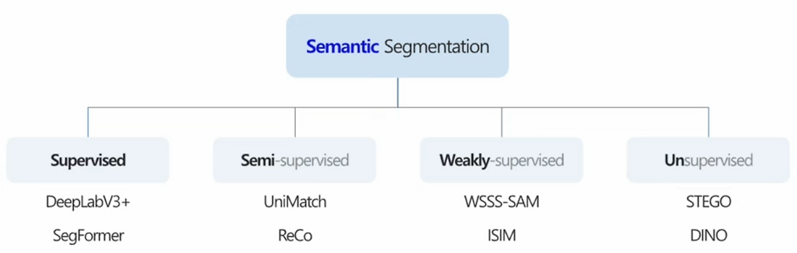

segmenation label에 대해서 큰 갈래는 위와 같다. 간단하게 설명해서 Supervised는 위에서 설명한 것과 같이 이미지마다 label을 모두 만들어주어서 학습시키는 것을 말하고, Semi-supervised는 일부만 label이 존재하고 다수의 이미지에 대해서 label이 없을 때의 학습 방법, Weakly-supervised는 Segmentation label은 만들기 너무 힘드니 point나 bounding box, class label등을 사용하는 것을 말한다. 마지막으로, unsupervised는 label이 없는 상태에서 학습하는 방법이다.

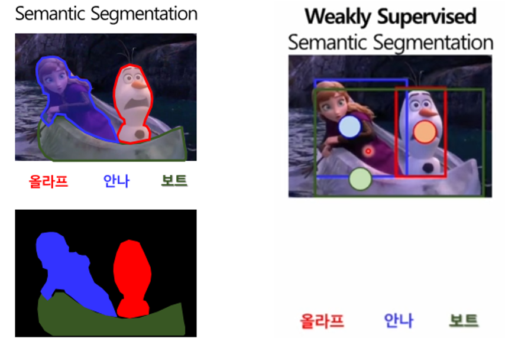
출처 : https://www.youtube.com/watch?v=7wITg-SkM3M, DSBA 연구실 유튜브

해당 논문에서는 Weakly Supervised와 비슷한 개념을 사용하고 있다. 일반적인 Semantic segmentation은 모든 픽셀에 대한 클래스 정보를 label로 사용하지만, Weakly-supervised는 bounding box와 point, class label을 사용하여 학습을 한다.

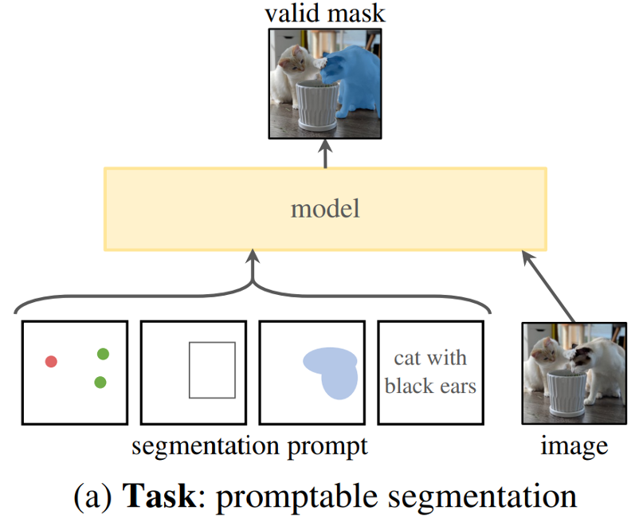
프롬포트란 일종의 형식인데 chatGPT를 보면 어떤 task에 대해서 적절한 프롬포트를 정의해주기만 해도 성능이 큰 폭으로 상승한다. 여기에서도 그 프롬포트로 위와 같이 point, bounding box, mask, text 등을 사용한다. 즉, 이미지와 함께 해당 프롬포트를 네트워크의 입력으로 주면 그에 맞는 segmentation mask를 출력으로 내보낸다.

## Network Architecture
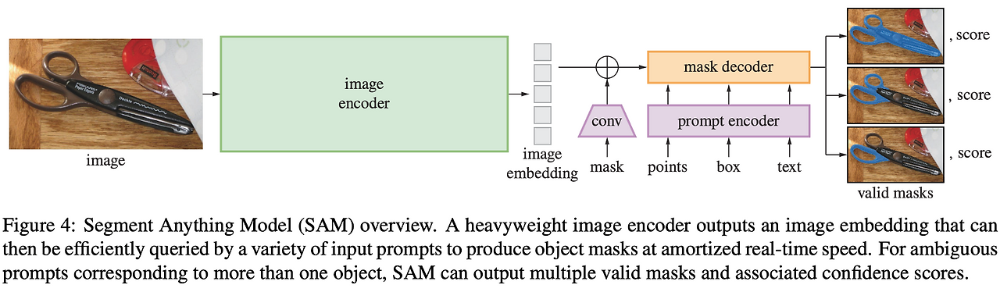  
아키텍쳐는 크게 3가지로 나눌 수 있다.
- image encoder
- flexible prompt encoder
- fast mask decoder

### 1. Image encoder
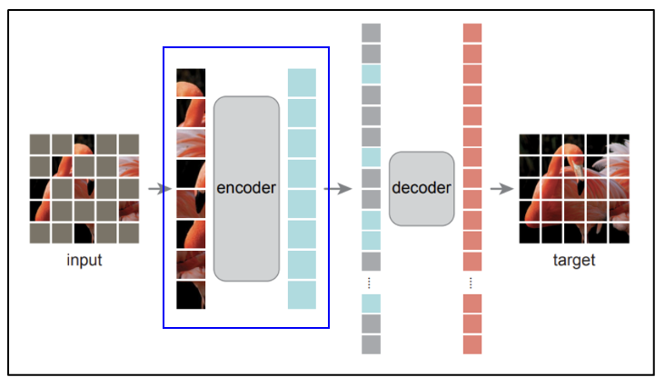
- 이미지에서 임베딩을 추출한다
- 사용되는 인코더는 MAE로 프리 트레이닝된 ViT-H/16
  - MAE(masked autoencoder)는 높은 scalability와 강력한 pre-training이 가능하게 해준다
  - 기존에 학습된 MAE에서 encoder 부분만 떼어서 image embedding을 만드는데 활용
  
  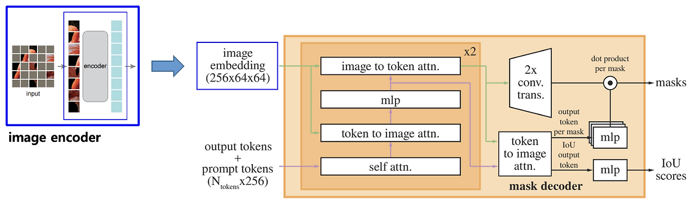
  전체 SAM 아키텍처에서 봤을때 Image encoder는 위 그림과 같이 Image embedding을 만드는 부분이다.
  - Input image : (1024 * 1024) size * (16 * 16 * 3) channels
  - patch size : 16이며, 채널에 (1x1 Conv) (3x3 Conv) (Norm) 진행
  - output embedding : (64 * 64) patches * 256 dimensions

### 2. Prompt encoder
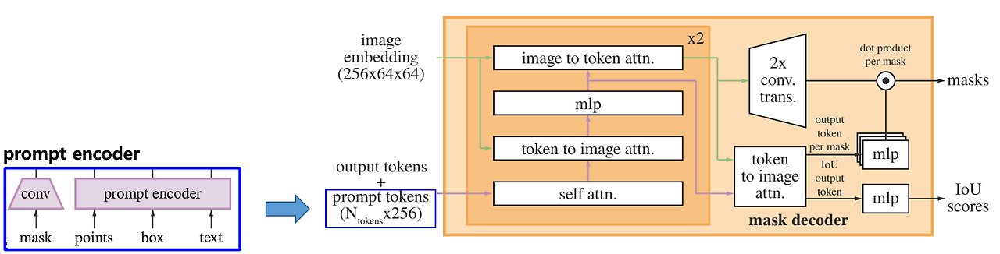
프롬포트에서 임베딩을 추출한다. 프롬포트는 (sparse, dense) 2가지가 있다.
- sparse : (점을 찍어서 명령하는 points, 박스를 그려 명령하는 boxes, 단어로 명령하는 text) 3가지
    - points, boxes : positional encoding 을 추출
    - free-from text : off-the-shelf text encdoer로 추출 (CLIP)
- dense : (직접 마스크를 제공하는 masks) 1가지
    - 보편적인 segmentation 메서드로 추출

### 3. Mask decoder
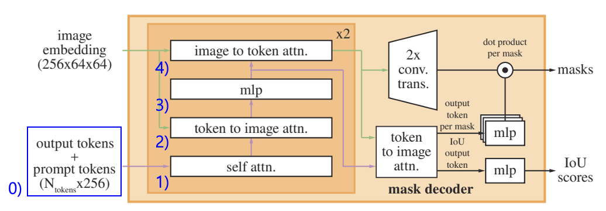
이미지 임베딩과 프롬포트 임베딩을 효율적으로 매핑해 아웃풋 마스크를 만든다.
총 2번의 디코딩이 이루어진다.

0. 프롬포트 임베딩에 Output token embedding을 부착
1. self-attention 레이어를 통해 토큰에서 representation을 추출
2. cross-attention 레이어를 통해 토근(=Q)에서 이미지 임베딩(=K,V)을 사용해 representation을 추출
3. point-wise MLP가 토큰 즉, 프롬포트를 각 토큰에 대해 차원 간 업데이트
4. cross-attention 레이어를 통해 이미지 임베딩(=Q)에서 토큰(=K,V)을 사용해 representation을 추출

이걸 2번 반복한다.

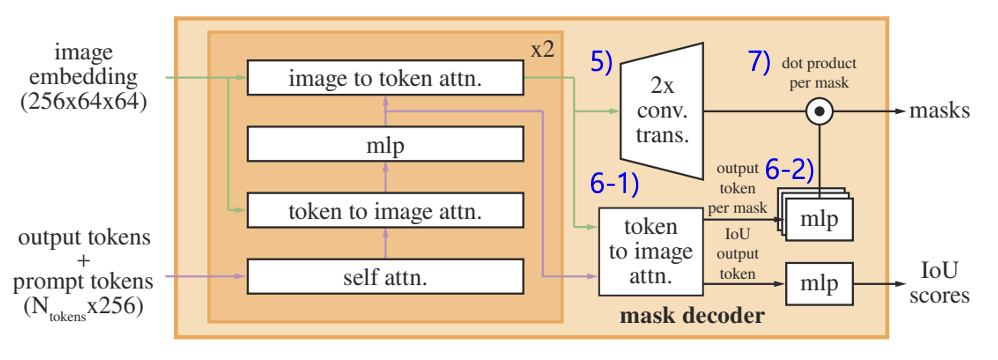

5. 2x transposed conv layer 를 사용해서 이미지 임베딩을 4배로 키운다
6. (1) cross-attention 레이어를 통해 토큰(=Q)에서 이미지 임베딩(=K, V)을 사용해 representation을 추출
   - 여기에 들어가는 토큰은 최종 크로스 어텐션 직전의 토큰
   - 이미지 임베딩은 최종 이미지 임베딩
6. (2) (1)번의 output을 small 3-layter MLP에 통과
7. 5의 결과와 6의 결과를 spatially point-wise product하여 최종 마스크를 예측 

### 4. Ambuiguity
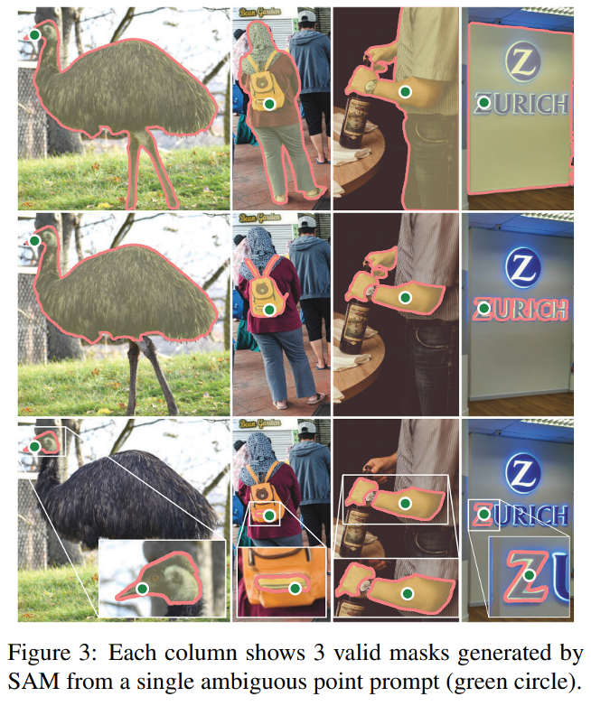

segmentation mask외에 IoU scores도 출력해야 하는 이유는 "ambuiguity"라는 문제 때문인데 프롬포트를 줄 때 어떠한 의도로 주었는지가 모호하다는 문제를 말한다. 위의 예시를 보면 프롬포트로 선택한 Point가 사람 전체인지 가방인지 지퍼부분인지 네트워크가 그 의도까지 파악해주는건 어렵다. 따라서 IoU scores를 계산해서 여러 Mask 후보 중 그나마 가장 가능성이 높은 mask를 출력으로 내보내주는 것이다.

## Data
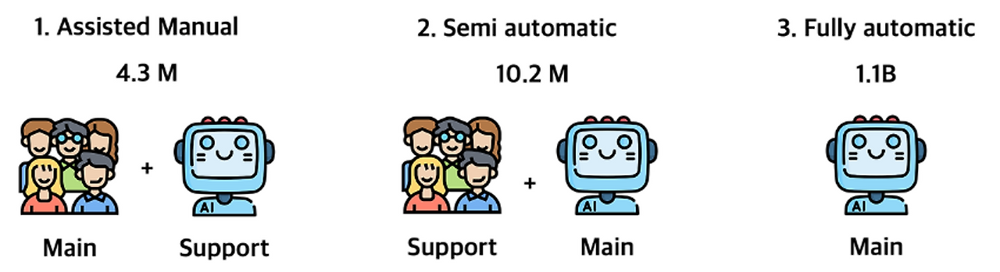

학습에 사용될 데이터(이미지, 레이블 마스크)를 만드는 과정은 위와 같이 3단계로 나뉘어져있다.

1. 첫번째 단계는, 기존 데이터셋으로 먼저 segment anything 모델을 학습시킨 후에 추론 과정을 거치고, 나온 mask들에 대해서 전문가들이 수정 및 추가하는 과정을 거친다.  
2. 두번째 단계는, 첫번 째 단계를 거쳐서 얻은 마스크 430만 장을 사용하여 다시 모델을 학습 시키고, 추론 과정을 거쳐서 mask를 만들어낸다. 여기서도 전문가가 투입되는데 첫번 째 단계와 다른 점은 수정은 하지 않고 빠진 부분에 해당하는 label만 추가해준다는 것이다. 즉, segment anything 모델이 이제는 segmentation mask를 대체로 잘 만들어낸다는 것을 가정하고 있다.

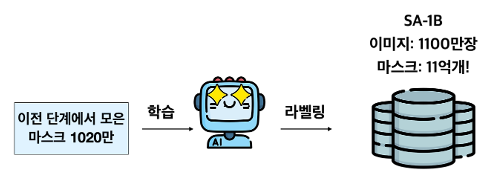

3. 마지막으로, 두번 째 단계까지 거쳐서 모은 마스크 1020만개를 사용하여 모델을 학습시키고, 전문가를 통해 수집한 1100만장의 이미지들에 대해서 segmentation mask를 만들어내도록 한다. 이 단계에서는 전문가들이 없고 온전히 모델이 만들어내는 mask를 사용한다.

## 특징
### 장점
- 범용성
- Interactive Segmentation
- Downstream 확장성
  - SAM + CLIP
  - SAM + Tracking
  - SAM + Detection

### 단점
- semantic 정보 부족
- find boundary 한계 
- 실시간성 한계 

### 기존 segmentation 모델과 비교
| 구분          | U-Net | DeepLab | Mask2Former | SAM       |
| ----------- | ----- | ------- | ----------- | --------- |
| 클래스 기반      | ⭕     | ⭕       | ⭕           | ❌         |
| Prompt 입력   | ❌     | ❌       | ❌           | ⭕         |
| Zero-shot   | ❌     | ❌       | ❌           | ⭕         |
| Interactive | ❌     | ❌       | ❌           | ⭕         |
| 범용성         | 낮음    | 중간      | 높음          | **매우 높음** |

### 한계와 오해
- SAM은 segmentation 최강자다 -> x
  - mIoU 기준으로는 task-specific 모델이 더 좋음
- AM으로 바로 서비스 만들면 된다 -> x
  - 보통은 전처리 / 후보 생성 / annotation 도구 역할

### 결론
Segmentation을 “모델 문제”에서 “인터페이스 문제”로 바꿨다
- Prompt 기반
- 범용 segmentation
- Foundation model 개념 정착

---

## 실무에서 SAM을 '모델'이 아니라 '도구'로 쓰는 방식
1. Annotation 보조 도구
   - 클릭 한두번으로 mask 자동 생성 -> 미세 수정만 사람 개입
2. 후보 영역 생성기
   - image -> SAM (object-agnostic mask proposals) -> 후처리 후처리 (filter / merge / size threshold) -> downstream 모델
   - 쓰이는 곳 : 불량 검출, 의료 병변 후보, 위성 객체 후보, OCR 전 문자 영역 추출
   - 뭐가 있는지만 잘라주고 이게 뭔지는 뒤 모델이 담당
3. 후처리 도구
   - 이미 기존 모델 결과가 있는 경우에도 사용 가능
   - ex) detection box -> SAM으로 정확한 mask 복원
       - yolo box -> sam (box prompt) -> high-quality mask
   

