# Segment Anything

## 논문 정보
> - 논문 제목: Segment Anything
> - 모델 이름: SAM (Segment Anything Model)
> - 발표 연도: 2023 / Meta AI (FAIR)
> - 한줄 요약: 프롬프트 기반으로 어떤 객체든 즉시 분할할 수 있도록, 대규모 데이터와 promptable 구조로 학습된 범용 segmentation 파운데이션 모델

## Introduction
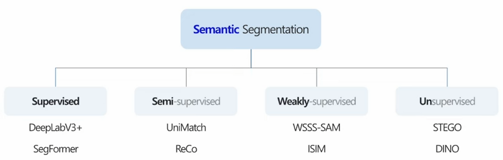

segmenation label에 대해서 큰 갈래는 위와 같다. 간단하게 설명해서 Supervised는 위에서 설명한 것과 같이 이미지마다 label을 모두 만들어주어서 학습시키는 것을 말하고, Semi-supervised는 일부만 label이 존재하고 다수의 이미지에 대해서 label이 없을 때의 학습 방법, Weakly-supervised는 Segmentation label은 만들기 너무 힘드니 point나 bounding box, class label등을 사용하는 것을 말한다. 마지막으로, unsupervised는 label이 없는 상태에서 학습하는 방법이다.

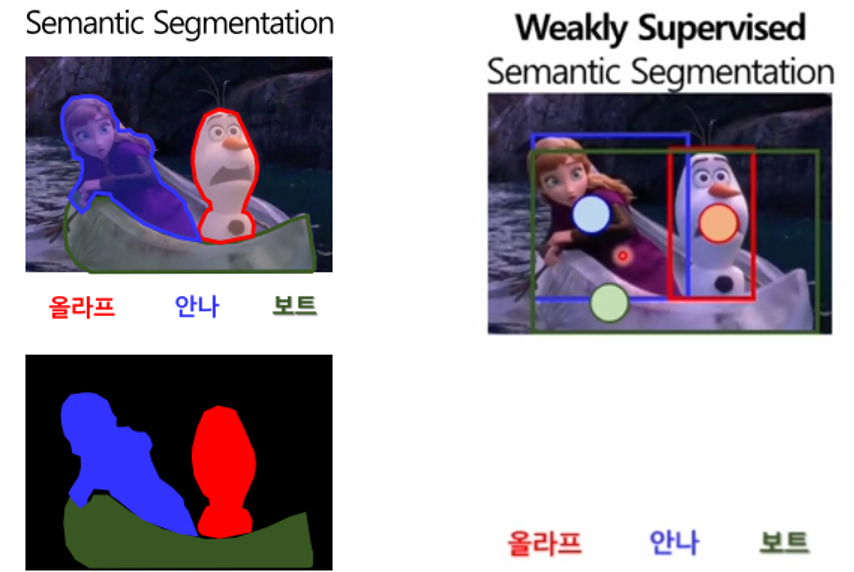
출처 : https://www.youtube.com/watch?v=7wITg-SkM3M, DSBA 연구실 유튜브

해당 논문에서는 Weakly Supervised와 비슷한 개념을 사용하고 있다. 일반적인 Semantic segmentation은 모든 픽셀에 대한 클래스 정보를 label로 사용하지만, Weakly-supervised는 bounding box와 point, class label을 사용하여 학습을 한다.

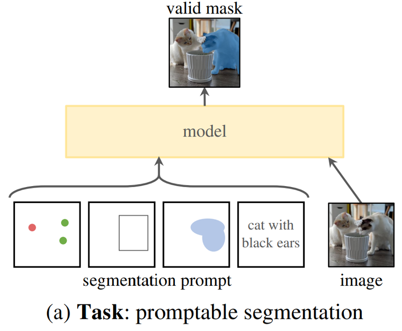
프롬포트란 일종의 형식인데 chatGPT를 보면 어떤 task에 대해서 적절한 프롬포트를 정의해주기만 해도 성능이 큰 폭으로 상승한다. 여기에서도 그 프롬포트로 위와 같이 point, bounding box, mask, text 등을 사용한다. 즉, 이미지와 함께 해당 프롬포트를 네트워크의 입력으로 주면 그에 맞는 segmentation mask를 출력으로 내보낸다.

## Network Architecture
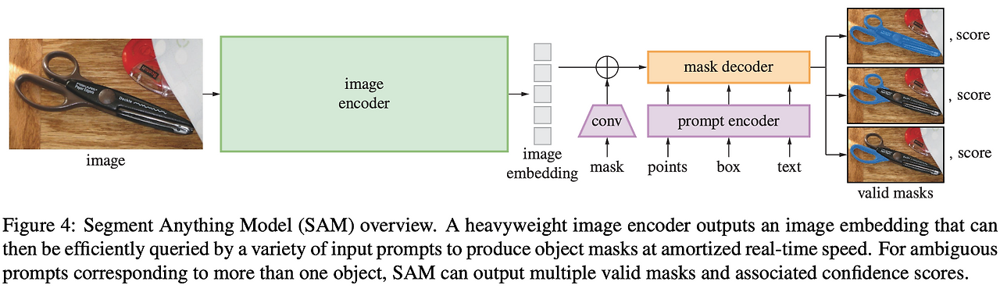  
아키텍쳐는 크게 3가지로 나눌 수 있다.
- image encoder
- flexible prompt encoder
- fast mask decoder

### 1. Image encoder
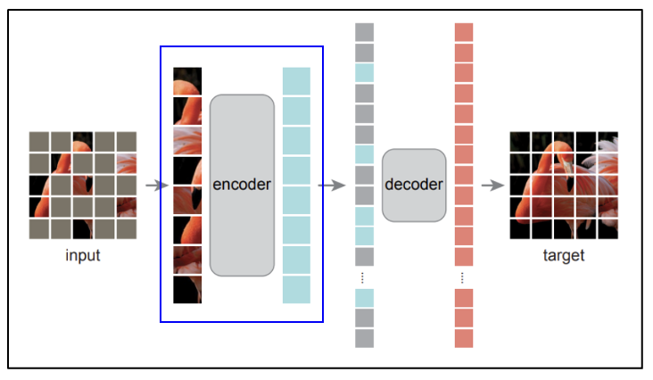
- 이미지에서 임베딩을 추출한다
- 사용되는 인코더는 MAE로 프리 트레이닝된 ViT-H/16
  - MAE(masked autoencoder)는 높은 scalability와 강력한 pre-training이 가능하게 해준다
  - 기존에 학습된 MAE에서 encoder 부분만 떼어서 image embedding을 만드는데 활용
  
  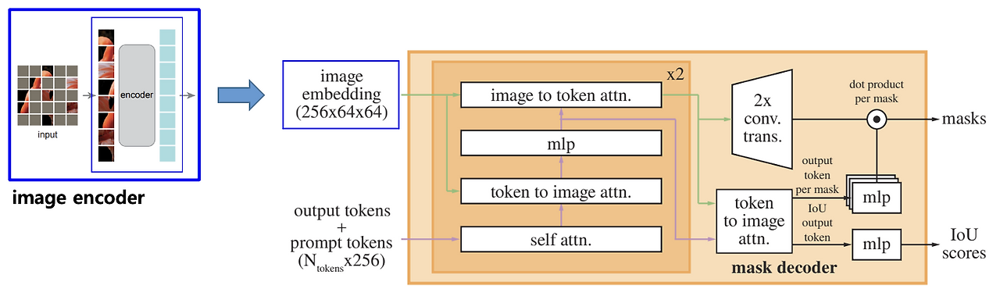
  전체 SAM 아키텍처에서 봤을때 Image encoder는 위 그림과 같이 Image embedding을 만드는 부분이다.
  - Input image : (1024 * 1024) size * (16 * 16 * 3) channels
  - patch size : 16이며, 채널에 (1x1 Conv) (3x3 Conv) (Norm) 진행
  - output embedding : (64 * 64) patches * 256 dimensions

### 2. Prompt encoder
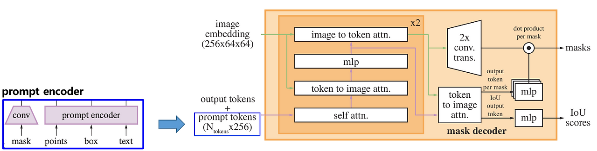
프롬포트에서 임베딩을 추출한다. 프롬포트는 (sparse, dense) 2가지가 있다.
- sparse : (점을 찍어서 명령하는 points, 박스를 그려 명령하는 boxes, 단어로 명령하는 text) 3가지
    - points, boxes : positional encoding 을 추출
    - free-from text : off-the-shelf text encdoer로 추출 (CLIP)
- dense : (직접 마스크를 제공하는 masks) 1가지
    - 보편적인 segmentation 메서드로 추출

### 3. Mask decoder
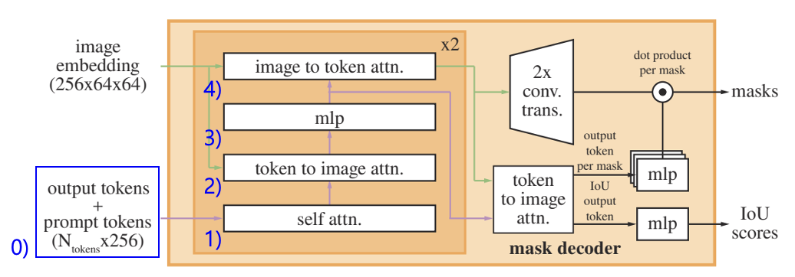
이미지 임베딩과 프롬포트 임베딩을 효율적으로 매핑해 아웃풋 마스크를 만든다.
총 2번의 디코딩이 이루어진다.

0. 프롬포트 임베딩에 Output token embedding을 부착
1. self-attention 레이어를 통해 토큰에서 representation을 추출
2. cross-attention 레이어를 통해 토근(=Q)에서 이미지 임베딩(=K,V)을 사용해 representation을 추출
3. point-wise MLP가 토큰 즉, 프롬포트를 각 토큰에 대해 차원 간 업데이트
4. cross-attention 레이어를 통해 이미지 임베딩(=Q)에서 토큰(=K,V)을 사용해 representation을 추출

이걸 2번 반복한다.

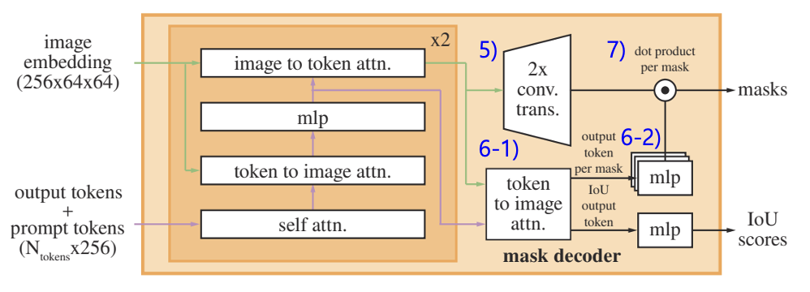

5. 2x transposed conv layer 를 사용해서 이미지 임베딩을 4배로 키운다
6. (1) cross-attention 레이어를 통해 토큰(=Q)에서 이미지 임베딩(=K, V)을 사용해 representation을 추출
   - 여기에 들어가는 토큰은 최종 크로스 어텐션 직전의 토큰
   - 이미지 임베딩은 최종 이미지 임베딩
6. (2) (1)번의 output을 small 3-layter MLP에 통과
7. 5의 결과와 6의 결과를 spatially point-wise product하여 최종 마스크를 예측 

### 4. Ambuiguity
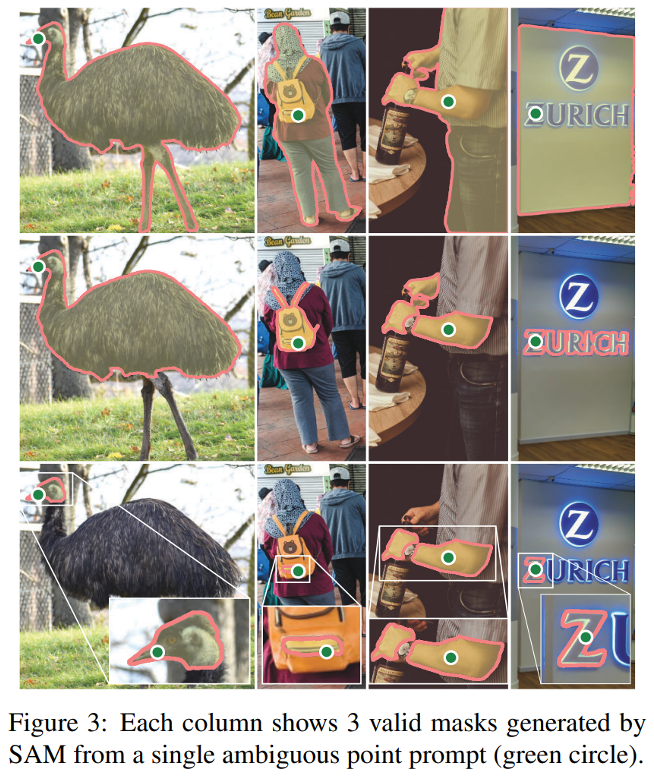

segmentation mask외에 IoU scores도 출력해야 하는 이유는 "ambuiguity"라는 문제 때문인데 프롬포트를 줄 때 어떠한 의도로 주었는지가 모호하다는 문제를 말한다. 위의 예시를 보면 프롬포트로 선택한 Point가 사람 전체인지 가방인지 지퍼부분인지 네트워크가 그 의도까지 파악해주는건 어렵다. 따라서 IoU scores를 계산해서 여러 Mask 후보 중 그나마 가장 가능성이 높은 mask를 출력으로 내보내주는 것이다.

## Data
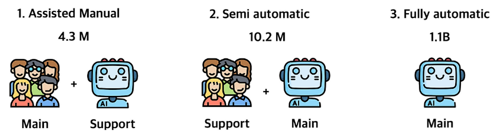

학습에 사용될 데이터(이미지, 레이블 마스크)를 만드는 과정은 위와 같이 3단계로 나뉘어져있다.

1. 첫번째 단계는, 기존 데이터셋으로 먼저 segment anything 모델을 학습시킨 후에 추론 과정을 거치고, 나온 mask들에 대해서 전문가들이 수정 및 추가하는 과정을 거친다.  
2. 두번째 단계는, 첫번 째 단계를 거쳐서 얻은 마스크 430만 장을 사용하여 다시 모델을 학습 시키고, 추론 과정을 거쳐서 mask를 만들어낸다. 여기서도 전문가가 투입되는데 첫번 째 단계와 다른 점은 수정은 하지 않고 빠진 부분에 해당하는 label만 추가해준다는 것이다. 즉, segment anything 모델이 이제는 segmentation mask를 대체로 잘 만들어낸다는 것을 가정하고 있다.

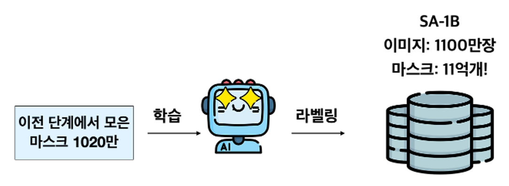

3. 마지막으로, 두번 째 단계까지 거쳐서 모은 마스크 1020만개를 사용하여 모델을 학습시키고, 전문가를 통해 수집한 1100만장의 이미지들에 대해서 segmentation mask를 만들어내도록 한다. 이 단계에서는 전문가들이 없고 온전히 모델이 만들어내는 mask를 사용한다.

## 특징
### 장점
- 범용성
- Interactive Segmentation
- Downstream 확장성
  - SAM + CLIP
  - SAM + Tracking
  - SAM + Detection

### 단점
- semantic 정보 부족
- find boundary 한계 
- 실시간성 한계 

### 기존 segmentation 모델과 비교
| 구분          | U-Net | DeepLab | Mask2Former | SAM       |
| ----------- | ----- | ------- | ----------- | --------- |
| 클래스 기반      | ⭕     | ⭕       | ⭕           | ❌         |
| Prompt 입력   | ❌     | ❌       | ❌           | ⭕         |
| Zero-shot   | ❌     | ❌       | ❌           | ⭕         |
| Interactive | ❌     | ❌       | ❌           | ⭕         |
| 범용성         | 낮음    | 중간      | 높음          | **매우 높음** |

### 한계와 오해
- SAM은 segmentation 최강자다 -> x
  - mIoU 기준으로는 task-specific 모델이 더 좋음
- SAM으로 바로 서비스 만들면 된다 -> x
  - 보통은 전처리 / 후보 생성 / annotation 도구 역할

### 결론
Segmentation을 “모델 문제”에서 “인터페이스 문제”로 바꿨다
- Prompt 기반
- 범용 segmentation
- Foundation model 개념 정착

---

## 실무에서 SAM을 '모델'이 아니라 '도구'로 쓰는 방식
1. Annotation 보조 도구
   - 클릭 한두번으로 mask 자동 생성 -> 미세 수정만 사람 개입
2. 후보 영역 생성기
   - image -> SAM (object-agnostic mask proposals) -> 후처리 후처리 (filter / merge / size threshold) -> downstream 모델
   - 쓰이는 곳 : 불량 검출, 의료 병변 후보, 위성 객체 후보, OCR 전 문자 영역 추출
   - 뭐가 있는지만 잘라주고 이게 뭔지는 뒤 모델이 담당
3. 후처리 도구
   - 이미 기존 모델 결과가 있는 경우에도 사용 가능
   - ex) detection box -> SAM으로 정확한 mask 복원
       - yolo box -> sam (box prompt) -> high-quality mask
   

---

# SAM3

## 논문 정보
> - 논문 제목: SAM 3: Segment Anything with Concepts
> - 모델 이름: SAM3
> - 발표 연도: 2025
> - 한줄 요약: SAM 3는 "yellow school bus" 같은 짧은 명사구나 이미지 예시만으로 해당 개념의 모든 인스턴스를 자동으로 찾아 세그멘테이션할 수 있음

## Introduction
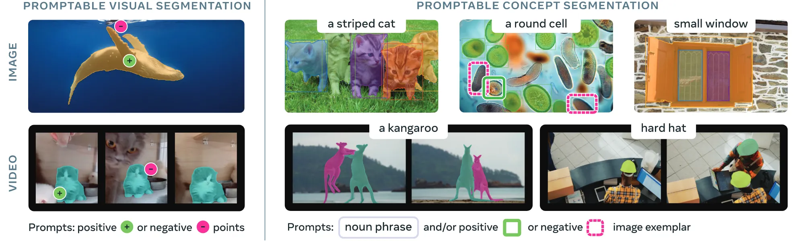
기존 SAM 모델들이 point나 box를 이용해 특정 객체 하나를 분할하는 promptable visual segmentation(PVS)에 중점을 뒀다면, SAM3는 텍스트나 이미지 예시를 입력받아 해당 concept에 해당하는 모든 객체를 찾아내고 비디오에서 추척하는 능력까지 갖췄다. 

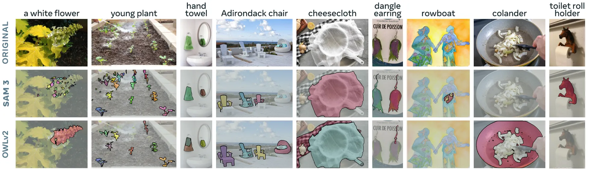
또한 SAM3는 Open-Vocabulary 환경에서도 기존 모델보다 훨씬 정밀한 마스크 생성, 작은 객체 탐지, 그리고 희귀한 개념 처리 능력을 보여주며 확실한 성능 향상을 입증했다.

## Main idea
### Promptable Concept Segmentation(PCS)
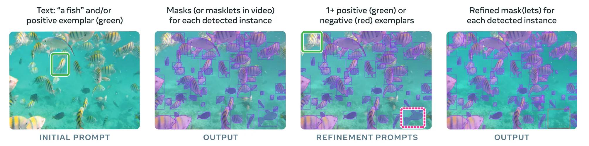
하나의 이미지나 30초보다 작은 길이의 짧은 비디오가 들어오고, 해당 입력에서 detect나 segment하고 싶은 부분에 대해서 text나 positive exempler(왼쪽에 초록색 박스)를 넣으면 condition에 맞는 모든 객체를 detect나 segment하는 방식이 Promptable Concept Segmentation(PCS)이다. 개념은 명사와 선택적 수식어로 구성된 단순 명사구(NP)로 정의된 개념으로 제한된다. 명사구 프롬프트는 이미지/동영상의 모든 프레임에 글로벌하게 적용되는 반면, image exemplar는 개별 프레임에 positive/negative bounding box로 제공하여 대상 마스크를 반복적으로 개선할 수 있다.

Vocabulary에는 시각적 장면에서 근거로 삼을 수 있는 간단한 명사구가 모두 포함되어 있어, task가 본질적으로 모호해진다. 다의성, 주관적인 설명어, 근거조차 없는 모호하거나 맥락에 따라 달라지는 문구, 경계 모호성, object의 범위를 가리는 occlusion 및 blur와 같은 요소로 인해 문구에 대한 여러 해석이 있을 수 있다. Vocabulary를 신중하게 선별하고 모든 관심 클래스에 대한 명확한 정의를 설정함으로써 이러한 문제를 완화할 수 있다. 저자들은 세 명의 전문가로부터 테스트 주석을 수집하고, 여러 가지 유효한 해석을 허용하도록 평가 프로토콜을 조정하고, 주석의 모호성을 최소화하기 위한 데이터 파이프라인 및 가이드라인을 설계하고, 모델에 모호성 모듈을 추가함으로써 모호성 문제를 해결하였다.

## Network Architecture
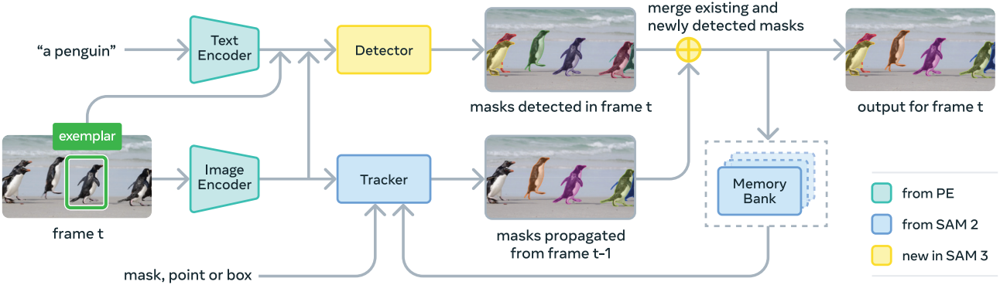

SAM3는 SAM2의 일반화로, 기존의 PVS task와 함께 새로운 PCS task를 지원한다. 개념 프롬프트 (단순 명사구, image exemplar) 또는 비주얼 프롬프트 (점, 상자, 마스크)를 사용하여 시공간적으로 분할할 object를 정의한다. image exemplar와 비주얼 프롬프트를 개별 프레임에 반복적으로 추가하여 대상 마스크를 개선할 수 있다. False positive 및 false negative object는 image exemplar를 사용하여 각각 제거하거나 추가할 수 있으며, 개별 masklet은 SAM 2 스타일의 PVS를 사용하여 개선할 수 있다.

### Detector Architecture
아키텍처에서 사용한 detector는 DETR 방식을 선택했다. Image나 Text prompt는 각각의 encoder를 통해서 encoding되고, image exemplar가 존재할 경우 exemplar encoder를 통해서 encoding된다. 여기서 생성된 text token과 image exemplar token을 논문에서는 prompt token이라고 정의했다.

1. Image token과 prompt token에 대해서 cross attention을 수행한 후 DETR 기반의 decoder를 사용해서 이미지에서 prompt에 맞는 부분 탐지
2. 각각의 decoder layer는 물체가 prompt에 해당하는지를 binary label과 confidence로 나타내고, bounding box의 변화량을 delta로 나타냄
   - 첫번째 layer에서 물체에 대한 bbox와 confidence를 예측하면, 다음 layer는 이를 기반으로 bbox를 더 정교하게 예측하기 위해 delta만큼 변화시키고, 이에 대한 confidence를 예측하는 식으로 진행
    - 특정 box를 집중적으로 보기 위해서 box-region-positional bias와 vanilla attention 방식을 사용
    - DETR은 Detection모델이기 때문에 Segmentation을 진행하기 위해서 MaskFromer를 추가로 사용

#### Presence Token
하나의 toekn으로 물체가 존재하는지 확인하면서 어디에 있는지 동시에 확인하는 작업은 어렵다. 왜냐면 물체의 유무는 global한 정보이고, 어디에 있는지는 local한 정보이기 때문이다. 이에 SAM3는 presence token의 학습을 통해 이 과정을 분해했다. presence token은 target concept이 존재하는지에 대해서 존재 여부만을 나타낸다

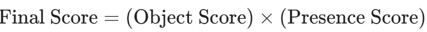

최종 점수는 위와 같이 Presence Score를 기반과 기존 object score를 곱해서 나타내기 때문에 물체가 존재하지 않으면 presence score가 0이라서 최종 score도 0이 된다. 따라서 기존의 DETR의 token은 물체의 존재여부를 알고 있는 상태에서 물체의 위치만 알 수 있도록 학습 될 수 있기 때문에 global과 local에 대해서 2개의 token으로 분해해서 더 정확한 결과를 얻을 수 있다.

#### Image Examplars and Interactivity
SAM3도 SAM(1,2)처럼 point나 box를 통해서 prompt를 줄 수 있지만 기존 모델들과 다르게 하나의 객체 탐지가 아니라 이미지내에 prompt와 동일한 모든 객체를 찾는다. 이를 위해서 prompt가 어딨는지 위치 정보를 주기 위해서 position embedding, positive인지 negative인지 알려주기 위해서 label embedding, prompt에 해당하는 이미지 정보를 주기 위해서 ROI-pooled visual feature를 이용해서 학습을 진행한다.

### Tracker and Video
video에서 매 프레임마다 물체를 탐지하기 위해서 detector와 tracker를 사용한다.
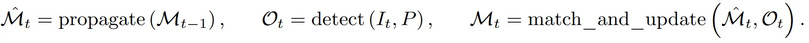

detector는 매 프레임마다 새로운 물체를 예측해서 결과 $O_{t}$ 로 나타내고, tracker는 이전 프레임에 생성된 mask들 $M_{t-1}$ 에 대해서 현재 위치에 존재하는지에 대해서 예측한 mask $\hat{M}_{t}$ 로 나타낸다. 이후 detector가 예측한 $M_{t}$와 tracker가 예측한 $\hat{M}_{t}$ 를 비교해서 물체가 동일하게 존재하는지, 존재한다면 그 물체를 추척하는 형식으로 진행

Tracker는 SAM2 모델을 이용했고 detector와 동일한 image/frame encoder를 사용했다. Detector를 우선 학습한 뒤 PE backbone만을 freeze시키고 prompt encoder, mask decoder, memory encoder, and a memory bank를 포함해서 tracker를 학습시킨다. Memorey encoder는 이전 프레임에 대한 정보를 저장하는 모델로 transformer 형태의 아키텍처로 현재 프레임과 이전 프레임의 정보를 cross-attention를 기반으로 정보를 공유하는 방식으로 설계 되어있다.

## Data Engine
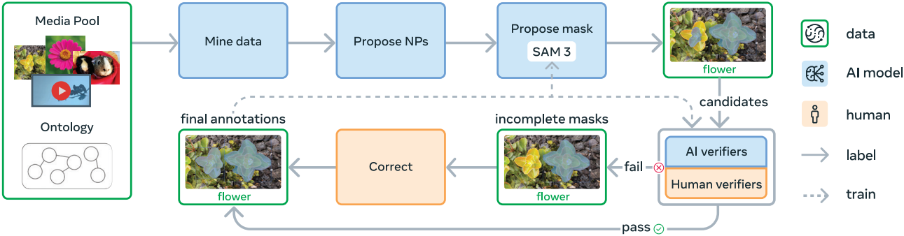

SAM 3를 활용한 PCS의 획기적인 변화를 달성하려면 기존 데이터셋을 넘어 광범위하고 다양한 개념과 도메인에 대한 학습이 필요하다. 저자들은 SAM 3, 인간, AI annotator 간의 피드백 루프를 통해 반복적으로 주석 데이터를 생성하는 효율적인 데이터 엔진을 구축하였다. 현재 버전의 SAM 3가 고품질 학습 데이터를 생성하지 못하는 미디어-구문 쌍을 적극적으로 마이닝하여 모델을 더욱 개선하였다. 특정 task를 인간의 정확도와 동일하거나 그 이상의 정확도를 가진 AI annotator에게 위임함으로써, 인간만 사용하는 파이프라인보다 처리량을 두 배 이상 향상시켰다. 데이터 엔진은 4단계로 개발되었으며, 각 단계에서는 AI 모델을 활용하여 인간의 노력을 가장 어려운 실패 사례로 유도하고 도메인 커버리지를 확장하였다. 1~3단계는 이미지에만 집중하고, 4단계에서는 동영상으로 확장하였다.

## 특징
### SAM / SAM2 / SAM3
| 구분 | SAM       | SAM2           | SAM3                    |
| -- | --------- | -------------- | ----------------------- |
| 핵심 | object 분할 | video tracking | **concept 기반 분할**       |
| 입력 | point/box | prompt + video | **text + exemplar**     |
| 출력 | 단일 객체     | tracked 객체     | **모든 개념 인스턴스**          |
| 범위 | visual    | temporal       | **semantic + temporal** |

### 성능
메타 Ai에서 사용하는 데이터셋인 SA-Co을 통해서 기존 SAM2 대비 정확도를 2배 향상시켰으며 인간의 정확도가 70~80% 정도이며 SAM3는 이에 근접한 65%의 성능을 보였다.
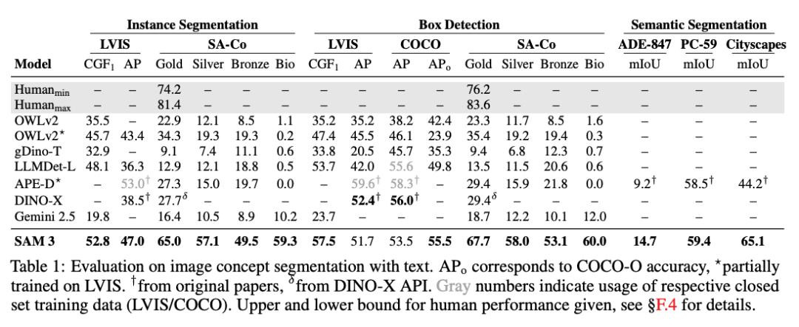

