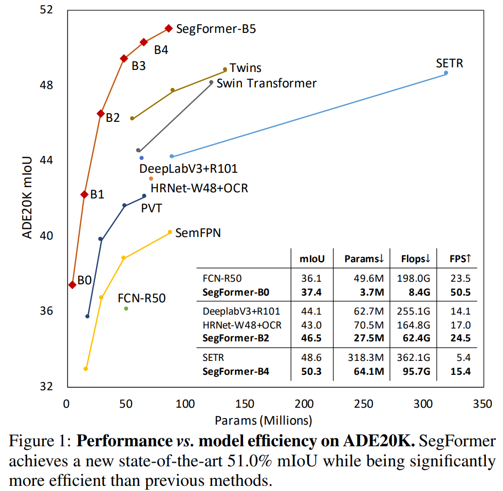
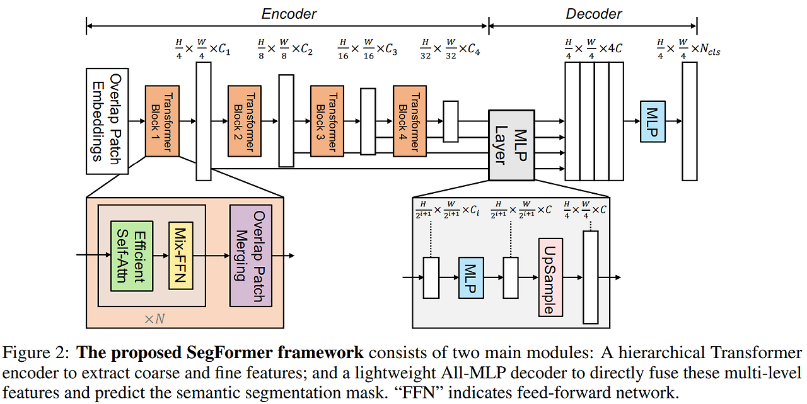
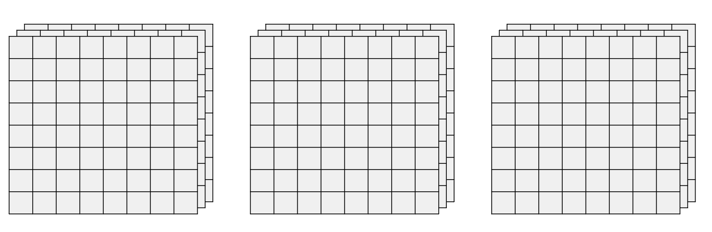
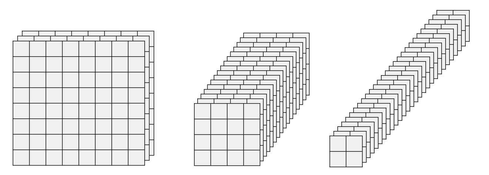
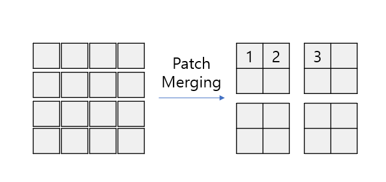
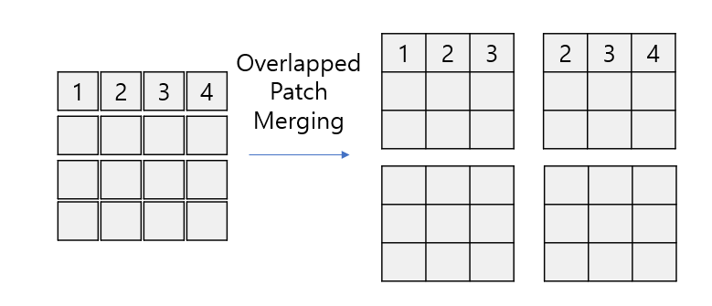
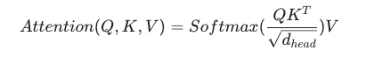
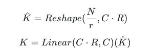
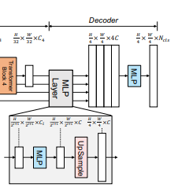
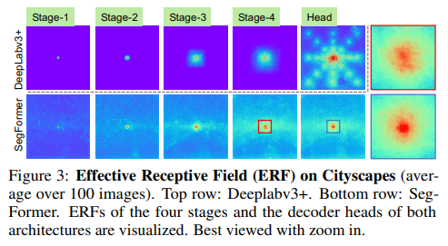

# SegFormer: Simple and Efficient Design for Semantic Segmentation with Transformers

## 논문 정보
> - 논문 제목: SegFormer: Simple and Efficient Design for Semantic Segmentation with Transformers
> - 모델 이름: SegFormer
> - 발표 연도: 2021 (NVIDIA, ICCV)
> - 한줄 요약: SegFormer는 Hierarchical Transformer Encoder + Lightweight MLP Decoder 구조로, 높은 정확도와 실제 산업에 적합한 효율성을 동시에 달성한 세그멘테이션 모델이다.

## Introduce
본 논문에서는 효율적인 segmentation task 수행을 위한 간단하고 효율적이면서 강력한 semantic segmentation 프레임워크인 SegFormer를 제안한다. SegFormer 는 1) multi-scale feature를 추출하는 새로운 Hierarchically structured Transformer encoder로 구성되고, Positional encoding이 필요하지 않기 때문에 테스트 이미지의 해상도가 학습 이미지의 해상도와 다를 때 성능이 저하되는 positional code의 interpolation을 피할 수 있다. 2) 또한 SegFormer는 복잡하지 않은 간단한 MLP 구조의 decoder를 사용하는데, 제안한 MLP decoder는 서로 다른 계층의 정보를 집계하여 강력한 representation을 렌더링하기 위해 local attention과 global attention을 결합한다. 

위의 표를 보면 SegFormer 모델이 다른 모델에 비해 파라미터 수는 적고 mIOU는 월등히 높은 것을 폴 수 있다.

## Network Architecture

SegFormer는 다음과 같은 특징을 가진다.
1. 계층적 구조의 Encoder : 고해상도의 coarse 특징들과 저해상도의 fine-grained 특징들을 추출한다. 특히 Positional embedding을 사용하지 않았고 이에 따라 추론시 다른 크기의 이미지를 사용해도 성능이 크게 감소하지 않는다.
2. 경량화된 Decoder : 더 적은 연산량을 가지며 Encoder에서 얻어낸 모든 특징들을 모두 활용해 최종 출력을 얻어낸다

간략한 구조 설명은 다음과 같다.
1. 크기가 H x W x 3 인 입력 이미지가 주어지면 4x4 크기의 패치로 나눈다
   1. 16x16 패치로 나누는 ViT에 비해 세분화된 패치를 사용하면 segmentation에 유리
2. 패치들을 인코더의 입력으로 사용하여 원본 이미지의 해상도가 {1/4, 1/8, 1/16, 1/32}인 multi-level feature를 얻는다. 
3. multi-level feature를 디코더에 전달하여 (H/4) x (W/4) x Ncls 해상도로 segmentation mask를 예측 (Ncls : 카테고리 수)

## Main idea
### Hierarchical Transformer Encoder
본 논문에서 Transformer Encoder의 이름을 Mix Transformer(MiT)라고 지었다. MiT의 주요 특징을 설명하면 다음과 같다.

#### 1. Hierarchical Feature Representation
ViT의 구조는 아래와 같다. 각 격자는 하나의 Patch라고 가정.

동일한 수의 patch를 토대로 연산을 진행하며 patch의 수가 변하지 않는다.

반면 MiT의 구조는 다음과 같다.

이 구조는 CNN과 유사한 형태로 고해상도의 coarse한 특징들과 저해상도의 find-grained 특징들을 얻어 segmentation에서 더 좋은 성능을 낼 수 있다고 한다.

#### 2. Overlapped Patch Merging
기존의 ViT 계열의 모델들에서 사용되던 Patch Merging은 인접한 Patch들을 붙이는 방법으로만 작동됐다.

이러한 구조는 다른 부분으로 병합된 다른 패치와의 정보는 단절되게 된다. (경계 정보 손실)
이를 해결하기 위해 overlapped patch merging을 고안하여 다른 패치와의 정보를 교환할 수 있도록 한다.

위와 같이 왼쪽 위의 패치에서는 1, 2, 3번 패치 오른쪽 위에서는 2, 3, 4번 패치와 각각 Self-Attention을 진행하기 때문에 정보가 단절되지 않는다. Conv 연산과 비슷하게 Kernel Size(K), Stride(S), Padding(P)를 정의하여 비슷한 원리로 Patch를 병합한다. 

#### 3. Efficient Self-Attention
Encoder의 연산에서 병목이 되는 주요한 원인 중 하나는 self-attention 레이어의 연산량이다. attention 연산은 다음과 같은 수식으로 이루어지는데 

이때 패치의 수가 N이라면 시간복잡도는 O(N^2)이 된다.
SegFormer는 공간을 줄여가며 hierarchical 구조로 attention 비용 감소하고자 했다.

이로 인해 attention 연산의 시간 복잡도는 O(N^2)에서 O(N^2/R)로 줄어든다.

### Lightweight All-MLP Decoder

기존 segmentation 모델들은 decoder가 무거운게 특징인데 SegFormer는 Decoder 부분에도 변화를 주어 경량화하여 좋은 성능을 내게 된다.

SegFormer 는 MLP 레이어로만 구성된 경량 디코더를 통합하며 이는 다른 방법에서 일반적으로 사용되는 수작업 및 계산 요구 사항 구성 요소를 필요로 하지 않는다. 이러한 간단한 디코더를 설계하는 핵심은 계층적 트랜스포머 인코더가 기존 CNN 인코더보다 더 큰 Effective Receptive Field (ERF) 를 갖는다는 점이다. 

제안하는 ALL-MLP 디코더는 크게 아래와 같은 4단계로 구성된다.
1. MiT 인코더의 multi-level feature Fi는 MLP를 통해 동일한 채널 사이즈로 통합
2. feature 를 원본 이미지의 1/4 사이즈로 업샘플링하고 concat
3. concat 하여 4배 증가된 채널을 MLP를 사용하여 원래 채널 사이즈로 변경
4. segmentation mask를 예측

#### 1. Effective Receptive Field Analysis

semantic segmentation에서 넓은 receptive field를 가지면서 문맥 정보를 파악하는 것은 가장 큰 문제였다.

위의 표는 DeepLab V3+ 모델과 SegFormer의 ERF를 시각화한 것인데 Deeplab V3+의 ERF를 살펴보면 Stage-4가 될때 까지 SegFormer보다 상대적으로 작다.

SegFormer의 Receptive Field 특징은 빈 부분이 없이 골고루 인식하며 이로 인해 Encoder만으로도 Global Context 또한 잘 인식할 수 있다는 점이 장점이다.

결국 CNN Encoder의 제한된 Receptive Field로 인해 ASPP와 같은 무거운 모듈을 사용해야 비어있는 Receptive Field를 반영하여 문맥 정보를 잘 파악할 수 있다.

하지만 SegFormer는 MiT Encoder의 골고루 퍼진 Receptive Field 때문에 간단한 Decoder 하나만으로도 넓은 Receptive Field를 가진다고 한다.

## Conclusion
### 장점
- 가볍고 빠르다.
  - Decoder가 거의 없는 수준
  - 다양한 GPU 환경에서 빠른 속도 확보
  - 산업 적용 시 필수인 inference latency 측면에서 강점
- transformer 기반이라 global context 학습이 뛰어나다
- multi-scale representation 우수
- 다양한 크기의 모델 제공
  - MiT-B0~B5까지 제공

### 단점
- 원본 ViT보다 지역 정보를 잘 쓰지만 CNN 대비 부족한 경향
- self-attention 비용은 cnn보다 높음
- Decoder 단순화로 세밀한 경계 복원 능력은 제한됨

### 결론
SegFormer는 **"가볍고 빠르면서도 정확한 Segmentation Transformer"** 라는 새로운 방향을 제시한 모델이다.
- Hierarchical Feature Representation : Multi-scale/level Feature → Semantice Segmentation 성능 ↑
- Efficient Self-Attention : Sequence Reduction → 연산 효율성 ↑
- Overlapped Patch Merging : 로컬 연속성 유지 → Semantice Segmentation 성능 ↑
- Positional-Encoding-Free Design : PE 사용 X → 학습/테스트 데이터 해상도 다른 경우에도 Semantic Segmentation 성능 저하 x
- Lightweights All-MLP Decoder: 복잡한 계산 X → 연산 효율 ↑

## DeepLabv3+ vs SegFormer
### 구조적 차이

| 항목 | DeepLabv3+ | SegFormer |
|:-----|:-----------|:----------|
| **Backbone** | ResNet/Xception (CNN) | Mix Transformer (Hierarchical ViT) |
| **Multi-scale 방식** | ASPP (Atrous convolution) | Hierarchical encoder (4-stage pyramid) |
| **Decoder 구조** | Heavy (ASPP + low-level feature refinement) | Lightweight (All-MLP decoder) |
| **Positional Encoding** | Implicit (convolution의 특성) | Mix-FFN (3×3 Depth-wise Conv) |
| **Receptive Field 확장** | Atrous convolution | Self-attention mechanism |
| **해상도 유연성** | Fixed (학습 해상도 고정) | Flexible (arbitrary resolution) |