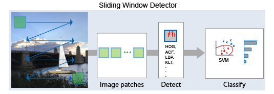
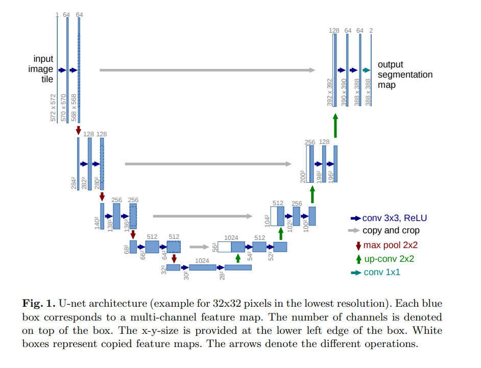
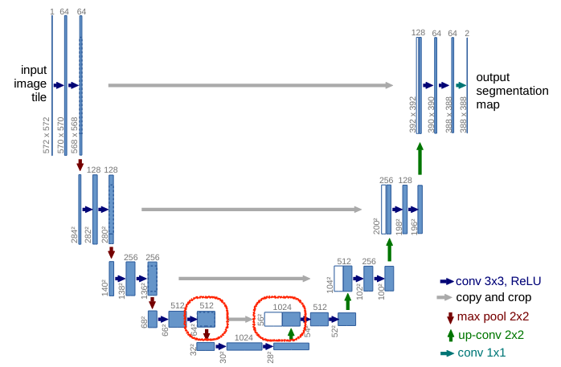
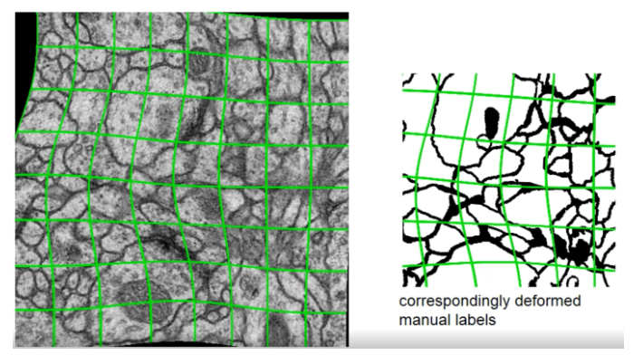
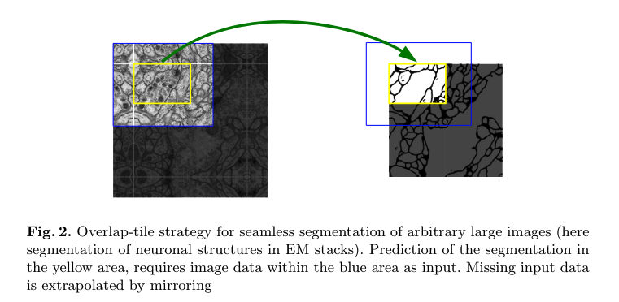
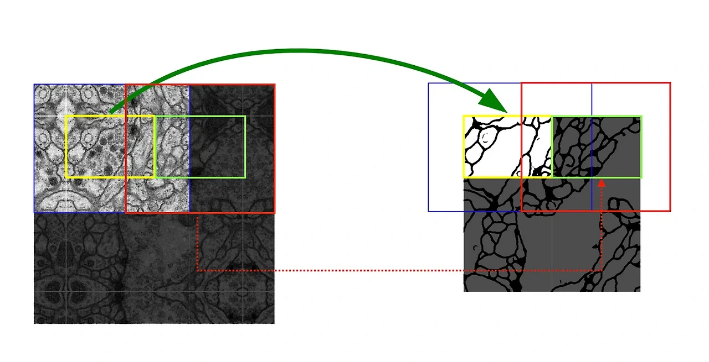

# U-Net: Convolutional Networks for Biomedical Image Segmentation

## 논문 정보
> - 논문 제목 : U-Net: Convolutional Networks for Biomedical Image Segmentation
> - 모델 이름 : U-Net
> - 발표 연도 : MICCAI 2015
> - 한줄 요악 : Encoder–Decoder 구조와 Skip Connection을 활용해 적은 데이터에서도 정교한 픽셀 단위 분할을 수행하는 대표적인 이미지 세그멘테이션 모델

## Introduction
전형적인 cnn 모델은 이미지를 입력하면, 이미지에 해당하는 하나의 class label이 출력되는 방식으로 분류작업을 수행한다. 그런데 실제로 많은 과업에서 localization을 포함한 결과가 필요한 경우가 많다. 즉, 이미지 전체가 아닌 이미지 내부의 각 픽셀에 해당하는 labeling이 필요한거다. 

Biomedical image에는 한 이미지 안에 여러개의 세포가 들어있어 더욱 세밀한 작업이 필요했지만 대량의 training set을 확보하기가 어렵다. 이를 위해 sliding window 방식이 도입되었는데 사진을 윈도우 사이즈에 맞춰 나눈 다음 매 윈도우로 잘린 이미지를 입력 값으로 모델을 통과해서 결과를 얻는 방식이다.

그런데 sliding window를 적용하면 계산량이 많아지면서 전체 네트워크가 느려진다는 단점이 있다. 게다가, localization accuracy와 use of context - 즉 전체와 부분 사이의 tradeoff가 발생하는 문제점도 있었다. 

이 문제를 해결하기 위해 U모양의 fully convolutional network가 제안되었다.
이 논문에서 강조하는 키워드는 아래와 같다.
- data augmentation
- contracting path & expanding path
- end-to-end
- not a sliding window
- outperform, fast

## Network Architecture

U-Net = Contraction path + Expansive path

### Encoder(Contraction path)
기본적인 컨볼루션 네트워크 구조로 되어 있다.
- (3x3) 필터를 사용하여 패딩 없이 conv 계산한 뒤 ReLU 적용
- 위의 과정 2번 반복
- 2x2 size, stride 2 의 max pooling 적용하여 다운샘플링
- 한 세트의 다운샘플링을 진행할 때마다 채널 수는 2배씩 증가 (정보 손실 최소화, 복잡한 특징 학습 강화)

이미지의 사이즈가 줄어드는 과정에서 이미지의 특징이 추출되고, 채널이 늘어나는 과정에서 이미지의 다양한 특징을 확보하게 된다.

### Decoder(Expansive path)
- (2x2) 필터를 사용하여 특징 맵의 사이즈를 키우는 업샘플링 수행
  - 이 과정에서 반대로 채널의 수는 다시 절반으로 점차 줄어들게 된다
- encoder에서 넘어온 feature map을 concatenation(skip connection)으로 연결
- 두 번의 3x3 conv(unpadded) 수행 후 ReLU 함수 적용
- 채널의 수를 반을 줄임
  - 정보 결합으로 인해 더욱 정제된 형태의 feature map 생성
- 마지막에는 1x1 conv 사용해 결과값의 필터 수를 원하는 값으로 조정

### skip connection

encoder의 low-level feature를 decoder로 전달해 정확한 경계와 위치 정보를 전달

  빨간색 표시한 부분을 보면 Contracting path의 (64 * 64 * 512)이 copy and crop으로 Extracting path의 (56 * 56 * 512)와 concatenate되어 (56 * 56 *  1024)가 된다. 64와 56이 사이즈가 맞지 않으니 64를 56으로 crop해주어야 했을 것이고, 이후 필터 512장과 512장이 concat으로 이어붙어 1024이 된 것이다.

## Main Idea

### (1) Data augmentation
UNet은 고작 30장밖에 되지 않는 데이터셋으로 성능을 뽑아야 했기 때문에 data augmentation이 중요했다. 그래서 U-Net은 shift(이동), rotation(회전), random-elastic deformation(탄성 변형)을 통해 풍부한 데이터 셋을 만들었다.

논문에서  random-elastic deformation이 작은 데이터 셋을 가지고 segmentation network를 학습시킬 때 key concept이라고 주장한다.

이 기법은 pixel이 랜덤하게 다른 방향으로 뒤틀리도록 변형하는 방법이다. 위의 그림을 보면 기본 이미지의 특성은 어느정도 유지되면서 이미지가 다양하게 변형되는 것을 볼 수 있다.

### (2) Overlap tile & Mirroring the input image
UNet은 이미지의 가장자리에 패딩을 사용하지 않는 대신, 오버랩-타일(overlap tile) 전략이는 것을 사용한다. 이 방식은 특히 큰 이미지를 분할할 때 유용한데, 경계 영역에서의 정보 손실을 최소화 할 수 있는 장점이 있다고 한다.

위에 이미지를 잘 보면 가장자리 부분이 내부 이미지를 상하좌우 대칭으로 미러링하여 채워져 있다.

UNetdptj 설명하는 타일링 전략은 하나의 큰 이미지를 여러 개의 작은 타일로 나누어 처리하는 방식이다. 이때 경계 부분에서 패딩을 사용하는 대신, 입력 이미지를 반사하는 미러링 방법을 사용하고, 타일끼리 서로 겹치는 부분이 발생하기 때문에 '오버랩'이라는 단어가 앞에 붙게 되었다. 

이 오버랩 타일링 전략을 통해 UNet은 이미지 경계에서 패딩을 사용했을 때 발생할 수 있는 정보 손실을 최소화할 수 있었고, 덕분에 정확하게 예측할 수 있었다.

### (3) weighted loss

세포 분할 작업에서 해결해야 한 또 다른 도전 과제는 같은 클래스의 서로 접촉하는 객체를 분리하는 것이다. 위의 그림을 보면, 여러 개의 같은 세포가 서로 매우 가깝게 접촉해 있는 것을 볼 수 있는데 서로 다른 개체임에도 불구하고 label이 같아서 하나의 큰 뭉텅이로 간주될 위험성이 있다.

이러한 문제를 해결하기 위해 UNet은 접촉하는 세포 사이의 배경 레이블에 큰 가중치를 부여하는 weighted loss를 제안한다. 탐지된 객체가 서로 가까이 붙어 있을 수록 그 사이의 배경이 큰 weight값을 갖게 되는 원리인데 위의 Fig.3. 그림에서 d를 보면, 세포 사이의 거리가 가까울수록 배경이 빨간 값을 가지게 되는 점이다. 이 방법을 적용하면서 뛰어난 segmentation 성능을 확보하게 되었다.

## Conclusion
### 장점
1. 구조가 간단하고 다양한 분야에서 잘 동작
- 의료 영상 → 일반적인 자연 이미지 segmentation까지 확장됨
- 이후 모든 segmentation 모델의 baseline 역할
2. Fine-grained segmentation에 강함
- skip connection 덕분에 boundary 정확도가 높음
3. 적은 데이터에서도 학습 가능
4. 학습 및 추론 속도 빠름

### 단점
1. 메모리 사용량 큼
- skip connection으로 인해 많은 feature map을 보관해야 함
- 특히 high-resolution 입력에서 GPU 메모리가 많이 필요
2. Complex 구조에 비해 global context 부족
- 이후 등장한 DeepLab, Attention 기반 모델처럼 장거리 의존성(Long-range dependency) 확보가 제한적
3. 작은 receptive field
- 물체가 매우 크거나 context가 중요한 경우 성능 제한

U-Net은 biomedical segmentation에서 시작했지만 이후 수많은 segmentation 모델의 기준점이 된 구조다.
“Encoder–Decoder + Skip Connection”이라는 조합은 지금도 대부분의 segmentation 모델에서 사용된다.

특히, Boundary 정보 보존 / 적은 데이터에서도 높은 성능 /구조적 단순함
이라는 강점 덕분에 가장 널리 쓰이는 모델 중 하나이며, 이후 U-Net++, Attention U-Net, UNet3+ 등 다양한 변형 모델로 확장되었다.