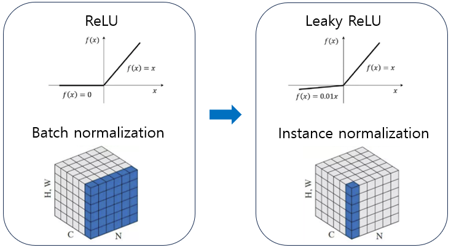
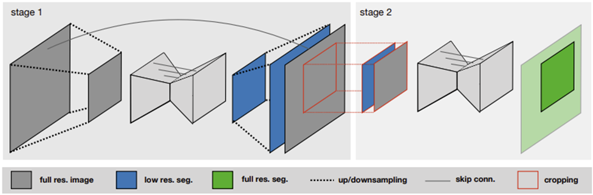
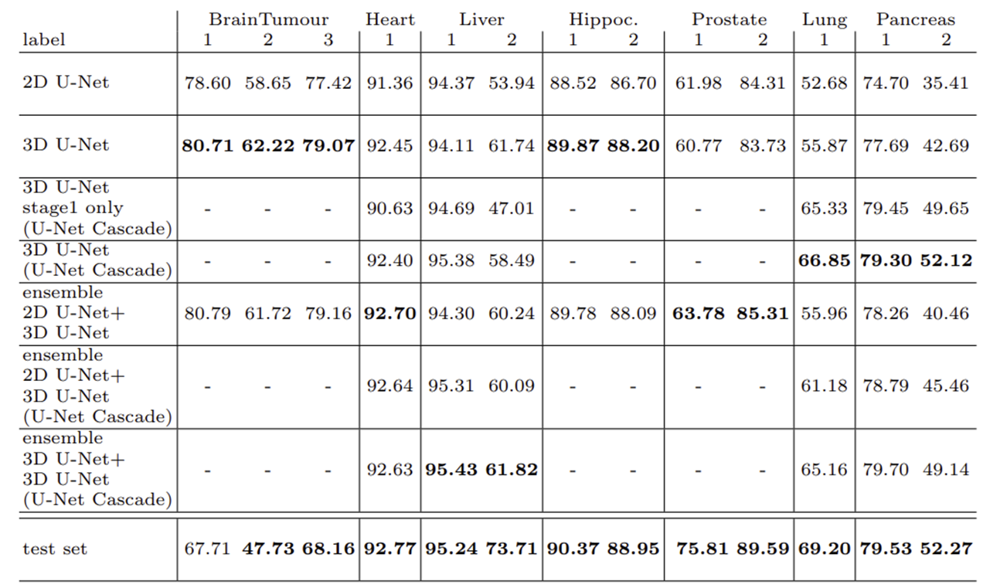

# nnU-Net : Self-adapting Framework for U-Net-Based Medical Image Segmentation

## 논문 정보
> - 논문 제목 : nnU-Net : Self-adapting Framework for U-Net-Based Medical Image Segmentation
> - 모델 이름 : nnU-Net
> - 발표 연도 : 2018 (arXiv), 이후 2021 Nature Methods 확장판
> - 한줄 요악 : U-Net을 잘 튜닝하는 규칙을 자동화하면, 새로운 모델 없이도 SOTA를 낼 수 있다

## Introduction
CNN 기반의 segmentation 기법은 좋은 성능을 내기 위한 특수한 네트워크 구조 및 다양한 훈련 기법을 요구하지만 이러한 요소 없이 다른 종류의 다양한 데이터셋에 대해 일반적인 결과를 산출할 수 있는 알고리즘이 필요하다. 본 논문은 네트워크 구조 외에 다른 방면에서 더 영향력이 있다고 제안하는데 nnU-Net 또한 "no new U-Net"의 줄임말로, 이전의 unet과 모델 구조에 대해서는 다른게 없다고 말하고 있다는 것을 알 수 있다.

## Network Architecture

네트워크 구조 외에 다른 면에 초점을 맞추므로 네트워크는 unet과 크게 다르지 않다. 다른 점이 있다면 U-Net에서 활성화 함수로 ReLU 함수를 사용했다면 nnU-Net은 Leaky ReLU 를 사용하여 weight가 음수의 값을 갖는 부분에서도 어느정도 살렸고, U-Net에서 batch normalization을 사용했다면 nnU-Net은 instance normalization을 사용하여, batch 단위가 아닌 이미지 단위로 normalize를 하여 각 이미지 고유 정보를 잃는 것을 방지하였다.

MRI, CT와 같은 이미지들은 3차원으로 구성되어 있는데, 각 slice로 저장된 2차원 이미지 여러장을 합친 꼴과 같다. 이러한 측면에서 instance normalization을 통해 각 이미지 고유 정보를 가져가는 것이 어쩌면 medical image segmentation에 더 적합할 수 있다고 본다.

### 2D U-Net
2D U-Net의 경우 z축에 대한 중요한 정보를 고려하지 않을 수 있으므로 3차원인 medical image를 segmentation하기에는 적합하지 않지만, 데이터셋이 anisotropic하다면 충분히 사용할 가치가 있다.

### 3D U-Net
3D U-Net이 medical image segmentation에 적합한 모델이지만, GPU 메모리의 한계로 인해 이미지를 패치 단위로 나누어 모델에 입력하게 된다. 이는 큰 이미지의 경우 field of view의 한계로 모든 context 정보를 못 모을 수 있다.

### U-Net cascade

이 모델은 이러한 3D U-Net의 단점을 보완하기 위해 제안되었다. U-Net을 통과해서 얻은 segmentation map을 ground-truth segmentation map에 one-hot encoding 형태로 두 번째 U-Net에 통과시켜 최종 output을 얻어낸다.

## Main idea
이 논문의 본질은 한 줄이다. : 모델이 아니라 pipeline을 자동화하자

### Dynamic adaption
GPU를 최대한 활용하여 모델이 입력 이미지의 공간 정보를 충분히 담아내기 위해 입력 patch의 크기, 층 별 pooling 횟수를 잘 설정해야 한다. 또한 네트워크의 수용능력에 따라 batch size 조절이 필요하다. 본 논문에서는 자동으로 결정하도록 한다. 자동 결정 요소는 다음과 같다.
- preprocessing
- network architecture (2D vs 3D vs cascade)
- patch size
- batch size
- learning rate
- augmentation
- post-processing

### 핵심 전략
1. Dataset fingerprinting
   - 데이터의 해상도, voxel spacing, 크기, 클래스 분포 분석
2. Rule-based system
   - heuristic 기반으로 최적 설정 선택
3. Cross-validation 자동 수행
   - 여러 설정 실험, best 모델 선택

## 특징
1. fully self-configuring
    - 데이터 넣으면 자동으로 전체 pipeline 구성
2. Architecture보다 pipeline이 중요
   - 복잡한 모델보다 데이터에 맞게 잘 설정하는게 더 중요
3. 강력한 일반화
4. Ensemble 전략
   - 2d + 3d 모델 결합

https://github.com/mic-dkfz/nnunet

