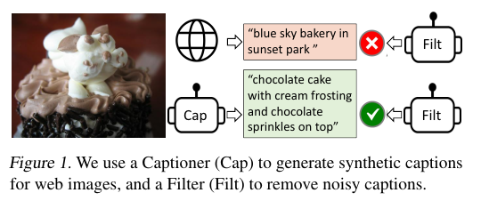
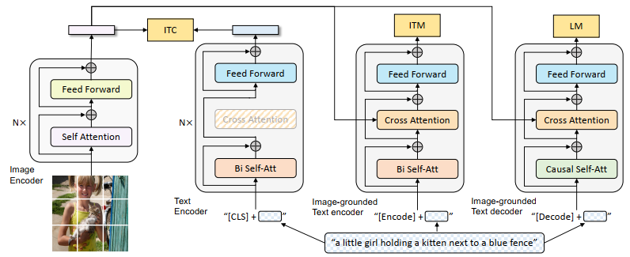
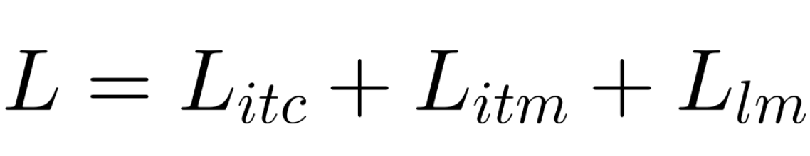
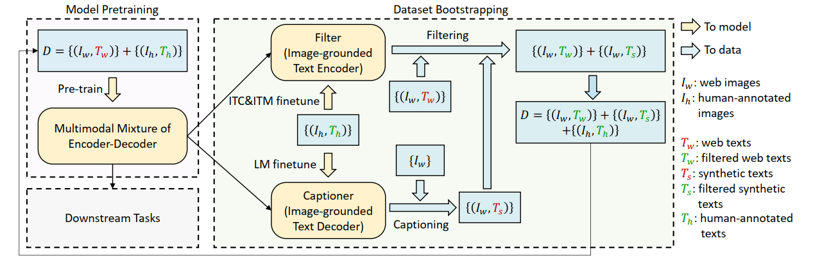

# BLIP: Bootstrapping Language-Image Pre-training for Unified Vision-Language Understanding and Generation

## 논문 정보
> - 논문 제목 : BLIP: Bootstrapping Language-Image Pre-training for Unified Vision-Language Understanding and Generation
> - 모델 이름 : BLIP
> - 발표 연도 : 2022 / Salesforce Research
> - 한줄 요악 : 노이즈가 많은 이미지-텍스트 데이터 문제를 해결하기 위해, 생성과 이해를 동시에 학습하는 unified VLM 구조와 데이터 부트스트래핑을 도입한 모델

---

## BLIP 이전 문제의식 (CLIP의 한계)
CLIP의 구조적 한계
1. dual encoder
   - Image <-> Text 독립
   - cross-model interaction X
2. Discriminative only
   - 문장을 생성하지는 못함
3. 웹 데이터 노이즈
   - 이미지-텍스트 쌍의 품질 편차 큼
   - clip은 이를 그대로 하긋ㅂ

---
## Abstract
Vision-Language Pre-training (VLP)는 vision-language tasks에서 성능의 향상을 보여왔다. 하지만 현존하는 많은 방법들은 understanding-based tasks 혹은 generation-based tasks 어느 한쪽에서만 향상을 보이고 있다. 뿐만 아니라 대부분의 성능 향상은 웹에서 가져온 noisy image-text pairs를 사용하여 데이터의 크기를 늘리는 방식이기 때문에 supervision의 측면에서 suboptimal이다. 

따라서 해당 논문에서 제시한 BLIP은 vision-language의 이해와 생성 양쪽으로 전환할 수 있으며 bootstrapping 부트스트래핑 방법으로 captioner가 노이지한 캡션을 지우고 새로 생성하는 방식을 사용했다. 이를 통해서 image-text retireval, image captioning, VQA 등의 분야에서 SOTA를 달성했다.

image-text retireval, image captioning, VQA

1. image-text retireval
- 텍스트 쿼리를 사용하여 관련 이미지를 검색하거나
- 반대로 이미지를 사용하여 관련 텍스트를 찾는 문제
2. image captioning
- 주어진 이미지에 대해 정확하고 관련성 있는 텍스트 설명을 자동으로 생성하는 문제
3. VQA
- 주어진 이미지에 대한 자연어 질문을 이해하고, 그 이미지를 분석하여 해당 질문에 적절한 답변을 자동으로 생성하는 문제

---
## Network Architecture

ViT를 image encoder로 사용했다. 이미지를 패치로 나눈 다음 sequence of embeddings로 만든다. 그리고 [CLS] 토큰을 global teature로 사용한다.

이해와 생성의 능력을 모두 가진 통합된 모델을 위해서 Multimodal mixture of encoder-decoder (MED)를 추가한다. 이는 다음의 세 가지 기능으로 동작한다.

### 1. Unimodal encdoer
이미지와 텍스트 데이터를 별도로 인코딩

1. Image Encoder
- ViT를 사용하여 입력 이미지를 patch로 나누어 임베딩 (Object Detector보다 계산 효율적)
- Global Image Feature를 표현하기 위해 [CLS] 토큰 사용
- [CLS] 토큰 : 입력 시퀀스의 맨 앞에 위치하며, 입력 전체를 대표하는 벡터로 학습됨
2. Text Encoder
- BERT와 같은 구조
- 입력된 문장을 토큰화하고 임베딩
- 텍스트의 시작 부분에 [CLS] 토큰이 추가되어 문장의 전체 의미 표현

### 2. Image-grounded text encoder
(Transformer Block 내의 구조)

- Self-Attention Layer : 일반적인 Transformer에서 사용되는 Self-Attention layer는 입력된 텍스트 토큰들 간의 상관관계를 학습하여 문장 내 단어들의 연관성 파악
- Feed-forward Network : Self-Attention layer 다음에 위치하는 네트워크로, 각 단어의 임베딩 벡터를 비선형적으로 변환하여 모델의 표현력을 향상시킴

(Croos-Attention Layer의 추가)

- Self-Attention과 Feed-forward layer 사이에 삽입
- Text Encoder가 Image Enocder의 정보를 참조할 수 있도록 함
- 이 layer를 통해 텍스트와 이미지의 상관관계를 학습하고, 텍스트가 이미지와 어떻게 연결되는지 모델이 이해할 수 있게 함

([Encode] 토큰 사용)

- Text Encoder 입력에 [Encode] 토큰 추가
- 해당 토큰의 임베딩은  Image-Text Pair의 Multimodal Representation으로 사용

### 3. Image-grounded text decoder
- Decoder는 텍스트 생성 작업에서 사용되며, 이미지에서 얻는 정보를 바탕으로 텍스트 시퀀스를 단계별로 생성
- Bidirectional Self-Attention Layer를 Causal Self-Attention Layer로 대체하여 현재 시점까지의 단어들만 참조하도록 하여, 미래의 단어를 참조하지 않도록 함
- [Decode] 토큰 : 텍스트 시퀀스의 시작을 알리는 역할
- [EOS] 토큰 : 시퀀스의 끝을 알리는 역

---
## Main Idea 
### 1. Unified Vision-Language Model
BLIP은 다음을 하나의 모델로 처리:

- Image-Text Retrieval
- Image Captioning
- VQA
- Image-Text Matching

→ task별 모델 ❌

→ 범용 멀티모달 backbone ⭕

### 2. Pre-training Objectives

Pre-train 과정에서 ITC, ITM, LM이라는 세 가지 loss를 사용한다. 

#### (1) Image-Text Contrastive Loss (ITC)
- Unimodel Encoder 활성화 (각 모달리티의 표현을 더 잘 학습하게 만듦)
- Positive Image-Text Pair, 즉 서로 일치하는 이미지와 텍스트 쌍이 유사한 표현을 갖도록 유도
- 이는 Visual Transformer와 Text Transformer의 Feature Space를 align하는 것을 목표로 함

#### (2) Image-Text Matching Loss (ITM)
- Iamge-grounded Text Encdoer를 활성화
- Multimodal Representation 학습 : 이미지와 텍스트 간의 세밀한 정렬을 포함하는 멀티모달 표현을 학습. 즉, 이미지와 텍스트가 함께 제공될 때, 이 둘이 의미적으로 일치하는지 학습
- ITM Head (Linear Layer) : 모델의 마지막 단계에서 사용되는 선형 레이어로, Image-Text 쌍의 멀티모달 특징을 고려하여 해당 쌍이 Positive인지 Negative인지 예측
- Informative Negative : 모델이 학습하는 동안, Negative 샘플 중에서도 특별히 중요한, 모델이 혼동할 가능성이 높은 샘플들을 선택하여 학습을 강화
- ALBEF 모델의 Hard Negative 전략을 차용하여, 실제로 일치하지 않는 샘플에서도 미묘한 유사성을 학습하도록 함

#### (3) Language Modeling Loss (LM)
- Image-grounded Text Decoder를 활성화
- Text Encoder와 Decoder의 파라미터 공유 (Self-Attention layer 제외)
- 인코더와 디코더 작업 간의 차이점을 가장 잘 반영할 수 있는 부분이 Self-Attention 레이어이기 때문
- Encoder는 현재 입력 토큰에 대한 Representation을 구축하기 위해 Bi-directional Self-Attention, Decoder는 다음 토큰을 예측하기 위해 Casual Self-Attention

### 3. CapFit

Annotation cost 때문에 고품질의 데이터는 COCO 등의 제한된 크기의 데이터만 존재한다.

이를 해결하기 위해서 Captioning and Filtering (CapFilt)를 제안한다.
방법은 위의 그림과 같다.

1. Captioner는 주어진 웹 이미지에 대한 설명을 생성하고 filter는 노이지한 이미지-텍스트 페어를 제거한다.
Captioner와 Filter 모두 동일한 pre-trained MED 모델로 부터 나오며 각각 별도로 COCO 데이터 셋에 대해서 파인 튜닝한다.  

2. Captioner를 LM objective의 측면에서 학습되며 주어진 이미지에 대한 캡션을 디코딩한다.
3. Filter는 imgae-grounded text conder다. ITC와 ITM 목적함수를 통해서 텍스트가 이미지와 매치되는지를 학습한다. 
4. 필터는 오리지널 텍스트와 Captioner가 만든 synthetic texts 합성 텍스트 모두를 제거하며, 이때의 제거 기준은 LM 헤드가 텍스트가 이미지와 unmatched라고 판단했을 때다.
5. 최종적으로 필터링된 이미지-텍스트 쌍을 사람이 annotated한 쌍들과 묶어서 새로운 데이터셋을 만들고 이를 새로운 모델의 pre-train에 사용한다.

---
## Conculsion
### 장점
- Cross-modal interaction
  - CLIP보다 정밀한 이미지-텍스트 정렬

- 생성 + 이해 통합
  - Captioning, VQA에 강함

- 노이즈 데이터에 강함
  - Bootstrapping 전략

- VLM 계열의 실질적 출발점
  - 이후 BLIP-2, LLaVA, Flamingo로 연결

### 단점
- 구조 복잡
- zero-shot 분류는 clip보다 불리
- 대규모 학습 비용

### clip vs blip
| 항목              | CLIP         | BLIP               |
| --------------- | ------------ | ------------------ |
| 구조              | Dual Encoder | Fusion Transformer |
| 생성              | ❌            | ⭕                  |
| Contrastive     | ⭕            | ⭕                  |
| Cross-attention | ❌            | ⭕                  |
| Zero-shot 분류    | 매우 강함        | 보통                 |
| VQA / Caption   | 약함           | 매우 강함              |

### 결론
BLIP는 clip의 표현 학습 능력 + transformer의 생성 능력 + 데이터 정제 젼략을 결합한 모델이다. 