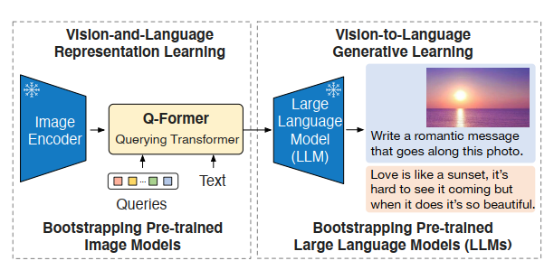
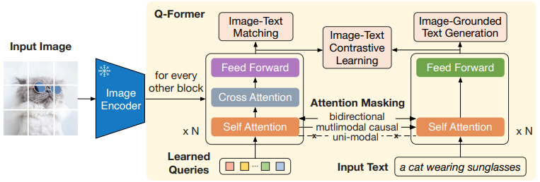
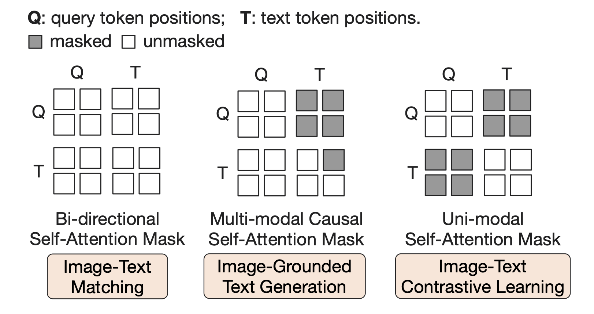
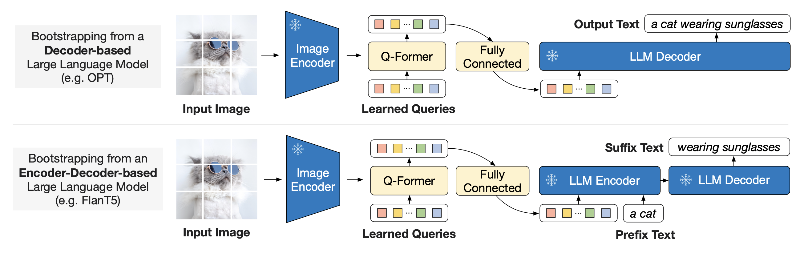
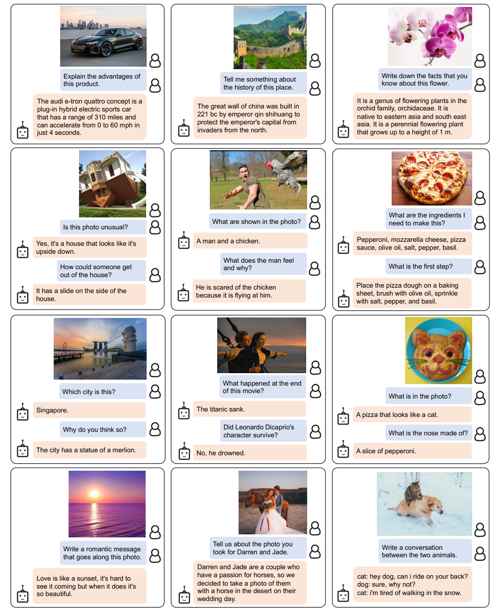

# BLIP-2: Bootstrapping Language-Image Pre-training with Frozen Image Encoders and Large Language Models

## 논문 정보
> - 논문 제목 : BLIP-2: Bootstrapping Language-Image Pre-training with Frozen Image Encoders and Large Language Models
> - 모델 이름 : BLIP2
> - 발표 연도 : 2023 / Salesforce Research
> - 한줄 요악 : Vision Encoder와 LLM을 모두 고정(freeze)한 채, Q-Former로 둘을 효율적으로 연결한 최초의 LLM-기반 VLM 구조

---

## Introduction

문제인식
- 대부분의 State-of-the-art Vision-Langauge model들은 모델의 크기가 크고 학습 데이터가 많기 때문에 높은 연산량을 요구한다.
- 보통 VLM(Vision-Language Model)은 사전학습된 Unimodal model, 즉 이미지 인코더와 텍스트 인코더를 합쳐서 네트워크를 구축한다.
- 이 때 사전학습된 Unimodal model, 예를 들어 텍스트 데이터만을 학습한 LLM은 이미지에 대한 시각적 정보가 없기때문에 Vision-Language Alignment가 어렵다.

논문에서는 pre-train된 Vision 모델과 Language 모델을 bootstrapping하여 효율적인 VLP 방법을 제안한다. 계산 비용을 줄이고 catastrophic forgetting(망각) 문제를 피하기 위해 각각의 unimodal pre-train 모델은 frozen된 채로 유지한다.

이와 같이 VLP 작업에 pre-train된 unimodal을 활용하기 위해서는 cross-modal alignment가 매우 중요하다. 그러나 LLM은 unimodal pre-training 중에 이미지를 보지 못했으므로 모델을 frozen하게 되면 alignment가 어려워진다. 따라서 modality gap을 충분히 연결해주는 작업이 필요하다.

논문에서는 frozen unimodal 모델로 효과적인 vision-language alignment을 달성하기 위해 새로운 2단계 방법으로 pre-train된 Querying Transformer(Q-Former)를 제안했다. Q-Former는 frozen image encoder와 frozen LLM 사이의 information bottleneck 역할을 하며, LLM이 원하는 텍스트를 출력하는 데 가장 유용한 visual feature을 제공한다.

BLIP-2 의 주요 장점은 다음과 같다
- BLIP-2는 frozen pre-trained 이미지 모델과 언어 모델을 모두 효과적으로 활용한다. Representation learning stage, generative learning stage의 두 단계로 pre-train된 Q-Former를 사용하여 modality gap을 해소했다.
- FlanT5 LLM을 기반으로 하는 BLIP-2는 자연어 지침에 따라 zero-shot image-to-text generation이 가능하다.
- Frozen unimodal 모델과 경량 Q-Former를 사용하므로 BLIP-2는 기존 최첨단 모델보다 컴퓨팅 효율성이 더 높다.

---

## Network Architecture
BLIP2는 frozen pre-train unimodal 모델에서 bootstrap을 수행하는 수행하는 vision-language pre-training 방법이다. Modality gap을 해소하기 위해 Querying Transformer(Q-Former)을 제안한다. Q-Former는 두 단계를 거쳐 pre-train된다.
1. Frozen image encoder를 사용하는 vision-language representation learning stage
2. Frozen LLM을 사용하는 vision-to-language generative learning stage

Q-Former는 동결된 이미지 인코더와 언어 모델 간의 간극을 연결하기 위한 학습 가능한 모듈이다. 고정된 수의 출력 feature를 이미지 인코더에서 추출한다.
1. Image transformer
   - frozen image encoder와 상호작용하여 시각적 특징 추출
   - 학습 가능한 query embedding을 input으로 사용
   - query는 self-attention layer으로 상호작용하며 특징과는 cross-attention layer로 상호작용
2. Text transformer
   - 텍스트 인코더와 텍스트 디코더 모두 작동
   - 동일한 self-attention layer를 사용해 쿼리와 텍스트 간 상호작용

--- 

## Main idea ; Q-Former
### Bootstrap Vision-Language Representation Learning from a Frozen Image Encoder
Q-Former의 두 단계 학습 방법 중 1단계인 representation learning stage에 대해서 먼저 살펴보자.

Representation learning stage에서는 Q-Former를 frozen image encoder에 연결하고 image-text pair를 사용하여 pre-train을 수행한다. 학습의 목적은 query가 visual representation을 추출하는 방법을 학습하는 것인데, 이 때 이 visual representaion은 text와 연관지어지는 유익한 정보여야한다.

BLIP 논문의 방법과 유사하게 세가지 objective를 jointly optimize한다. 

각각 Mask에 대한 설명

- Bi-direntional Self-Attention Mask: 모든 Query와 Text token이 서로 attend 할 수 있다.
- Multi-modal Causal Self-Attention Mask: Query는 모든 query에 대해 서로 attend 할 수 있지만 text에는 attend 할 수 없다. 반면 Text 모든 query에 attend 할 수 있고, 이전 시점까지의 text에 attend 할 수 있다.
- Uni-modal Self-Attention Mask: Query와 text는 서로에게 attend 할 수 없다.

#### 1. Image-Text Contrastive Learning (ITC)
- Image transformer에서 나온 Z (query representation)와 text transformer에서 나온 t (text representation)의 similarity를 극대화되로록 학습한다.
- 또한 image transformer와 text transformer가 서로의 정보를 볼 수 없게 unimodal self-attention을 이용한다
- 위의 그림에서 오른쪽 그림처럼 q는 q만, t는 t만 attend할 수 있도록 masking

#### 2. Image-grounded Text Generation (ITG)
- 입력 이미지를 condition으로 알맞은 text를 생성하게 학습한다
- query가 입력 텍스트에 맞는 정보를 이미지 feature에서 뽑을 수 있도록 Multimodal causal self-attention mask를 이용
- 위의 그림에서 중앙 그럼처럼 q는 q만, t는 q와 t를 attend 할 수 있도록 masking

#### 3. Image-Text Matching (ITM)
- 입력 이미지와 입력 텍스트 간의 positive 혹은 negative를 classification 하도록 학습
- 이때, bi-directional self-attention mask를 이용하여 모든 query와 text들이 서로를 확인할 수 잇음
- 위의 그림에서 왼쪽 그림처럼 q와 t를 서로 attend 할 수 있음

### Bootstrap Vision-to-Language Generative Learning from a Frozen LLM

다음으로 Q-Former의 두 단계 학습 방법 중 2단계인 generative learning stage에 대해 살펴보자.

Generative learning 단계에서는 Q-Former를 frozen된 LLM과 연결하여 생성적 언어 능력을 활용한다. 

Q-Former의 출력 쿼리 임베딩(Z)은 완전 연결층(FC)을 통해 LLM의 텍스트 임베딩 차원과 일치하도록 선형 변환된다. 변현된 쿼리 임베딩은 텍스트 임베딩 앞에 추가되며 소프트 비주얼 프롬프트 역할을 하며, Q-Former에서 추출한 시각적 표현에 따라 LLM을 조정한다. Q-Former는 시각적 정보를 텍스트와 관련된 중요한 정보만 남기고 불필요한 정보를 제거하여 LLM에 전달하며 catastrophic forgetting 문제를 완화한다.

LLM은 decoder-based와 encoder-decoder-based LLM이 존재한다.

1. Decoder-based LLM
- language modeling loss를 사용하여 LLM이 Q-Former에서 추출한 시각적 표현을 조건으로 텍스트를 생성하도록 학습
2. Encoder-decoder-based LLM
- 프리픽스 언어 모델링 손실을 사용
- 텍스트를 두 부분으로 나누어, 텍스트의 앞부분(프리픽스)과 시각적 표현을 llm의 인코더 입력으로 제공
- 텍스트의 뒷부분(서픽스)은 Llm 디코더의 생성 목표로 사용

---

## Model pre-training
BLIP와 동일한 사전 학습 데이터셋을 사용하며, 총 1.29억 개의 이미지가 포함된다. 웹 이미지를 위한 합성 캡션은 CapFilt 방법을 사용하여 생성된다. 

### Pre-trained image encoder and LLM
이미지 인코더 
- (1) ViT-L/14 (CLIP) (2) ViT-g (EVA-CLIP) 

언어 모델
- (1) OPT 모델군 (디코더 기반 LLM) (2) Flan T5 모델군(인코더-디코더 기반 LLM)

---

## 특징
### 장점
- llm 친화적 구조 : 어떤 llm이든 연결 가능
- 학습 비용 대폭 절감 : end-to-end 대비 훨씬 효율적
- 멀티모달 생성 성능 우수 : VQA, captioning 강함
- 현대 vlm 구조의 기준점

### 단점
- 구조 복잡성 : q-former
- zero-shot 분류는 clip보다 약함
- 실시간 서비스엔 무거움

### 결론
BLIP-2의 기여는 명확하다.
“Vision과 Language를 섞지 말고, 필요한 만큼만 연결하라.”

### CLIP vs BLIP vs BLIP-2 vs LLaVA

| 구분              | **CLIP**                   | **BLIP**                             | **BLIP-2**                     | **LLaVA**              |
| --------------- | -------------------------- | ------------------------------------ | ------------------------------ | ---------------------- |
| 발표              | 2021 (OpenAI)              | 2022 (Salesforce)                    | 2023 (Salesforce)              | 2023 (UW, MSR)         |
| 핵심 목적           | 이미지–텍스트 **공동 임베딩 학습**      | Vision-Language **통합 사전학습**          | Vision ↔ LLM **효율적 연결**        | **멀티모달 대화형 LLM**       |
| Vision Encoder  | ResNet / ViT               | ViT                                  | 고정된 ViT (ex. EVA, CLIP ViT)    | CLIP ViT               |
| Text / Language | Transformer (텍스트 인코더)      | Transformer (텍스트 인코더)                | **LLM (고정)**                   | **LLM (Vicuna/LLaMA)** |
| 핵심 모듈           | Dual Encoder               | **MED (Multimodal Encoder-Decoder)** | **Q-Former**                   | Projection Layer       |
| 학습 방식           | Contrastive Learning       | ITC + ITM + LM                       | Vision–Language **Bridge만 학습** | Instruction Tuning     |
| 생성 능력           | ❌ 없음                       | ⭕ Captioning 가능                      | ⭕ Captioning / QA 가능           | ⭕ 대화·추론 중심             |
| Zero-shot       | ⭕ 매우 강함                    | ⭕                                    | ⭕                              | ⭕ (대화 기반)              |
| 대규모 학습 비용       | 매우 큼                       | 큼                                    | **상대적으로 작음**                   | 큼                      |
| 확장성             | 제한적                        | 제한적                                  | **LLM 교체 용이**                  | LLM 성능에 의존             |
| 실무 포지션          | **Retriever / Align Tool** | End-to-End VLM                       | **VLM Backbone**               | **멀티모달 ChatGPT**       |
