# Learning Transferable Visual Models From Natural Language Supervision

## 논문 정보
> - 논문 제목 : Learning Transferable Visual Models From Natural Language Supervision
> - 모델 이름 : CLIP (Contrastive Language–Image Pretraining)
> - 발표 연도 : 2021 / OpenAI
> - 한줄 요악 : 이미지와 텍스트를 같은 임베딩 공간에서 대조 학습해, 추가 학습 없이 zero-shot 이미지 분류가 가능한 멀티모달 모델

## Introduction
NLP 분야에서는 대규모 웹 텍스트를 활용한 사전 학습 기법이 강력한 성능을 보이며 발전해왔다. Label 없는 대규모 데이터를 효과적으로 학습할 수 있기 때문에, 특히 GPT-3와 같은 모델은 label 없이도 다양한 task에서 높은 성능을 보인다.

반면에 컴퓨터 비전 분야에서는 여전히 ImageNet과 같은 수작업 라벨링된 데이터셋을 활용한 지도학습이 주류다. 절대적으로 학습 데이터의 크기가 작기 때문에 벽이 존재해왔다. NLP 분야와 마찬가지로 웹 상에서 수집할 수 있는 대규모 텍스트 데이터로 학습한다면 비전 분야에서도 큰 혁신을 기대해 볼 수 있을 것이다.

이미지와 텍스트 쌍을 활용하여 이미지 표현을 학습하는 과거 연구들은 존재했지만, 성능이 기존 지도학습 모델보다 낮아 실용성이 제한적이었다.

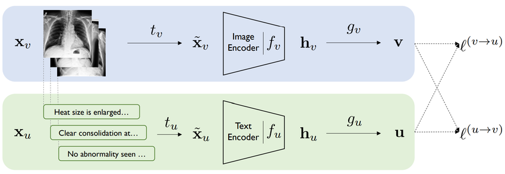

그 중 ConVIRT (Zhang et al., 2020) 는 transformer, masked language modeling, contrastive objectives 등을 활용한 모델로, 본 연구의 중요한 기반이 된다.

따라서 저자들은 4억 개의 (이미지, 텍스트) 쌍으로 구성된 새로운 데이터셋을 만들고, Contrastive Language-Image Pre-training (CLIP)이라는 모델을 제시한다.

---

## Approach
### 1. Natural Language Supervision
- CLIP의 핵심은 자연어를 이미지 학습의 'supervision'으로 사용하는 것! 
- 자연어를 이용한 학습은 아래의 이점이 있다
  - 1) 인터넷에서 많은 양의 텍스트를 얻을 수 있기 때문에 scale이 가능 
  - 2) 단순히 class를 학습하는 것이 아니라 텍스트로 표현된 자연어를 학습하기 때문에 이미지에 대한 더 깊은 이해 가능 

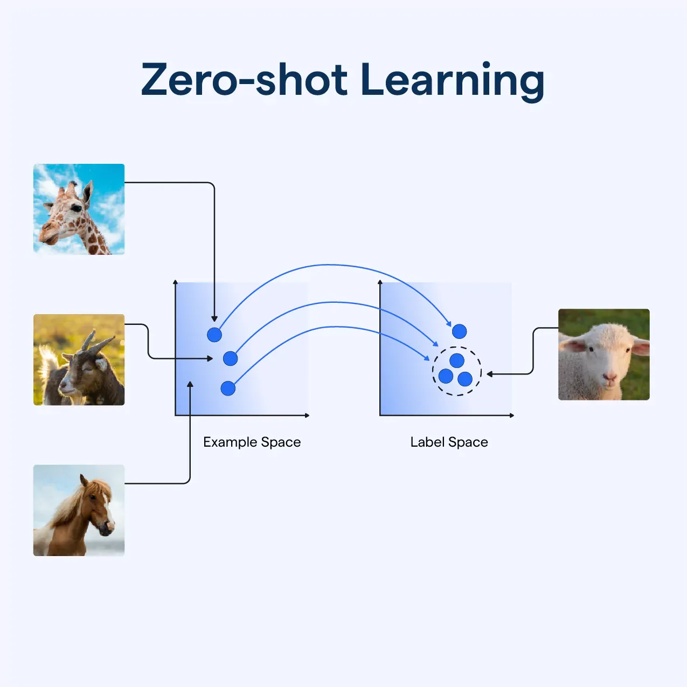
zero-sho transfer : 학습 과정 중 본 적 없는 데이터의 class도 예측할 수 있는 능력

### 2. Dataset
- 기존에 존재하는 이미지 데이터셋들은 크기, 질 등의 문제로 활용하기 어려움
- 새로운 데이터셋인 WIT (WebImageText)를 제안하는데, 약 4억 개의 (img, txt) 쌍으로 구성된 데이터를 인터넷에서 수집

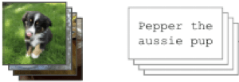

- 이미지와 설명 캡션을 다양하게 수집하기 위해 50만개의 쿼리 사용

### 3. Pre-training
- 굉장히 많은 양의 데이터를 학습하기 때문에 학습 효율성이 무척 중요
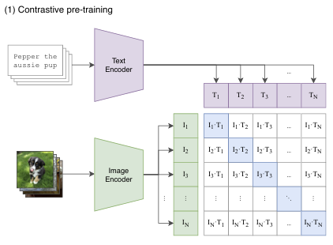

- Contrastive learning 학습 방식을 사용
  - self-supervised learning 분야에서 자주 활용되는 방식
  - 매칭되는 feature들끼리는 가까워지게 (cosine 유사도 커짐) 학습하는 것으로, 위 그림에서 파란 대각선 부분의 값이 커지게 하는 것

CLIP의 전체 학습 과정은 먼저 이미지 데이터는 image encoder 모델로, 텍스트 데이터는 text encoder 모델로 넣어주어 각각 feature를 추출한다. 이후 이 두 feature으로 contrastive learning을 진행하면 전체 모델이 학습된다. 

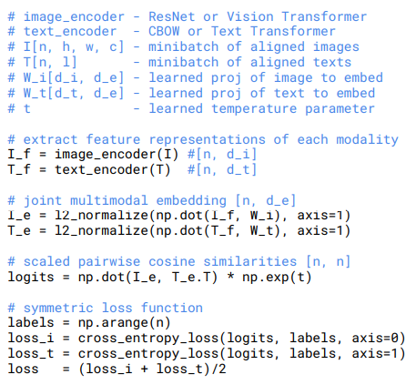

### 4. Model
CLIP의 image encoder 모델로는 5가지 종류의 ResNet과 3가지 종류의 ViT를 사용하여 비교했다. Text encoder 모델로는 Transformer를 사용했다.

모델 크기를 키우기 위해서 image encoder는 width, depth, resolution을 모두 동일한 정도로 scale 했으며, text encoder는 width만 scale 했다.

---

## Experiments

### 1. Zero-Shot Transfer
zero-shot prediction은 다음과 같은 방식으로 진행된다

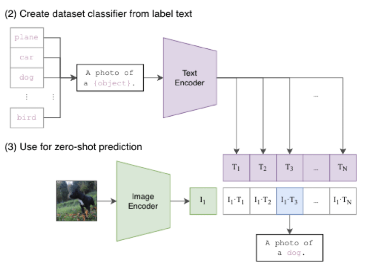

- 입력 이미지를 encoder에 통과하여 feature를 얻음
- 학습된 text encoder에서 나오는 feature와 + img feature 의 cosine 유사도 계산
- 입력 이미지를 가장 잘 설명하는 text feature를 출력
- 여기에 적절한 prompt enginerring과 여러 classifier를 ensemble하는 방식을 더하여 zero-shot 성능을 높임

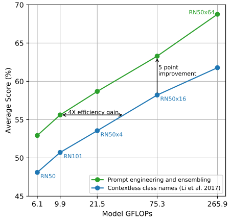

CLIP의 zero-shot 성능을 살펴보기 위해 아래 그림을 보면 zero-shot prediction 성능과 ResNet50에 각 데이터셋 별로 fine-tuning 한 뒤 성능을 비교한 결과다

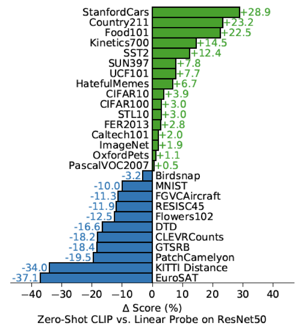

- fine-tuning을 전혀 하지 않은 zero-shot CLIP이 절반 이상의 경우에서 더 높은 성능을 보인다. 
- 다만 비교적 복잡하거나 추상적인 데이터셋 task에서는 CLIP이 뒤쳐지는 모습을 보인다.

추가로 zero-shot CLIP 모델을 few-shot 모델들과 비교했는데 그 결과는 다음과 같다

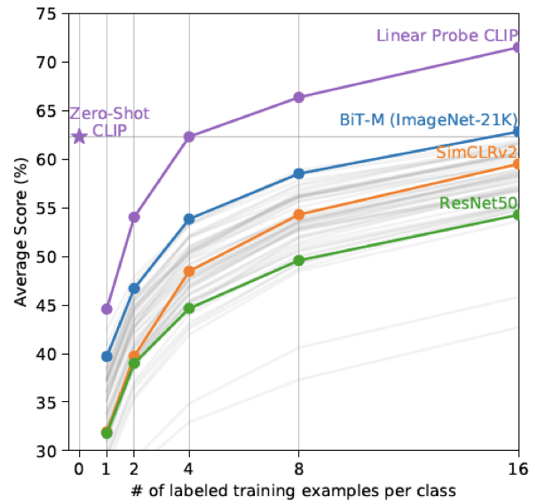

-  zero-shot CLIP이 대부분의 모델들의 성능보다 좋다는 것을 알 수 있다
-  심지어 4-shot (클래스 당 4개 데이터 학습) CLIP과 비슷한 수준의 성능을 보인다
-  물론 데이터셋별로 차이는 존재하지만, 전반적으로 zero-shot CLIP의 data efficiency가 높다는 것을 시사한다
  

### 2. Representation Learning
다음은 CLIP 자체가 과연 좋은 표현력을 학습하였는가를 검증해본다

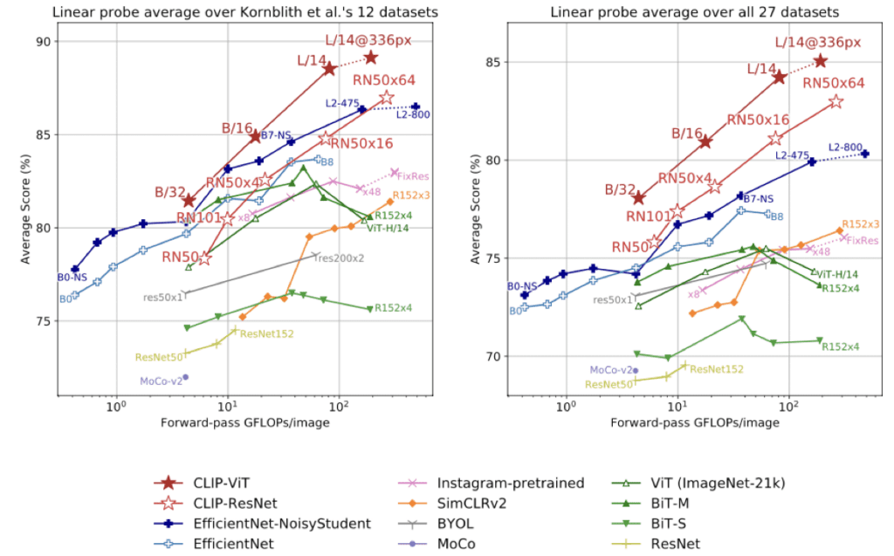

왼쪽은 12가지, 오른쪽은 27가지의 다양한 데이터셋으로 평균적인 성능을 비교한 결과인데, CLIP 모델의 성능이 가장 좋다

### 3. Robustness
마지막으로 모델의 강건성, 또는 일반화 성능을 실험하였다

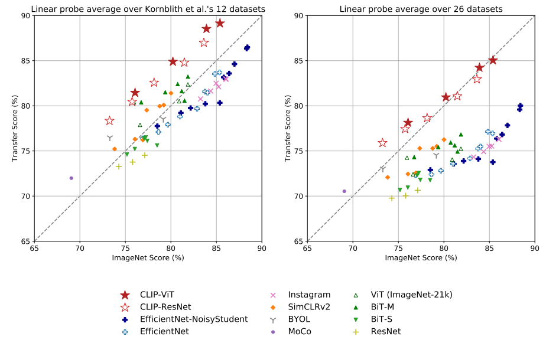

위 결과와 같이 CLIP 모델은 다른 task에 대해서도 성능을 유지하는 모습이다

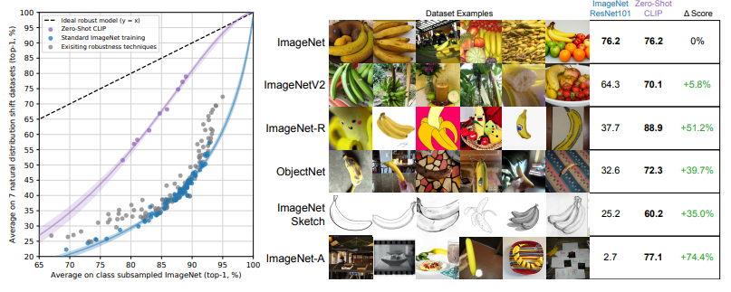

위의 표는 ImageNet 데이터셋의 분포를 변형 (distribution shift)시켜 이에 대한 다양한 모델들의 성능을 비교한 것이다.
Zero-shot CLIP의 경우 다른 모델에 비해 월등히 높은 강건성을 보인다!

## Conclusion
### 1. Limitations
1. Zero-shot CLIP의 경우 아직 전통적인 학습 방식을 사용하는 SOTA 모델들에 비해 낮은 성능을 보인다. 계산량과 데이터 효율성 측면에서도 개선이 필요하다.
2. 특정 task에 대해 zero-shot CLIP이 특히 약한 모습을 보여준다. 세밀하거나 추상적인 문제, 그리고 아예 새로운 문제에서는 좋은 성능을 내지 못한다.
3. 높은 강건성을 보이지만, 분포에서 아예 벗어난 새로운 데이터에 대해서는 일반화 성능이 떨어진다. MNIST 분류 문제에서 낮은 성능을 낸다는 점
4. 데이터 효율성 문제가 존재한다. 4억 개의 이미지를 1초에 하나씩 32 epoch을 수행하면 무려 405년이 걸린다고 한다.
5. CLIP의 학습 데이터는 전부 인터넷에서 수집하였기 때문에 사회적인 편향도 학습하게 된다. 
6. Localization에 약함 , Prompt 의존성

### 2. 정리
CLIP은 멀티모달 모델이라기보단 표현 학습 방식 자체를 바꾼 모델로 Contrastive Learning(대조 학습) 방식을 사용하고 Zero-shot 학습이 가능한 모델이다. CLIP은 Contrastive Loss를 사용해서 학습한다. 

CLIP의 구조는 다음과 같이 구성
- Vision Encoder (ResNet or Vision Transformer 기반)
- Text Encoder (Transformer 기반, GPT-like 구조)
- Projection Head (이미지와 텍스트 임베딩을 동일한 차원으로 변환)
- Contrastive Loss (이미지-텍스트 매칭 학습)