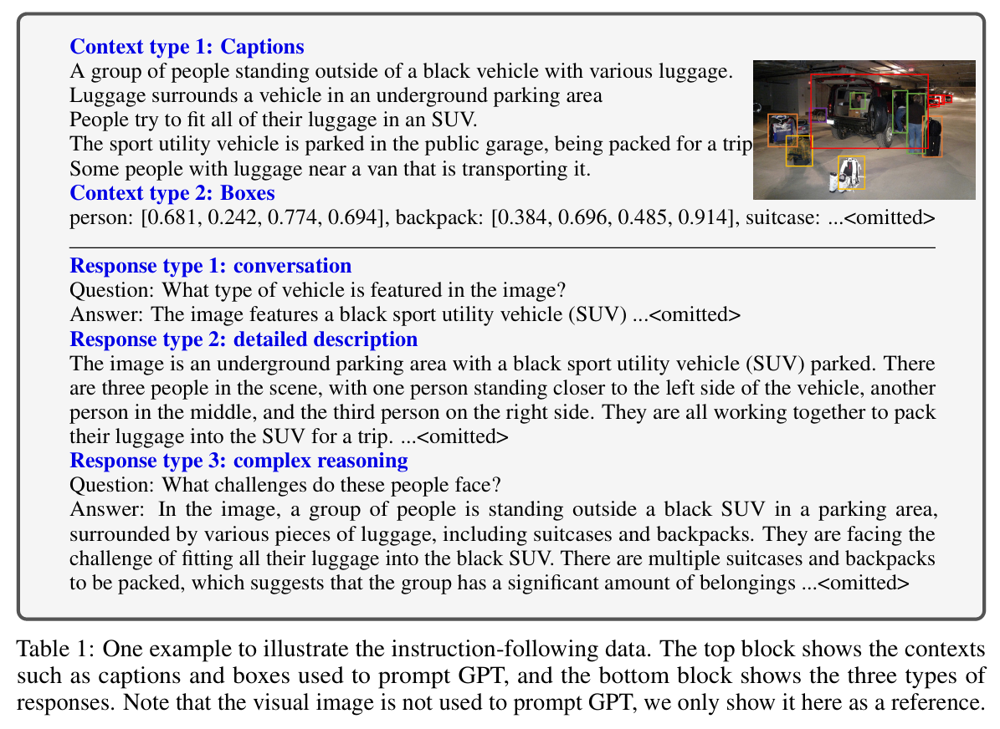
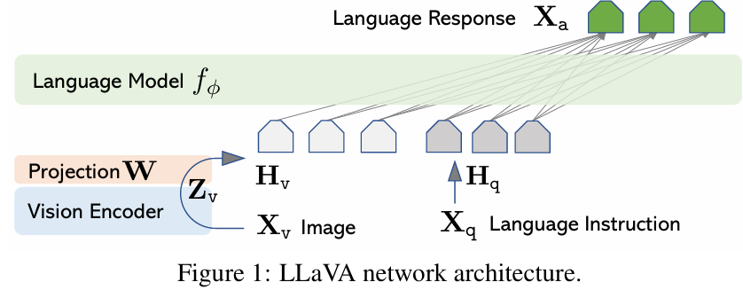
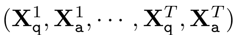
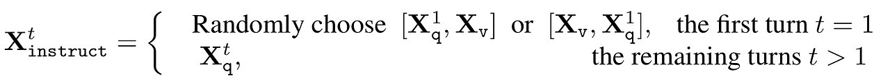
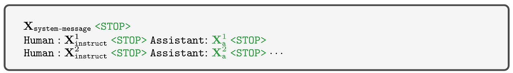
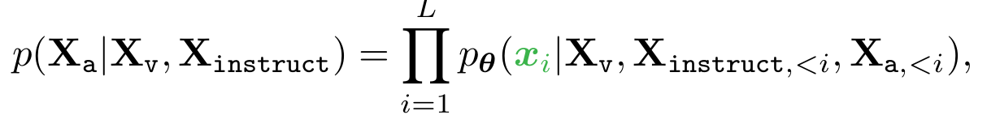
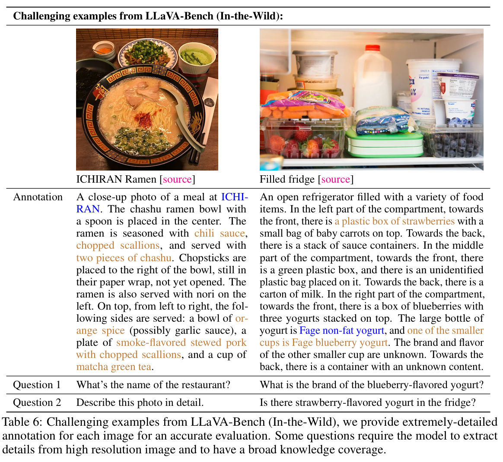

# Visual Instruction Tuning

## 논문 정보
> - 논문 제목 : Visual Instruction Tuning
> - 모델 이름 : LLaVA (Large Language and Vision Assistant)
> - 발표 연도 : 2023 (NeurIPS 2023)
> - 한줄 요악 : CLIP 기반 비전 인코더와 LLM을 연결하고, “Instruction Tuning”으로 멀티모달 ChatGPT에 가장 가까운 형태를 만든 모델

---

## Introduction
본 논문에서는 범용 비전 어시스턴트를 구축하기 위해 instruction-tuning을 언어-이미지 멀티모달 공간으로 확장하려는 첫 번째 시도인 visual instruction-tuning을 제시했다.

한 가지 주요 과제는 비전-언어 명령에 따른 데이터가 부족하다는 것이다. 본 논문에서는 ChatGPT/GPT-4를 사용하여 이미지-텍스트 쌍을 instruction-following 형식으로 변환하는 데이터 재구성 관점과 파이프라인을 제시했다.

저자들은 CLIP의 open-set 비전 인코더를 언어 디코더 Vicuna와 연결하고 생성된 데이터에 대해 end-to-end로 fine-tuning하여 large multimodal model (LMM)인 LLaVA (Large Language and Vision Assistant)를 개발하였다. 또한 LMM instruction-tuning을 위해 생성된 데이터를 사용하는 것의 효율성을 검증하고 범용적인 명령을 따르는 비전 에이전트를 구축하기 위한 실용적인 팁을 제안하였다. LLaVA는 GPT-4와의 앙상블을 통해 Science QA 멀티모달 추론 데이터셋에서 SOTA를 달성하였다.

---

## GPT-assisted Visual Instruction Data Generation
COCO 데이터셋에서는 Caption과 Bounding Box가 함께 제공된다. Text-Image pair가 같이 제공된다는 점에서 긍정적이기는 하나, 대화의 형태는 아니므로, 인간의 질문에 대답하는 등의 Task를 수행하기는 쉽지 않다. 따라서 저자들은 GPT-4를 활용하여 Caption을 대화형태로 바꾸었다. 구체적으로는 GPT-4에 COCO에서 제공되는 Caption/BBox를 Input으로 놓고 아래 Table과 같이 3가지 타입의 Response를 생성하도록 하였다. (아래 그림 참조)

GPT-4는 Multimodal로 만들어져서 Image/Text를 같이 넣을 수도 있으나, Text쪽으로 더 강점이 있어 이러한 방식을 택했다고 한다. 이러한 방식으로 총 158K의 샘플을 생성하였다.

---

## Visual Instruction TuningPermalink

### 1. Architecture

주요 목표는 사전 학습된 LLM과 시각적 모델의 feature를 효과적으로 활용하는 것이다. 공개적으로 사용 가능한 체크포인트 중에서 언어 task에서 최고의 instruction-follwing 능력을 가지고 있는 Vicuna를 LLM f()로 사용한다.

- 입력 이미지 Xv를 CLIP(ViT0L/14)를 통과시켜 Zv를 얻고, (Image embedding)
- 여기에 Projection matrix W를 곱해서 이미지 토큰 Hv를 얻는다. (Projection to our training space)
- GPT로 만든 conversation data는 아래의 형태로 구성되어 있다. 사용자의 질문, Agent의 응답이 번갈아가며 나오는 형태이다. 

- GPT가 생성한 conversation data 를 이용하여 모델에 넣어줄 Instruction을 아래와 같이 구성한다. 많이 바뀌는 것은 아니고, 첫번째 Instruction에는 이미지와 질문을 같이 넣어주고 (순서를 랜덤하게 바꿔서 멀티모달에 더 유연하게 반응하도록 함) 그 뒤로는 질문을 그대로 사용한다.

- 최종적인 Model training data의 형태는 다음과 같은 형태가 된다.아래에서 녹색으로 표시된 부분을 모델이 예측하도록 하였다.

- 이렇게 구성한 Instruction data를 바탕으로 아래와 같이 Auto-regressive하게 모델을 학습시켰다. 이때 모든 t 시점에서 응답을 생성할때 이미지에 대한 조건(Xv)도 같이 들어가게 함으로써 응답이 항상 이미지의 내용을 바탕으로 하도록 하였다.

- Language model fΦ는 Vicuna를 사용하였다.

| 구성             | 설명                              |
| -------------- | ------------------------------- |
| Vision Encoder | **CLIP ViT-L/14 (frozen)**      |
| Connector      | **단순 Linear Projection**        |
| LLM            | **Vicuna / LLaMA (fine-tuned)** |
| 학습 대상          | **Projection + LLM**            |

### 2. Model training
학습은 2단계로 나누어서 수행하였다.
1. Pre-training for feature alignment : 이미지 임베딩 Hv와 word 임베딩이 어느 정도 유사해지도록 조정하기 위하여 사전학습을 진행. Projection matrix W만 학습.
- CC3M 데이터셋에서 일부 image-text pair 필터링 (595K)
- 위에서 설명한 방법과 같이 GPT를 이용하여 대화 형태로 변경
- 대화형태로 변경된 데이터 중 Xq를 임의로 하나로 추출하고, 이에 대한 정답은 원본 Caption을 활용
- Visual Encoder (CLIP)과 LLM (Vicuna)를 모두 고정하고, 학습 진행
2. Fine-tuning End-to-End : 이번에는 projection matrix W뿐만 아니라 LLM 파트도 같이 학습시킨다. 아래 2가지 경우에 사용될 수 있다고 가정하였다.
- Multimodal chatbot
- Science QA: 과학시험문제 풀기

## Conculsion
### 장점
1. 구조가 매우 단순
- BLIP-2 대비 구현 쉬움
2. 멀티모달 대화 성능 뛰어남
- 이미지 설명
- 추론 기반 질문
3. LLM 중심 패러다임 확립
- vision은 feature provider
- 지능은 llm이 담당

### 단점
1. vision 이해 한계
- CLIP 표현력에 의존
2. 이미지 grounding 약함
- bounding box, segmentation x
3. 데이터 의존성 매우 큼
- gpt-4 기반 synthetic data 없으면 성능 급락

### Limitations

- 왼쪽의 경우 레스토랑 이름에 정확하게 대답하려면 모델에 광범위한 지식 범위와 다국어 이해 능력이 필요하다.
  - 반찬을 정확하게 설명하려면 모델이 인터넷에서 관련 멀티모달 정보를 검색해야 할 수도 있다
- 오른쪽의 경우 올바른 요구르트 브랜드를 인식하려면 모델이 고해상도 이미지를 처리하고 광범위한 지식을 보유해야 한다
  - 또한 냉장고에 요구르트와 딸기만 들어 있음에도 불구하고 딸기 맛 요구르트가 있는지 묻는 질문에 '예'라고 응답하는 흥미로운 결과도 관찰되었다
  - 이는 LLaVA가 이미지를 "패치 덩어리" 로 인식하여 이미지 내의 복잡한 의미를 파악하지 못하는 경우가 있음을 나타낸다.

### 모델 비교
| 모델        | Vision-Text 연결        | 학습 철학                        |
| --------- | --------------------- | ---------------------------- |
| CLIP      | Contrastive           | Representation 학습            |
| BLIP      | Cross-attention       | End-to-end VLM               |
| BLIP-2    | Q-Former              | LLM 효율적 연결                   |
| **LLaVA** | **Linear projection** | **Instruction-tuned LLM 중심** |

LLaVA는 “VLM”이라기보다 “LLM + Vision Adapter”

### 결론
LLaVA는 복잡한 멀티모달 아키텍처보다, 강력한 LLM과 잘 설계된 Instruction 데이터가 멀티모달 지능의 핵심임을 증명한 모델이다.